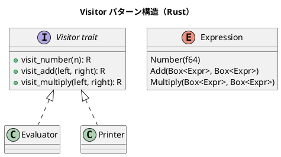

# 第12章: Visitor パターン

## はじめに

Visitor パターンは、データ構造の要素に対する操作を、データ構造から分離するパターンです。関数型プログラミングでは、パターンマッチングを使ってこのパターンを自然に実現できます。

本章では、式の評価、AST 変換、ドキュメント処理など、様々な例を通じて Visitor パターンの Rust での実装を学びます。

## 1. パターンの構造



## 2. 式の Visitor

### 式の定義

```rust
/// 数式 AST
#[derive(Debug, Clone, PartialEq)]
pub enum Expr {
    Number(f64),
    Variable(String),
    Add(Box<Expr>, Box<Expr>),
    Subtract(Box<Expr>, Box<Expr>),
    Multiply(Box<Expr>, Box<Expr>),
    Divide(Box<Expr>, Box<Expr>),
}

impl Expr {
    pub fn number(n: f64) -> Expr {
        Expr::Number(n)
    }

    pub fn add(left: Expr, right: Expr) -> Expr {
        Expr::Add(Box::new(left), Box::new(right))
    }

    pub fn multiply(left: Expr, right: Expr) -> Expr {
        Expr::Multiply(Box::new(left), Box::new(right))
    }
}
```

### Visitor トレイト

```rust
/// Visitor トレイト
pub trait ExprVisitor<R> {
    fn visit_number(&mut self, n: f64) -> R;
    fn visit_variable(&mut self, name: &str) -> R;
    fn visit_add(&mut self, left: R, right: R) -> R;
    fn visit_subtract(&mut self, left: R, right: R) -> R;
    fn visit_multiply(&mut self, left: R, right: R) -> R;
    fn visit_divide(&mut self, left: R, right: R) -> R;
}

/// 式を訪問
pub fn visit<R>(expr: &Expr, visitor: &mut dyn ExprVisitor<R>) -> R {
    match expr {
        Expr::Number(n) => visitor.visit_number(*n),
        Expr::Variable(name) => visitor.visit_variable(name),
        Expr::Add(left, right) => {
            let l = visit(left, visitor);
            let r = visit(right, visitor);
            visitor.visit_add(l, r)
        }
        Expr::Subtract(left, right) => {
            let l = visit(left, visitor);
            let r = visit(right, visitor);
            visitor.visit_subtract(l, r)
        }
        Expr::Multiply(left, right) => {
            let l = visit(left, visitor);
            let r = visit(right, visitor);
            visitor.visit_multiply(l, r)
        }
        Expr::Divide(left, right) => {
            let l = visit(left, visitor);
            let r = visit(right, visitor);
            visitor.visit_divide(l, r)
        }
    }
}
```

### 評価 Visitor

```rust
/// 評価 Visitor
pub struct Evaluator {
    pub variables: HashMap<String, f64>,
}

impl ExprVisitor<f64> for Evaluator {
    fn visit_number(&mut self, n: f64) -> f64 {
        n
    }

    fn visit_variable(&mut self, name: &str) -> f64 {
        self.variables.get(name).copied().unwrap_or(0.0)
    }

    fn visit_add(&mut self, left: f64, right: f64) -> f64 {
        left + right
    }

    fn visit_subtract(&mut self, left: f64, right: f64) -> f64 {
        left - right
    }

    fn visit_multiply(&mut self, left: f64, right: f64) -> f64 {
        left * right
    }

    fn visit_divide(&mut self, left: f64, right: f64) -> f64 {
        if right != 0.0 { left / right } else { f64::NAN }
    }
}
```

### 出力 Visitor

```rust
/// 式を文字列に変換する Visitor
pub struct Printer;

impl ExprVisitor<String> for Printer {
    fn visit_number(&mut self, n: f64) -> String {
        n.to_string()
    }

    fn visit_variable(&mut self, name: &str) -> String {
        name.to_string()
    }

    fn visit_add(&mut self, left: String, right: String) -> String {
        format!("({} + {})", left, right)
    }

    fn visit_subtract(&mut self, left: String, right: String) -> String {
        format!("({} - {})", left, right)
    }

    fn visit_multiply(&mut self, left: String, right: String) -> String {
        format!("({} * {})", left, right)
    }

    fn visit_divide(&mut self, left: String, right: String) -> String {
        format!("({} / {})", left, right)
    }
}
```

### 使用例

```rust
// (2 + 3) * 4
let expr = Expr::multiply(
    Expr::add(Expr::number(2.0), Expr::number(3.0)),
    Expr::number(4.0),
);

// 評価
let mut evaluator = Evaluator { variables: HashMap::new() };
let result = visit(&expr, &mut evaluator);
assert_eq!(result, 20.0);

// 文字列変換
let mut printer = Printer;
let string = visit(&expr, &mut printer);
assert_eq!(string, "((2 + 3) * 4)");
```

## 3. 関数型 Visitor

パターンマッチングを使った直接的な実装：

```rust
/// 関数型評価
pub fn evaluate(expr: &Expr, vars: &HashMap<String, f64>) -> f64 {
    match expr {
        Expr::Number(n) => *n,
        Expr::Variable(name) => vars.get(name).copied().unwrap_or(0.0),
        Expr::Add(l, r) => evaluate(l, vars) + evaluate(r, vars),
        Expr::Subtract(l, r) => evaluate(l, vars) - evaluate(r, vars),
        Expr::Multiply(l, r) => evaluate(l, vars) * evaluate(r, vars),
        Expr::Divide(l, r) => {
            let r_val = evaluate(r, vars);
            if r_val != 0.0 {
                evaluate(l, vars) / r_val
            } else {
                f64::NAN
            }
        }
    }
}

/// 変数を収集
pub fn collect_variables(expr: &Expr) -> HashSet<String> {
    match expr {
        Expr::Number(_) => HashSet::new(),
        Expr::Variable(name) => {
            let mut set = HashSet::new();
            set.insert(name.clone());
            set
        }
        Expr::Add(l, r) | Expr::Subtract(l, r) | Expr::Multiply(l, r) | Expr::Divide(l, r) => {
            let mut vars = collect_variables(l);
            vars.extend(collect_variables(r));
            vars
        }
    }
}

/// 式を簡略化
pub fn simplify(expr: &Expr) -> Expr {
    match expr {
        Expr::Add(l, r) => {
            let l = simplify(l);
            let r = simplify(r);
            match (&l, &r) {
                (Expr::Number(0.0), _) => r,
                (_, Expr::Number(0.0)) => l,
                (Expr::Number(a), Expr::Number(b)) => Expr::Number(a + b),
                _ => Expr::Add(Box::new(l), Box::new(r)),
            }
        }
        Expr::Multiply(l, r) => {
            let l = simplify(l);
            let r = simplify(r);
            match (&l, &r) {
                (Expr::Number(0.0), _) | (_, Expr::Number(0.0)) => Expr::Number(0.0),
                (Expr::Number(1.0), _) => r,
                (_, Expr::Number(1.0)) => l,
                (Expr::Number(a), Expr::Number(b)) => Expr::Number(a * b),
                _ => Expr::Multiply(Box::new(l), Box::new(r)),
            }
        }
        _ => expr.clone(),
    }
}
```

## 4. ドキュメント Visitor

```rust
/// ドキュメント要素
#[derive(Debug, Clone)]
pub enum DocElement {
    Text(String),
    Bold(Box<DocElement>),
    Italic(Box<DocElement>),
    Link { text: Box<DocElement>, url: String },
    Paragraph(Vec<DocElement>),
    Document(Vec<DocElement>),
}

/// HTML 変換
pub fn to_html(element: &DocElement) -> String {
    match element {
        DocElement::Text(text) => text.clone(),
        DocElement::Bold(inner) => format!("<strong>{}</strong>", to_html(inner)),
        DocElement::Italic(inner) => format!("<em>{}</em>", to_html(inner)),
        DocElement::Link { text, url } => {
            format!(r#"<a href="{}">{}</a>"#, url, to_html(text))
        }
        DocElement::Paragraph(elements) => {
            let content: String = elements.iter().map(to_html).collect();
            format!("<p>{}</p>", content)
        }
        DocElement::Document(elements) => {
            elements.iter().map(to_html).collect()
        }
    }
}

/// Markdown 変換
pub fn to_markdown(element: &DocElement) -> String {
    match element {
        DocElement::Text(text) => text.clone(),
        DocElement::Bold(inner) => format!("**{}**", to_markdown(inner)),
        DocElement::Italic(inner) => format!("*{}*", to_markdown(inner)),
        DocElement::Link { text, url } => {
            format!("[{}]({})", to_markdown(text), url)
        }
        DocElement::Paragraph(elements) => {
            let content: String = elements.iter().map(to_markdown).collect();
            format!("{}\n\n", content)
        }
        DocElement::Document(elements) => {
            elements.iter().map(to_markdown).collect()
        }
    }
}
```

## 5. パターンの利点

1. **分離**: データ構造と操作を分離
2. **拡張性**: 新しい操作を追加しやすい
3. **単一責任**: 各 Visitor は単一の操作に集中
4. **型安全性**: コンパイル時に型チェック

## 6. Rust での特徴

### パターンマッチングによる網羅性

```rust
// 全てのケースをカバーしないとコンパイルエラー
match expr {
    Expr::Number(n) => { /* ... */ }
    Expr::Variable(name) => { /* ... */ }
    Expr::Add(l, r) => { /* ... */ }
    // 他のケースを忘れると警告
}
```

### enum による代数的データ型

```rust
// 直和型として自然に表現
pub enum Expr {
    Number(f64),
    Add(Box<Expr>, Box<Expr>),
    // ...
}
```

## Scala との比較

| 概念 | Scala | Rust |
|------|-------|------|
| データ定義 | sealed trait + case class | enum |
| パターンマッチ | match | match |
| 再帰型 | 直接参照 | Box で包む |
| Visitor | trait | trait |

## まとめ

本章では、Visitor パターンについて学びました：

1. **式の Visitor**: 評価、出力、変数収集
2. **関数型アプローチ**: パターンマッチングによる直接実装
3. **AST 変換**: 式の簡略化
4. **ドキュメント Visitor**: HTML/Markdown 変換

Rust の enum とパターンマッチングを使うことで、Visitor パターンを型安全かつ簡潔に実装できます。

## 参考コード

本章のコード例は以下のファイルで確認できます：

- ソースコード: `app/rust/part4/src/chapter12.rs`

## 次章予告

次章では、**Abstract Factory パターン**について学びます。関連するオブジェクト群を生成する方法を探ります。
