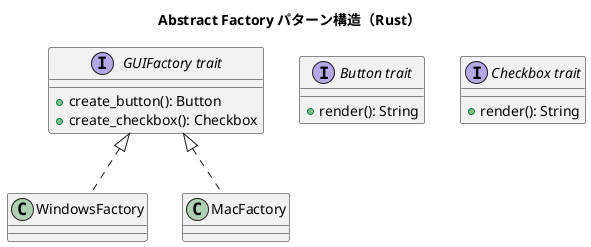

# 第13章: Abstract Factory パターン

## はじめに

Abstract Factory パターンは、関連するオブジェクト群を、その具体的なクラスを指定せずに生成するパターンです。関数型プログラミングでは、ファクトリ関数を使ってこのパターンを実現します。

本章では、UI コンポーネント、ゲームオブジェクト、データベース接続など、様々な例を通じて Abstract Factory パターンの Rust での実装を学びます。

## 1. パターンの構造



## 2. UI コンポーネントファクトリ

### トレイト定義

```rust
/// ボタントレイト
pub trait Button {
    fn render(&self) -> String;
    fn click(&self) -> String;
}

/// チェックボックストレイト
pub trait Checkbox {
    fn render(&self) -> String;
    fn toggle(&self, checked: bool) -> bool;
}

/// テキストフィールドトレイト
pub trait TextField {
    fn render(&self) -> String;
    fn set_value(&self, value: &str) -> String;
}

/// GUI ファクトリトレイト
pub trait GUIFactory {
    fn create_button(&self, label: &str) -> Box<dyn Button>;
    fn create_checkbox(&self, label: &str, checked: bool) -> Box<dyn Checkbox>;
    fn create_text_field(&self, placeholder: &str) -> Box<dyn TextField>;
}
```

### Windows スタイル実装

```rust
pub struct WindowsButton {
    label: String,
}

impl Button for WindowsButton {
    fn render(&self) -> String {
        format!("[WIN Button: {}]", self.label)
    }

    fn click(&self) -> String {
        format!("Windows button '{}' clicked", self.label)
    }
}

pub struct WindowsCheckbox {
    label: String,
    checked: bool,
}

impl Checkbox for WindowsCheckbox {
    fn render(&self) -> String {
        let check = if self.checked { "X" } else { " " };
        format!("[WIN Checkbox: [{}] {}]", check, self.label)
    }

    fn toggle(&self, checked: bool) -> bool {
        checked
    }
}

pub struct WindowsFactory;

impl GUIFactory for WindowsFactory {
    fn create_button(&self, label: &str) -> Box<dyn Button> {
        Box::new(WindowsButton {
            label: label.to_string(),
        })
    }

    fn create_checkbox(&self, label: &str, checked: bool) -> Box<dyn Checkbox> {
        Box::new(WindowsCheckbox {
            label: label.to_string(),
            checked,
        })
    }

    fn create_text_field(&self, placeholder: &str) -> Box<dyn TextField> {
        Box::new(WindowsTextField {
            placeholder: placeholder.to_string(),
        })
    }
}
```

### Mac スタイル実装

```rust
pub struct MacButton {
    label: String,
}

impl Button for MacButton {
    fn render(&self) -> String {
        format!("(MAC Button: {})", self.label)
    }

    fn click(&self) -> String {
        format!("Mac button '{}' clicked", self.label)
    }
}

pub struct MacFactory;

impl GUIFactory for MacFactory {
    fn create_button(&self, label: &str) -> Box<dyn Button> {
        Box::new(MacButton {
            label: label.to_string(),
        })
    }
    // ... 他のメソッド
}
```

### 使用例

```rust
fn create_ui(factory: &dyn GUIFactory) -> String {
    let button = factory.create_button("Submit");
    let checkbox = factory.create_checkbox("Accept Terms", false);
    let text_field = factory.create_text_field("Enter name");

    format!(
        "{}\n{}\n{}",
        button.render(),
        checkbox.render(),
        text_field.render()
    )
}

// Windows UI
let windows_factory = WindowsFactory;
let windows_ui = create_ui(&windows_factory);

// Mac UI
let mac_factory = MacFactory;
let mac_ui = create_ui(&mac_factory);
```

## 3. 関数型ファクトリ

```rust
/// ファクトリ関数型
pub type ButtonFactory = Box<dyn Fn(&str) -> Box<dyn Button>>;
pub type CheckboxFactory = Box<dyn Fn(&str, bool) -> Box<dyn Checkbox>>;

/// ファクトリ関数を作成
pub fn windows_button_factory() -> ButtonFactory {
    Box::new(|label| {
        Box::new(WindowsButton {
            label: label.to_string(),
        })
    })
}

pub fn mac_button_factory() -> ButtonFactory {
    Box::new(|label| {
        Box::new(MacButton {
            label: label.to_string(),
        })
    })
}

/// ファクトリコンテキスト
pub struct FactoryContext {
    pub button_factory: ButtonFactory,
    pub checkbox_factory: CheckboxFactory,
}

impl FactoryContext {
    pub fn windows() -> FactoryContext {
        FactoryContext {
            button_factory: windows_button_factory(),
            checkbox_factory: windows_checkbox_factory(),
        }
    }

    pub fn mac() -> FactoryContext {
        FactoryContext {
            button_factory: mac_button_factory(),
            checkbox_factory: mac_checkbox_factory(),
        }
    }
}
```

## 4. ゲームオブジェクトファクトリ

```rust
/// ゲームキャラクター
pub trait Character {
    fn name(&self) -> &str;
    fn health(&self) -> i32;
    fn attack(&self) -> String;
}

/// 武器
pub trait Weapon {
    fn name(&self) -> &str;
    fn damage(&self) -> i32;
}

/// ゲームファクトリ
pub trait GameFactory {
    fn create_warrior(&self, name: &str) -> Box<dyn Character>;
    fn create_mage(&self, name: &str) -> Box<dyn Character>;
    fn create_sword(&self) -> Box<dyn Weapon>;
    fn create_staff(&self) -> Box<dyn Weapon>;
}

/// ファンタジーテーマ
pub struct FantasyFactory;

impl GameFactory for FantasyFactory {
    fn create_warrior(&self, name: &str) -> Box<dyn Character> {
        Box::new(Knight { name: name.to_string(), health: 100 })
    }
    // ... 他のメソッド
}

/// SF テーマ
pub struct SciFiFactory;

impl GameFactory for SciFiFactory {
    fn create_warrior(&self, name: &str) -> Box<dyn Character> {
        Box::new(SpaceMarine { name: name.to_string(), health: 120 })
    }
    // ... 他のメソッド
}
```

## 5. データベース接続ファクトリ

```rust
/// データベース接続
pub trait Connection {
    fn execute(&self, query: &str) -> Result<String, String>;
    fn close(&self) -> String;
}

/// データベースファクトリ
pub trait DatabaseFactory {
    fn create_connection(&self, config: &ConnectionConfig) -> Box<dyn Connection>;
}

pub struct ConnectionConfig {
    pub host: String,
    pub port: u16,
    pub database: String,
}

/// PostgreSQL ファクトリ
pub struct PostgresFactory;

impl DatabaseFactory for PostgresFactory {
    fn create_connection(&self, config: &ConnectionConfig) -> Box<dyn Connection> {
        Box::new(PostgresConnection {
            connection_string: format!(
                "postgres://{}:{}/{}",
                config.host, config.port, config.database
            ),
        })
    }
}
```

## 6. パターンの利点

1. **一貫性**: 関連するオブジェクト群を一貫して生成
2. **切り替え容易**: ファクトリを切り替えるだけで全体を変更
3. **テスト容易性**: モックファクトリを使ってテスト
4. **分離**: 具体的な実装からクライアントを分離

## 7. Rust での特徴

### トレイトオブジェクトによる抽象化

```rust
// ファクトリとプロダクトの両方をトレイトで抽象化
fn use_factory(factory: &dyn GUIFactory) {
    let button = factory.create_button("OK");
    println!("{}", button.render());
}
```

### ジェネリクスによる静的ディスパッチ

```rust
fn use_factory_generic<F: GUIFactory>(factory: &F) {
    let button = factory.create_button("OK");
    // 静的ディスパッチでオーバーヘッドなし
}
```

## Scala との比較

| 概念 | Scala | Rust |
|------|-------|------|
| 抽象ファクトリ | trait | trait |
| プロダクト | trait | trait |
| 動的生成 | new | Box::new |
| 型パラメータ | [A] | <A> |

## まとめ

本章では、Abstract Factory パターンについて学びました：

1. **UI ファクトリ**: 異なるプラットフォームの UI コンポーネント
2. **関数型ファクトリ**: クロージャを使ったファクトリ
3. **ゲームファクトリ**: テーマに応じたゲームオブジェクト
4. **データベースファクトリ**: 異なるデータベースへの接続

Rust のトレイトとトレイトオブジェクトを使うことで、柔軟で型安全な Abstract Factory を実装できます。

## 参考コード

本章のコード例は以下のファイルで確認できます：

- ソースコード: `app/rust/part5/src/chapter13.rs`

## 次章予告

次章では、**Abstract Server パターン**について学びます。サーバーインターフェースを抽象化する方法を探ります。
