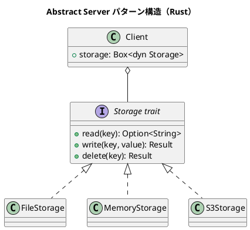

# 第14章: Abstract Server パターン

## はじめに

Abstract Server パターンは、サーバー（サービス提供者）のインターフェースを抽象化し、クライアントを具体的な実装から分離するパターンです。依存性注入（DI）と組み合わせて使用されることが多く、テスト容易性とモジュール性を向上させます。

本章では、ストレージサービス、通知サービス、認証サービスなど、様々な例を通じて Abstract Server パターンの Rust での実装を学びます。

## 1. パターンの構造



## 2. ストレージサービス

### トレイト定義

```rust
/// ストレージトレイト
pub trait Storage {
    fn read(&self, key: &str) -> Option<String>;
    fn write(&mut self, key: &str, value: &str) -> Result<(), String>;
    fn delete(&mut self, key: &str) -> Result<(), String>;
    fn exists(&self, key: &str) -> bool;
    fn list_keys(&self) -> Vec<String>;
}
```

### インメモリ実装

```rust
/// インメモリストレージ
pub struct MemoryStorage {
    data: HashMap<String, String>,
}

impl MemoryStorage {
    pub fn new() -> MemoryStorage {
        MemoryStorage {
            data: HashMap::new(),
        }
    }
}

impl Storage for MemoryStorage {
    fn read(&self, key: &str) -> Option<String> {
        self.data.get(key).cloned()
    }

    fn write(&mut self, key: &str, value: &str) -> Result<(), String> {
        self.data.insert(key.to_string(), value.to_string());
        Ok(())
    }

    fn delete(&mut self, key: &str) -> Result<(), String> {
        self.data.remove(key);
        Ok(())
    }

    fn exists(&self, key: &str) -> bool {
        self.data.contains_key(key)
    }

    fn list_keys(&self) -> Vec<String> {
        self.data.keys().cloned().collect()
    }
}
```

### ファイルストレージ実装

```rust
/// ファイルストレージ
pub struct FileStorage {
    base_path: PathBuf,
}

impl FileStorage {
    pub fn new(base_path: &str) -> FileStorage {
        FileStorage {
            base_path: PathBuf::from(base_path),
        }
    }

    fn file_path(&self, key: &str) -> PathBuf {
        self.base_path.join(key)
    }
}

impl Storage for FileStorage {
    fn read(&self, key: &str) -> Option<String> {
        std::fs::read_to_string(self.file_path(key)).ok()
    }

    fn write(&mut self, key: &str, value: &str) -> Result<(), String> {
        std::fs::write(self.file_path(key), value)
            .map_err(|e| e.to_string())
    }

    fn delete(&mut self, key: &str) -> Result<(), String> {
        std::fs::remove_file(self.file_path(key))
            .map_err(|e| e.to_string())
    }

    fn exists(&self, key: &str) -> bool {
        self.file_path(key).exists()
    }

    fn list_keys(&self) -> Vec<String> {
        std::fs::read_dir(&self.base_path)
            .map(|entries| {
                entries
                    .filter_map(|e| e.ok())
                    .filter_map(|e| e.file_name().into_string().ok())
                    .collect()
            })
            .unwrap_or_default()
    }
}
```

## 3. 通知サービス

```rust
/// 通知トレイト
pub trait NotificationService {
    fn send(&self, recipient: &str, message: &str) -> Result<(), String>;
    fn send_bulk(&self, recipients: &[&str], message: &str) -> Vec<Result<(), String>>;
}

/// メール通知
pub struct EmailNotification {
    smtp_server: String,
}

impl NotificationService for EmailNotification {
    fn send(&self, recipient: &str, message: &str) -> Result<(), String> {
        // 実際にはSMTPサーバーに接続
        println!("Sending email to {} via {}: {}", recipient, self.smtp_server, message);
        Ok(())
    }

    fn send_bulk(&self, recipients: &[&str], message: &str) -> Vec<Result<(), String>> {
        recipients.iter().map(|r| self.send(r, message)).collect()
    }
}

/// SMS 通知
pub struct SmsNotification {
    api_key: String,
}

impl NotificationService for SmsNotification {
    fn send(&self, recipient: &str, message: &str) -> Result<(), String> {
        println!("Sending SMS to {}: {}", recipient, message);
        Ok(())
    }

    fn send_bulk(&self, recipients: &[&str], message: &str) -> Vec<Result<(), String>> {
        recipients.iter().map(|r| self.send(r, message)).collect()
    }
}

/// モック通知（テスト用）
pub struct MockNotification {
    pub sent: RefCell<Vec<(String, String)>>,
}

impl NotificationService for MockNotification {
    fn send(&self, recipient: &str, message: &str) -> Result<(), String> {
        self.sent.borrow_mut().push((recipient.to_string(), message.to_string()));
        Ok(())
    }

    fn send_bulk(&self, recipients: &[&str], message: &str) -> Vec<Result<(), String>> {
        recipients.iter().map(|r| self.send(r, message)).collect()
    }
}
```

## 4. 認証サービス

```rust
/// ユーザー情報
#[derive(Debug, Clone)]
pub struct User {
    pub id: String,
    pub username: String,
    pub email: String,
}

/// 認証結果
pub enum AuthResult {
    Success(User),
    InvalidCredentials,
    AccountLocked,
    Error(String),
}

/// 認証トレイト
pub trait AuthService {
    fn authenticate(&self, username: &str, password: &str) -> AuthResult;
    fn validate_token(&self, token: &str) -> Option<User>;
    fn logout(&mut self, token: &str) -> Result<(), String>;
}

/// 基本認証
pub struct BasicAuthService {
    users: HashMap<String, (String, User)>,  // username -> (password_hash, user)
    sessions: HashMap<String, User>,          // token -> user
}

impl AuthService for BasicAuthService {
    fn authenticate(&self, username: &str, password: &str) -> AuthResult {
        match self.users.get(username) {
            Some((stored_hash, user)) if self.verify_password(password, stored_hash) => {
                AuthResult::Success(user.clone())
            }
            Some(_) => AuthResult::InvalidCredentials,
            None => AuthResult::InvalidCredentials,
        }
    }

    fn validate_token(&self, token: &str) -> Option<User> {
        self.sessions.get(token).cloned()
    }

    fn logout(&mut self, token: &str) -> Result<(), String> {
        self.sessions.remove(token);
        Ok(())
    }
}
```

## 5. 依存性注入

```rust
/// アプリケーションサービス
pub struct Application {
    storage: Box<dyn Storage>,
    notifications: Box<dyn NotificationService>,
    auth: Box<dyn AuthService>,
}

impl Application {
    pub fn new(
        storage: Box<dyn Storage>,
        notifications: Box<dyn NotificationService>,
        auth: Box<dyn AuthService>,
    ) -> Application {
        Application {
            storage,
            notifications,
            auth,
        }
    }

    pub fn save_and_notify(&mut self, key: &str, value: &str, recipient: &str) -> Result<(), String> {
        self.storage.write(key, value)?;
        self.notifications.send(recipient, &format!("Data saved: {}", key))
    }
}

// 本番環境
let app = Application::new(
    Box::new(FileStorage::new("/data")),
    Box::new(EmailNotification { smtp_server: "smtp.example.com".to_string() }),
    Box::new(BasicAuthService::new()),
);

// テスト環境
let test_app = Application::new(
    Box::new(MemoryStorage::new()),
    Box::new(MockNotification { sent: RefCell::new(Vec::new()) }),
    Box::new(MockAuthService::new()),
);
```

## 6. サービスレジストリ

```rust
/// サービスレジストリ
pub struct ServiceRegistry {
    storage: Option<Box<dyn Storage>>,
    notifications: Option<Box<dyn NotificationService>>,
    auth: Option<Box<dyn AuthService>>,
}

impl ServiceRegistry {
    pub fn new() -> ServiceRegistry {
        ServiceRegistry {
            storage: None,
            notifications: None,
            auth: None,
        }
    }

    pub fn with_storage(mut self, storage: Box<dyn Storage>) -> Self {
        self.storage = Some(storage);
        self
    }

    pub fn with_notifications(mut self, notifications: Box<dyn NotificationService>) -> Self {
        self.notifications = Some(notifications);
        self
    }

    pub fn with_auth(mut self, auth: Box<dyn AuthService>) -> Self {
        self.auth = Some(auth);
        self
    }

    pub fn build(self) -> Result<Application, String> {
        Ok(Application::new(
            self.storage.ok_or("Storage not configured")?,
            self.notifications.ok_or("Notifications not configured")?,
            self.auth.ok_or("Auth not configured")?,
        ))
    }
}
```

## 7. パターンの利点

1. **テスト容易性**: モック実装で単体テスト可能
2. **柔軟性**: 実装を切り替え可能
3. **分離**: クライアントと実装の疎結合
4. **拡張性**: 新しい実装を追加しやすい

## Rust での特徴

### トレイトオブジェクトと所有権

```rust
// Box<dyn Trait> で動的ディスパッチ
pub struct Application {
    storage: Box<dyn Storage>,
}
```

### 内部可変性

```rust
// RefCell で内部状態を変更
pub struct MockNotification {
    pub sent: RefCell<Vec<(String, String)>>,
}
```

## まとめ

本章では、Abstract Server パターンについて学びました：

1. **ストレージサービス**: ファイル、メモリ、クラウドストレージ
2. **通知サービス**: メール、SMS、モック
3. **認証サービス**: 基本認証、OAuth、モック
4. **依存性注入**: サービスの組み立て
5. **サービスレジストリ**: ビルダーパターンとの組み合わせ

Rust のトレイトシステムを活用することで、テスト可能で保守性の高いアーキテクチャを実現できます。

## 参考コード

本章のコード例は以下のファイルで確認できます：

- ソースコード: `app/rust/part5/src/chapter14.rs`

## 次章予告

次章では、**ゴシップ好きなバスの運転手**問題を通じて、これまで学んだパターンを実践的に適用します。
