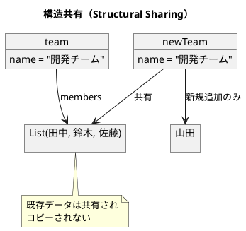

# 第1章: 不変性とデータ変換

## はじめに

関数型プログラミングの最も重要な概念の一つが**不変性（Immutability）**です。不変データ構造を使用することで、プログラムの予測可能性が向上し、並行処理でのバグを防ぎ、コードの理解と保守が容易になります。

本章では、Scala における不変データ構造の基本から、データ変換パイプライン、副作用の分離まで、実践的な例を通じて学びます。

## 1. 不変データ構造の基本

### なぜ不変性が重要なのか

従来の命令型プログラミングでは、変数やオブジェクトの状態を直接変更します：

```java
// Java（可変）
person.setAge(31);  // 元のオブジェクトが変更される
```

これに対し、Scala の case class はデフォルトで不変です。データを「変更」すると、新しいデータ構造が作成されます：

```scala
case class Person(name: String, age: Int)

def updateAge(person: Person, newAge: Int): Person =
  person.copy(age = newAge)

// 使用例
val originalPerson = Person("田中", 30)
val updatedPerson = updateAge(originalPerson, 31)

originalPerson   // => Person("田中", 30)  ← 元のデータは変わらない
updatedPerson    // => Person("田中", 31)  ← 新しいデータ
```

### 不変性の利点

1. **予測可能性**: データが変更されないため、関数の動作を予測しやすい
2. **スレッドセーフ**: 複数のスレッドから安全にアクセスできる
3. **履歴の保持**: 変更前のデータを保持できる（Undo/Redo の実装が容易）
4. **デバッグの容易さ**: データの変更履歴を追跡しやすい

## 2. 構造共有（Structural Sharing）

「毎回新しいデータ構造を作成すると非効率では？」と思うかもしれません。Scala の永続的データ構造は**構造共有**により、効率的にメモリを使用します。

```scala
case class Member(name: String, role: String)
case class Team(name: String, members: List[Member])

def addMember(team: Team, member: Member): Team =
  team.copy(members = team.members :+ member)

val team = Team("開発チーム", List(
  Member("田中", "developer"),
  Member("鈴木", "designer"),
  Member("佐藤", "manager")
))

val newTeam = addMember(team, Member("山田", "developer"))
```

`newTeam` は新しい Team ですが、`name` の値や既存のメンバーデータは `team` と共有されています。変更されていない部分はコピーされず、参照が共有されます。



## 3. データ変換パイプライン

関数型プログラミングでは、データを変換する一連の処理を**パイプライン**として表現します。Scala ではメソッドチェーンを使用して、読みやすいパイプラインを構築できます。

### 実践例：注文処理システム

```scala
case class Item(name: String, price: Int, quantity: Int)
case class Customer(name: String, membership: String)
case class Order(items: List[Item], customer: Customer)

// 各アイテムの小計を計算
def calculateSubtotal(item: Item): Int =
  item.price * item.quantity

// 会員種別に応じた割引率を取得
def membershipDiscount(membership: String): Double =
  membership match
    case "gold"   => 0.1
    case "silver" => 0.05
    case "bronze" => 0.02
    case _        => 0.0

// 注文の合計金額を計算
def calculateTotal(order: Order): Int =
  order.items.map(calculateSubtotal).sum

// 割引後の金額を計算
def applyDiscount(order: Order, total: Int): Double =
  val discountRate = membershipDiscount(order.customer.membership)
  total * (1 - discountRate)

// 注文を処理し、割引後の合計金額を返す
def processOrder(order: Order): Double =
  val total = calculateTotal(order)
  applyDiscount(order, total)
```

### Scala のパイプライン記法

Scala では複数の方法でパイプラインを表現できます：

```scala
// メソッドチェーン
order.items.map(calculateSubtotal).sum

// パターンマッチングと組み合わせ
order.customer.membership match
  case "gold"   => 0.1
  case "silver" => 0.05
  case _        => 0.0

// for 式（モナディックな合成）
for
  item <- order.items
  subtotal = calculateSubtotal(item)
yield subtotal
```

## 4. 副作用の分離

関数型プログラミングでは、**純粋関数**と**副作用を持つ関数**を明確に分離することが重要です。

### 純粋関数とは

- 同じ入力に対して常に同じ出力を返す
- 外部の状態を変更しない（副作用がない）

```scala
// 純粋関数
def pureCalculateTax(amount: Int, taxRate: Double): Double =
  amount * taxRate

// 何度呼んでも同じ結果
pureCalculateTax(1000, 0.1)  // => 100.0
pureCalculateTax(1000, 0.1)  // => 100.0
```

### 副作用の分離パターン

ビジネスロジック（純粋関数）と副作用（I/O）を分離します：

```scala
case class Invoice(subtotal: Int, tax: Double, total: Double)

// ビジネスロジック（純粋関数）
def calculateInvoice(items: List[Item], taxRate: Double): Invoice =
  val subtotal = items.map(calculateSubtotal).sum
  val tax = pureCalculateTax(subtotal, taxRate)
  val total = subtotal + tax
  Invoice(subtotal, tax, total)

// 副作用を含む処理（分離）
def saveInvoice(invoice: Invoice): Invoice =
  // データベースへの保存（副作用）
  println(s"Saving invoice: $invoice")
  invoice

def sendNotification(invoice: Invoice, customerEmail: String): Invoice =
  // メール送信（副作用）
  println(s"Sending notification to: $customerEmail")
  invoice

// 処理全体のオーケストレーション
def processAndSaveInvoice(items: List[Item], taxRate: Double, customerEmail: String): Invoice =
  val invoice = calculateInvoice(items, taxRate)
  val saved = saveInvoice(invoice)
  sendNotification(saved, customerEmail)
```

Scala では副作用を持つ関数に特別なサフィックスを付ける慣例はありませんが、コメントやドキュメントで明示することが推奨されます。また、Cats Effect や ZIO などの関数型エフェクトシステムを使用することで、副作用を型レベルで追跡することも可能です。

## 5. 永続的データ構造の活用：Undo/Redo の実装

不変データ構造を活用すると、履歴管理が非常に簡単に実装できます。

```scala
case class History[A](current: Option[A], past: List[A], future: List[A])

// 履歴を保持するデータ構造を作成する
def createHistory[A](): History[A] =
  History(current = None, past = List.empty, future = List.empty)

// 新しい状態を履歴にプッシュする
def pushState[A](history: History[A], newState: A): History[A] =
  History(
    current = Some(newState),
    past = history.current.toList ++ history.past,
    future = List.empty
  )

// 直前の状態に戻す
def undo[A](history: History[A]): History[A] =
  history.past match
    case Nil => history
    case previous :: rest =>
      History(
        current = Some(previous),
        past = rest,
        future = history.current.toList ++ history.future
      )

// やり直し操作
def redo[A](history: History[A]): History[A] =
  history.future match
    case Nil => history
    case nextState :: rest =>
      History(
        current = Some(nextState),
        past = history.current.toList ++ history.past,
        future = rest
      )
```

### 使用例

```scala
val history = pushState(
  pushState(
    pushState(createHistory[Map[String, String]](), Map("text" -> "Hello")),
    Map("text" -> "Hello World")
  ),
  Map("text" -> "Hello World!")
)

history.current  // => Some(Map("text" -> "Hello World!"))

val afterUndo = undo(history)
afterUndo.current  // => Some(Map("text" -> "Hello World"))

val afterRedo = redo(afterUndo)
afterRedo.current  // => Some(Map("text" -> "Hello World!"))
```

## 6. Iterator による効率的な変換

複数の変換を行う場合、通常は中間コレクションが作成されます。Scala では **Iterator** を使用すると、複数の変換を1回のパスで処理できます。

```scala
case class ProcessedItem(name: String, price: Int, quantity: Int, subtotal: Int)

// 通常のコレクション処理（中間コレクションが作成される）
def processItemsEfficiently(items: List[Item]): List[ProcessedItem] =
  items
    .filter(_.quantity > 0)
    .map(item => ProcessedItem(item.name, item.price, item.quantity, calculateSubtotal(item)))
    .filter(_.subtotal > 100)

// Iterator を使用した効率的な処理（中間コレクションを作成しない）
def processItemsWithIterator(items: List[Item]): List[ProcessedItem] =
  items.iterator
    .filter(_.quantity > 0)
    .map(item => ProcessedItem(item.name, item.price, item.quantity, calculateSubtotal(item)))
    .filter(_.subtotal > 100)
    .toList
```

Iterator の利点：
- 中間コレクションを作成しない
- 遅延評価により必要な要素のみ処理
- メモリ効率が良い

### LazyList による遅延評価

Scala 2.13 以降では LazyList を使用した遅延評価も可能です：

```scala
val lazyNumbers = LazyList.from(1)
  .filter(_ % 2 == 0)
  .take(10)
  .toList  // => List(2, 4, 6, 8, 10, 12, 14, 16, 18, 20)
```

## まとめ

本章では、関数型プログラミングの基礎である不変性について学びました：

1. **不変データ構造**: case class と copy メソッドによる不変性の実現
2. **構造共有**: 効率的なメモリ使用を実現する永続的データ構造
3. **データ変換パイプライン**: メソッドチェーンによる読みやすい変換処理
4. **副作用の分離**: 純粋関数と I/O 処理の明確な分離
5. **履歴管理**: 不変性を活用した Undo/Redo の簡潔な実装
6. **Iterator**: 効率的な遅延評価による複合変換

これらの概念は、関数型プログラミングの他のすべてのパターンの基盤となります。

## 参考コード

本章のコード例は以下のファイルで確認できます：

- ソースコード: `app/scala/part1/src/main/scala/Immutability.scala`
- テストコード: `app/scala/part1/src/test/scala/ImmutabilitySpec.scala`

## 次章予告

次章では、**関数合成と高階関数**について学びます。小さな関数を組み合わせて複雑な処理を構築する方法を探ります。
