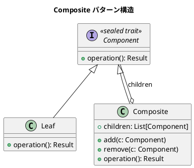

# 第7章: Composite パターン

## はじめに

Composite パターンは、オブジェクトをツリー構造で構成し、個々のオブジェクトとオブジェクトの集合を同じように扱うことができるようにするパターンです。このパターンを使用すると、クライアントは個々のオブジェクトとその組み合わせを区別せずに操作できます。

本章では、図形（Shape）、スイッチ（Switchable）、ファイルシステム、メニュー、数式など、様々な例を通じて Composite パターンの実装を学びます。

## 1. パターンの構造

Composite パターンは以下の要素で構成されます：

- **Component**: 全てのオブジェクトの共通インターフェース
- **Leaf**: 子要素を持たない末端オブジェクト
- **Composite**: 子要素を持つコンテナオブジェクト



## 2. Shape の例 - 図形の Composite パターン

### sealed trait による共通インターフェース

```scala
/** 2D座標 */
case class Point(x: Double, y: Double):
  def +(other: Point): Point = Point(x + other.x, y + other.y)
  def *(factor: Double): Point = Point(x * factor, y * factor)

/** 図形の共通インターフェース（sealed trait） */
sealed trait Shape:
  def translate(dx: Double, dy: Double): Shape
  def scale(factor: Double): Shape
  def area: Double
  def boundingBox: BoundingBox
```

### Leaf の実装

```scala
/** 円（Leaf） */
case class Circle(center: Point, radius: Double) extends Shape:
  def translate(dx: Double, dy: Double): Circle =
    copy(center = Point(center.x + dx, center.y + dy))
  
  def scale(factor: Double): Circle =
    copy(radius = radius * factor)
  
  def area: Double = math.Pi * radius * radius
  
  def boundingBox: BoundingBox =
    BoundingBox(
      Point(center.x - radius, center.y - radius),
      Point(center.x + radius, center.y + radius)
    )

/** 正方形（Leaf） */
case class Square(topLeft: Point, side: Double) extends Shape:
  def translate(dx: Double, dy: Double): Square =
    copy(topLeft = Point(topLeft.x + dx, topLeft.y + dy))
  
  def scale(factor: Double): Square =
    copy(side = side * factor)
  
  def area: Double = side * side
  
  def boundingBox: BoundingBox =
    BoundingBox(topLeft, Point(topLeft.x + side, topLeft.y + side))
```

### Composite の実装

```scala
/** 複合図形（Composite） */
case class CompositeShape(shapes: List[Shape] = Nil) extends Shape:
  def add(shape: Shape): CompositeShape = copy(shapes = shapes :+ shape)
  def remove(shape: Shape): CompositeShape = copy(shapes = shapes.filterNot(_ == shape))
  
  def translate(dx: Double, dy: Double): CompositeShape =
    copy(shapes = shapes.map(_.translate(dx, dy)))
  
  def scale(factor: Double): CompositeShape =
    copy(shapes = shapes.map(_.scale(factor)))
  
  def area: Double = shapes.map(_.area).sum
  
  def boundingBox: BoundingBox =
    shapes match
      case Nil => BoundingBox(Point(0, 0), Point(0, 0))
      case head :: tail => tail.foldLeft(head.boundingBox)((acc, s) => acc.union(s.boundingBox))
  
  def flatten: List[Shape] =
    shapes.flatMap {
      case cs: CompositeShape => cs.flatten
      case s => List(s)
    }
```

### 使用例

```scala
// 個々の図形を作成
val circle = Circle(Point(10, 10), 5)
val square = Square(Point(0, 0), 10)

// 複合図形を作成
val group = CompositeShape()
  .add(circle)
  .add(square)

// 複合図形を移動（全ての子要素が移動する）
val moved = group.translate(5, 5)

// 複合図形を拡大（全ての子要素が拡大する）
val scaled = group.scale(2)

// 面積は全ての子要素の合計
val totalArea = group.area
```

## 3. Switchable の例 - スイッチの Composite パターン

```scala
/** スイッチの共通インターフェース */
sealed trait Switchable:
  def turnOn: Switchable
  def turnOff: Switchable
  def isOn: Boolean

/** 照明（Leaf） */
case class Light(on: Boolean = false, name: String = "Light") extends Switchable:
  def turnOn: Light = copy(on = true)
  def turnOff: Light = copy(on = false)
  def isOn: Boolean = on

/** 調光可能な照明（Leaf） */
case class DimmableLight(intensity: Int = 0, name: String = "DimmableLight") extends Switchable:
  def turnOn: DimmableLight = copy(intensity = 100)
  def turnOff: DimmableLight = copy(intensity = 0)
  def isOn: Boolean = intensity > 0
  def setIntensity(value: Int): DimmableLight =
    copy(intensity = math.max(0, math.min(100, value)))

/** 複合スイッチ（Composite） */
case class CompositeSwitchable(
  switchables: List[Switchable] = Nil,
  name: String = "Group"
) extends Switchable:
  
  def add(switchable: Switchable): CompositeSwitchable =
    copy(switchables = switchables :+ switchable)
  
  def turnOn: CompositeSwitchable =
    copy(switchables = switchables.map(_.turnOn))
  
  def turnOff: CompositeSwitchable =
    copy(switchables = switchables.map(_.turnOff))
  
  def isOn: Boolean = switchables.exists(_.isOn)
  def allOn: Boolean = switchables.nonEmpty && switchables.forall(_.isOn)
```

### 使用例

```scala
val bedroom = CompositeSwitchable(name = "Bedroom")
  .add(Light(name = "Ceiling"))
  .add(DimmableLight(name = "Bedside"))

val livingRoom = CompositeSwitchable(name = "LivingRoom")
  .add(Light(name = "Main"))
  .add(Fan(name = "Ceiling Fan"))

val house = CompositeSwitchable(name = "House")
  .add(bedroom)
  .add(livingRoom)

// 家中の全てのスイッチをオン
val allOn = house.turnOn
```

## 4. FileSystem の例

```scala
/** ファイルシステムエントリの共通インターフェース */
sealed trait FileSystemEntry:
  def name: String
  def size: Long
  def path: String
  def find(predicate: FileSystemEntry => Boolean): List[FileSystemEntry]

/** ファイル（Leaf） */
case class File(name: String, size: Long, parentPath: String = "") extends FileSystemEntry:
  def path: String = if parentPath.isEmpty then name else s"$parentPath/$name"
  def find(predicate: FileSystemEntry => Boolean): List[FileSystemEntry] =
    if predicate(this) then List(this) else Nil

/** ディレクトリ（Composite） */
case class Directory(
  name: String,
  children: List[FileSystemEntry] = Nil,
  parentPath: String = ""
) extends FileSystemEntry:
  
  def add(entry: FileSystemEntry): Directory = ...
  def size: Long = children.map(_.size).sum
  def fileCount: Int = ...
  def directoryCount: Int = ...
```

## 5. Expression の例 - 数式の Composite パターン

```scala
/** 数式の共通インターフェース */
sealed trait Expression:
  def evaluate: Double
  def simplify: Expression
  def variables: Set[String]

/** 数値（Leaf） */
case class Number(value: Double) extends Expression:
  def evaluate: Double = value
  def simplify: Expression = this
  def variables: Set[String] = Set.empty

/** 変数（Leaf） */
case class Variable(name: String, value: Option[Double] = None) extends Expression:
  def evaluate: Double = value.getOrElse(
    throw new IllegalStateException(s"Variable $name has no value")
  )
  def simplify: Expression = value.map(Number(_)).getOrElse(this)
  def variables: Set[String] = if value.isEmpty then Set(name) else Set.empty

/** 加算（Composite） */
case class Add(left: Expression, right: Expression) extends Expression:
  def evaluate: Double = left.evaluate + right.evaluate
  
  def simplify: Expression =
    (left.simplify, right.simplify) match
      case (Number(0), r) => r
      case (l, Number(0)) => l
      case (Number(a), Number(b)) => Number(a + b)
      case (l, r) => Add(l, r)
  
  def variables: Set[String] = left.variables ++ right.variables
```

### 使用例

```scala
// (2 + 3) * 4 = 20
val expr = Multiply(Add(Number(2), Number(3)), Number(4))
expr.evaluate // 20.0

// 変数を含む式
val exprWithVars = Add(Variable("x"), Variable("y"))
val bound = Expression.bind(exprWithVars, Map("x" -> 10.0, "y" -> 20.0))
bound.evaluate // 30.0

// 式の簡略化
Add(Variable("x"), Number(0)).simplify // Variable("x")
Multiply(Variable("x"), Number(1)).simplify // Variable("x")
```

## 6. パターンの利点

1. **統一的な操作**: 個々のオブジェクトとグループを同じインターフェースで操作可能
2. **階層構造**: ネストした構造を自然に表現可能
3. **拡張性**: 新しい Leaf や Composite を追加しやすい
4. **再帰的な構造**: Composite は他の Composite を含むことも可能

## 7. Scala での特徴

### sealed trait による網羅性チェック

```scala
sealed trait Shape
case class Circle(...) extends Shape
case class Square(...) extends Shape
case class CompositeShape(...) extends Shape

// パターンマッチで全ケースをカバーしないと警告
def process(shape: Shape): Unit = shape match
  case Circle(...) => ...
  case Square(...) => ...
  // CompositeShape を忘れると警告
```

### case class による不変性

```scala
// 全ての操作が新しいオブジェクトを返す（元のオブジェクトは変更されない）
val original = CompositeShape().add(Circle(Point(0, 0), 5))
val moved = original.translate(10, 10)

// original は変更されていない
original.shapes(0).asInstanceOf[Circle].center // Point(0, 0)
moved.shapes(0).asInstanceOf[Circle].center    // Point(10, 10)
```

### copy メソッドによる簡潔な更新

```scala
case class Circle(center: Point, radius: Double):
  def translate(dx: Double, dy: Double): Circle =
    copy(center = Point(center.x + dx, center.y + dy))
```

## Clojure との比較

| 概念 | Clojure | Scala |
|------|---------|-------|
| インターフェース | マルチメソッド | sealed trait |
| Leaf | defmethod | case class extends trait |
| Composite | defmethod + mapv | case class extends trait |
| データ構造 | マップ | case class |
| 操作の委譲 | mapv | shapes.map(...) |
| 不変性 | デフォルト | case class + copy |

## まとめ

本章では、Composite パターンについて学びました：

1. **Shape の例**: 図形の移動と拡大を統一的に操作
2. **Switchable の例**: 複数のスイッチをグループ化して操作
3. **FileSystem の例**: ファイルとディレクトリの階層構造
4. **Menu の例**: 単品とセットメニューの価格計算
5. **Expression の例**: 数式の評価と簡略化

Composite パターンは、ツリー構造のデータを扱う際に非常に有効なパターンです。Scala の sealed trait と case class を使うことで、型安全で不変なツリー構造を簡潔に実装できます。

## 参考コード

本章のコード例は以下のファイルで確認できます：

- ソースコード: `app/scala/part3/src/main/scala/CompositePattern.scala`
- テストコード: `app/scala/part3/src/test/scala/CompositePatternSpec.scala`

## 次章予告

次章では、**Decorator パターン**について学びます。既存の機能に新しい機能を動的に追加する方法を探ります。
