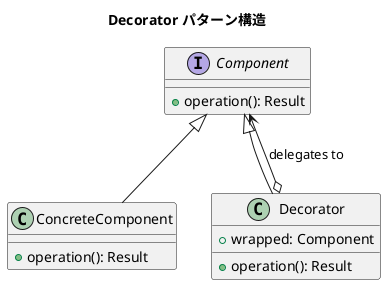

# 第8章: Decorator パターン

## はじめに

Decorator パターンは、既存のオブジェクトに新しい機能を動的に追加するパターンです。このパターンを使用すると、サブクラス化による継承よりも柔軟な方法で機能を拡張できます。

関数型プログラミングでは、高階関数を使って関数をラップし、横断的関心事（ログ、キャッシュ、認証など）を追加します。本章では、形状のジャーナリングと関数デコレータについて学びます。

## 1. パターンの構造



## 2. JournaledShape - 形状デコレータ

### 基本形状の定義

```scala
trait Shape:
  def translate(dx: Double, dy: Double): Shape
  def scale(factor: Double): Shape
  def area: Double

case class Circle(centerX: Double, centerY: Double, radius: Double) extends Shape:
  def translate(dx: Double, dy: Double): Circle =
    copy(centerX = centerX + dx, centerY = centerY + dy)
  def scale(factor: Double): Circle = copy(radius = radius * factor)
  def area: Double = math.Pi * radius * radius
```

### ジャーナル付き形状（デコレータ）

```scala
enum JournalEntry:
  case Translate(dx: Double, dy: Double)
  case Scale(factor: Double)
  case Rotate(angle: Double)

case class JournaledShape(
  shape: Shape,
  journal: List[JournalEntry] = Nil
) extends Shape:
  
  def translate(dx: Double, dy: Double): JournaledShape =
    copy(
      shape = shape.translate(dx, dy),
      journal = journal :+ JournalEntry.Translate(dx, dy)
    )
  
  def scale(factor: Double): JournaledShape =
    copy(
      shape = shape.scale(factor),
      journal = journal :+ JournalEntry.Scale(factor)
    )
  
  def area: Double = shape.area
  
  def clearJournal: JournaledShape = copy(journal = Nil)
  
  def replay(entries: List[JournalEntry]): JournaledShape =
    entries.foldLeft(this) { (js, entry) =>
      entry match
        case JournalEntry.Translate(dx, dy) => js.translate(dx, dy)
        case JournalEntry.Scale(factor) => js.scale(factor)
        case JournalEntry.Rotate(_) => js
    }
```

### 使用例

```scala
val circle = Circle(0, 0, 5)
val journaled = JournaledShape(circle)
  .translate(2, 3)
  .scale(5)

journaled.journal // List(Translate(2, 3), Scale(5))
journaled.shape   // Circle(2, 3, 25)
```

## 3. 関数デコレータ

関数型プログラミングでは、高階関数を使って関数をデコレートします。

### ログデコレータ

```scala
def withLogging[A, B](f: A => B, name: String)(implicit log: LogCollector): A => B =
  (a: A) =>
    log.add(s"[$name] called with: $a")
    val result = f(a)
    log.add(s"[$name] returned: $result")
    result

// 使用例
implicit val log = new LogCollector
val add: Int => Int = _ + 10
val logged = withLogging(add, "add")
logged(5) // 15 (ログも記録される)
```

### リトライデコレータ

```scala
def withRetry[A, B](f: A => B, maxRetries: Int, delay: Long = 0): A => B =
  (a: A) =>
    def attempt(remaining: Int): B =
      Try(f(a)) match
        case Success(result) => result
        case Failure(e) if remaining > 0 =>
          if delay > 0 then Thread.sleep(delay)
          attempt(remaining - 1)
        case Failure(e) => throw e
    attempt(maxRetries)

// 使用例
val unreliableFn = withRetry(callExternalService, maxRetries = 3)
```

### キャッシュデコレータ

```scala
def withCache[A, B](f: A => B): A => B =
  val cache = mutable.Map.empty[A, B]
  (a: A) => cache.getOrElseUpdate(a, f(a))

// TTL付きキャッシュ
def withTTLCache[A, B](f: A => B, ttlMs: Long): A => B =
  val cache = mutable.Map.empty[A, (B, Long)]
  (a: A) =>
    val now = System.currentTimeMillis()
    cache.get(a) match
      case Some((value, timestamp)) if now - timestamp < ttlMs => value
      case _ =>
        val result = f(a)
        cache(a) = (result, now)
        result
```

### バリデーションデコレータ

```scala
def withValidation[A, B](f: A => B)(validator: A => Boolean, errorMsg: String): A => B =
  (a: A) =>
    if validator(a) then f(a)
    else throw new IllegalArgumentException(s"$errorMsg: $a")

// 使用例
val positiveOnly = withValidation[Int, Int](_ * 2)(_ > 0, "Must be positive")
positiveOnly(5)   // 10
positiveOnly(-5)  // Exception!
```

### エラーハンドリングデコレータ

```scala
// Option に変換
def withOptionResult[A, B](f: A => B): A => Option[B] =
  (a: A) => Try(f(a)).toOption

// Either に変換
def withEitherResult[A, B](f: A => B): A => Either[Throwable, B] =
  (a: A) => Try(f(a)).toEither

// デフォルト値を返す
def withDefault[A, B](f: A => B, default: B): A => B =
  (a: A) => Try(f(a)).getOrElse(default)
```

## 4. デコレータの合成

```scala
object DecoratorComposition:
  def compose[A, B](f: A => B, decorators: List[(A => B) => (A => B)]): A => B =
    decorators.foldLeft(f) { (decorated, decorator) =>
      decorator(decorated)
    }

// 使用例
val fn: Int => Int = _ * 2
val decorators: List[(Int => Int) => (Int => Int)] = List(
  f => withCache(f),
  f => withLogging(f, "fn")
)
val composed = DecoratorComposition.compose(fn, decorators)
```

## 5. AuditedList - コレクションデコレータ

```scala
case class AuditedList[A](
  items: List[A],
  operations: List[String] = Nil
):
  def add(item: A): AuditedList[A] =
    copy(items = items :+ item, operations = operations :+ s"add($item)")
  
  def remove(item: A): AuditedList[A] =
    copy(items = items.filterNot(_ == item), operations = operations :+ s"remove($item)")
  
  def map[B](f: A => B): AuditedList[B] =
    AuditedList(items.map(f), operations :+ "map")
  
  def filter(p: A => Boolean): AuditedList[A] =
    copy(items = items.filter(p), operations :+ "filter")

// 使用例
val list = AuditedList.empty[Int].add(1).add(2).add(3)
list.operations // List("add(1)", "add(2)", "add(3)")
```

## 6. HTTPクライアントデコレータ

```scala
trait HttpClient:
  def get(url: String): HttpResponse

class SimpleHttpClient extends HttpClient:
  def get(url: String): HttpResponse = HttpResponse(200, s"Response from $url")

// ログ付きクライアント
class LoggingHttpClient(client: HttpClient)(implicit log: LogCollector) extends HttpClient:
  def get(url: String): HttpResponse =
    log.add(s"[HTTP] GET $url")
    val response = client.get(url)
    log.add(s"[HTTP] Response: ${response.status}")
    response

// キャッシュ付きクライアント
class CachingHttpClient(client: HttpClient) extends HttpClient:
  private val cache = mutable.Map.empty[String, HttpResponse]
  def get(url: String): HttpResponse = cache.getOrElseUpdate(url, client.get(url))

// デコレータの組み合わせ
val client = new LoggingHttpClient(
  new CachingHttpClient(
    new SimpleHttpClient
  )
)
```

## 7. FunctionBuilder - ビルダースタイル

```scala
class FunctionBuilder[A, B](f: A => B):
  private var current: A => B = f
  
  def withLogging(name: String)(implicit log: LogCollector): FunctionBuilder[A, B] =
    current = FunctionDecorators.withLogging(current, name)
    this
  
  def withCache(): FunctionBuilder[A, B] =
    current = FunctionDecorators.withCache(current)
    this
  
  def withValidation(validator: A => Boolean, errorMsg: String): FunctionBuilder[A, B] =
    current = FunctionDecorators.withValidation(current)(validator, errorMsg)
    this
  
  def build: A => B = current

// 使用例
val fn = FunctionBuilder[Int, Int](_ * 2)
  .withLogging("double")
  .withCache()
  .withValidation(_ > 0, "Must be positive")
  .build
```

## 8. パターンの利点

1. **単一責任の原則**: 各デコレータは一つの機能のみを追加
2. **開放/閉鎖の原則**: 既存コードを変更せずに機能を追加
3. **柔軟な組み合わせ**: 必要な機能だけを選択して組み合わせ可能
4. **実行時の決定**: どのデコレータを適用するか実行時に決定可能

## Clojure との比較

| 概念 | Clojure | Scala |
|------|---------|-------|
| 高階関数 | `(defn with-logging [f] ...)` | `def withLogging[A,B](f: A => B): A => B` |
| クロージャ | `(let [cache (atom {})] ...)` | `val cache = mutable.Map.empty` |
| 合成 | `(comp decorator1 decorator2)` | `compose(f, decorators)` |
| 状態 | `atom` | `var` or mutable collection |

## まとめ

本章では、Decorator パターンについて学びました：

1. **JournaledShape**: 形状操作の履歴を記録するデコレータ
2. **関数デコレータ**: ログ、リトライ、キャッシュなどの横断的関心事
3. **AuditedList**: 操作履歴付きコレクション
4. **HTTPクライアント**: クラスベースのデコレータ
5. **FunctionBuilder**: ビルダースタイルのデコレータ適用

Decorator パターンは、既存のコードを変更せずに機能を拡張する強力なパターンです。

## 参考コード

本章のコード例は以下のファイルで確認できます：

- ソースコード: `app/scala/part3/src/main/scala/DecoratorPattern.scala`
- テストコード: `app/scala/part3/src/test/scala/DecoratorPatternSpec.scala`

## 次章予告

次章では、**Adapter パターン**について学びます。異なるインターフェース間の変換とレガシーシステムとの統合を探ります。
