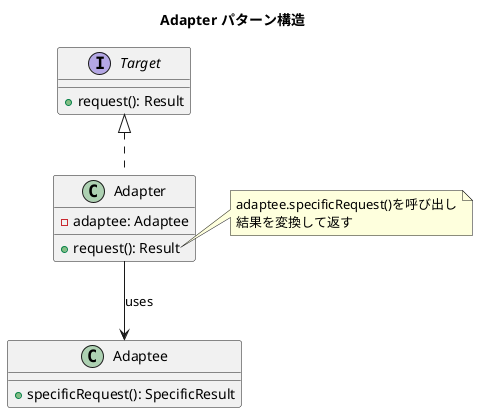

# 第9章: Adapter パターン

## はじめに

Adapter パターンは、既存のクラスのインターフェースを、クライアントが期待する別のインターフェースに変換するパターンです。このパターンにより、互換性のないインターフェースを持つクラス同士が協調動作できるようになります。

関数型プログラミングでは、関数変換やデータ変換を通じて異なるシステム間の「翻訳」を行います。本章では、様々なアダプターの実装パターンを学びます。

## 1. パターンの構造



## 2. VariableLightAdapter - インターフェースアダプター

### ターゲットインターフェース

```scala
/** スイッチの共通インターフェース */
trait Switchable:
  def turnOn(): Switchable
  def turnOff(): Switchable
  def isOn: Boolean
```

### アダプティー（既存クラス）

```scala
/** 可変強度ライト - 強度を0-100で設定する既存クラス */
case class VariableLight(intensity: Int = 0):
  require(intensity >= 0 && intensity <= 100, "Intensity must be 0-100")
  
  def setIntensity(value: Int): VariableLight =
    copy(intensity = math.max(0, math.min(100, value)))
  
  def brighten(amount: Int): VariableLight =
    setIntensity(intensity + amount)
  
  def dim(amount: Int): VariableLight =
    setIntensity(intensity - amount)
```

### アダプター

```scala
/** VariableLight を Switchable インターフェースに適応させるアダプター */
case class VariableLightAdapter(
  light: VariableLight,
  minIntensity: Int = 0,
  maxIntensity: Int = 100
) extends Switchable:
  
  def turnOn(): VariableLightAdapter =
    copy(light = light.setIntensity(maxIntensity))
  
  def turnOff(): VariableLightAdapter =
    copy(light = light.setIntensity(minIntensity))
  
  def isOn: Boolean = light.intensity > minIntensity
  
  /** アダプター固有：強度を取得 */
  def getIntensity: Int = light.intensity
```

### 使用例

```scala
val adapter = VariableLightAdapter(VariableLight(0))
val onAdapter = adapter.turnOn()
onAdapter.isOn        // true
onAdapter.getIntensity // 100

val offAdapter = onAdapter.turnOff()
offAdapter.isOn        // false
offAdapter.getIntensity // 0
```

## 3. UserFormatAdapter - データフォーマット変換

### データ形式の定義

```scala
/** 旧ユーザーフォーマット */
case class OldUserFormat(
  firstName: String,
  lastName: String,
  emailAddress: String,
  phoneNumber: String
)

/** 新ユーザーフォーマット */
case class NewUserFormat(
  name: String,
  email: String,
  phone: String,
  metadata: Map[String, Any] = Map.empty
)
```

### 双方向アダプター

```scala
object UserFormatAdapter:
  /** 旧フォーマット → 新フォーマット */
  def adaptOldToNew(old: OldUserFormat): NewUserFormat =
    NewUserFormat(
      name = s"${old.lastName} ${old.firstName}",
      email = old.emailAddress,
      phone = old.phoneNumber,
      metadata = Map(
        "migrated" -> true,
        "originalFormat" -> "old"
      )
    )
  
  /** 新フォーマット → 旧フォーマット */
  def adaptNewToOld(newUser: NewUserFormat): OldUserFormat =
    val nameParts = newUser.name.split(" ", 2)
    val lastName = nameParts.headOption.getOrElse("")
    val firstName = if nameParts.length > 1 then nameParts(1) else ""
    OldUserFormat(
      firstName = firstName,
      lastName = lastName,
      emailAddress = newUser.email,
      phoneNumber = newUser.phone
    )
```

### 使用例

```scala
val oldUser = OldUserFormat("太郎", "山田", "taro@example.com", "090-1234-5678")
val newUser = UserFormatAdapter.adaptOldToNew(oldUser)
// NewUserFormat("山田 太郎", "taro@example.com", "090-1234-5678", Map("migrated" -> true, ...))

val restored = UserFormatAdapter.adaptNewToOld(newUser)
// OldUserFormat("太郎", "山田", "taro@example.com", "090-1234-5678")
```

## 4. ApiResponseAdapter - 外部API統合

### データ構造

```scala
/** 外部 API のレスポンス形式 */
case class ExternalApiResponse(
  data: Map[String, Any]
)

/** 内部データ形式 */
case class InternalData(
  id: String,
  name: String,
  createdAt: LocalDateTime,
  metadata: Map[String, Any] = Map.empty
)
```

### アダプター

```scala
object ApiResponseAdapter:
  /** 外部レスポンス → 内部形式 */
  def adaptExternalToInternal(external: ExternalApiResponse): Option[InternalData] =
    for
      dataObj <- external.data.get("data").collect { case m: Map[_, _] => m }
      id <- dataObj.get("identifier").collect { case s: String => s }
      attributes <- dataObj.get("attributes").collect { case m: Map[_, _] => m }
      name <- attributes.get("name").collect { case s: String => s }
      createdAtStr <- attributes.get("createdAt").collect { case s: String => s }
      createdAt <- Try(LocalDateTime.parse(createdAtStr)).toOption
    yield InternalData(
      id = id,
      name = name,
      createdAt = createdAt,
      metadata = Map("source" -> "external-api")
    )
```

## 5. TemperatureAdapter - 単位変換

```scala
case class Celsius(value: Double)
case class Fahrenheit(value: Double)
case class Kelvin(value: Double)

object TemperatureAdapter:
  def celsiusToFahrenheit(c: Celsius): Fahrenheit =
    Fahrenheit(c.value * 9.0 / 5.0 + 32)
  
  def fahrenheitToCelsius(f: Fahrenheit): Celsius =
    Celsius((f.value - 32) * 5.0 / 9.0)
  
  def celsiusToKelvin(c: Celsius): Kelvin =
    Kelvin(c.value + 273.15)
  
  def kelvinToCelsius(k: Kelvin): Celsius =
    Celsius(k.value - 273.15)
  
  // 合成による変換
  def fahrenheitToKelvin(f: Fahrenheit): Kelvin =
    celsiusToKelvin(fahrenheitToCelsius(f))
  
  def kelvinToFahrenheit(k: Kelvin): Fahrenheit =
    celsiusToFahrenheit(kelvinToCelsius(k))
```

### 使用例

```scala
val celsius = Celsius(100)
val fahrenheit = TemperatureAdapter.celsiusToFahrenheit(celsius)
// Fahrenheit(212.0)

val kelvin = TemperatureAdapter.celsiusToKelvin(Celsius(0))
// Kelvin(273.15)
```

## 6. DateTimeAdapter - 日時フォーマット変換

```scala
object DateTimeAdapter:
  /** Unix タイムスタンプ → LocalDateTime */
  def fromUnixTimestamp(timestamp: Long): LocalDateTime =
    LocalDateTime.ofInstant(Instant.ofEpochSecond(timestamp), ZoneId.systemDefault())
  
  /** LocalDateTime → Unix タイムスタンプ */
  def toUnixTimestamp(dateTime: LocalDateTime): Long =
    dateTime.atZone(ZoneId.systemDefault()).toEpochSecond
  
  /** ISO 8601 文字列 → LocalDateTime */
  def fromIso8601(str: String): Option[LocalDateTime] =
    Try(LocalDateTime.parse(str, DateTimeFormatter.ISO_DATE_TIME)).toOption
  
  /** LocalDateTime → ISO 8601 文字列 */
  def toIso8601(dateTime: LocalDateTime): String =
    dateTime.format(DateTimeFormatter.ISO_DATE_TIME)
  
  /** 日本語形式 → LocalDateTime */
  def fromJapanese(str: String): Option[LocalDateTime] =
    val formatter = DateTimeFormatter.ofPattern("yyyy年MM月dd日 HH時mm分ss秒")
    Try(LocalDateTime.parse(str, formatter)).toOption
  
  /** LocalDateTime → 日本語形式 */
  def toJapanese(dateTime: LocalDateTime): String =
    val formatter = DateTimeFormatter.ofPattern("yyyy年MM月dd日 HH時mm分ss秒")
    dateTime.format(formatter)
```

### 使用例

```scala
val now = LocalDateTime.of(2024, 1, 15, 10, 30, 0)

DateTimeAdapter.toIso8601(now)      // "2024-01-15T10:30:00"
DateTimeAdapter.toJapanese(now)     // "2024年01月15日 10時30分00秒"
DateTimeAdapter.toUnixTimestamp(now) // 1705307400 (タイムゾーン依存)
```

## 7. CloudStorageAdapter - ファイルシステムアダプター

### インターフェース定義

```scala
/** ローカルファイルシステム（ターゲット） */
trait LocalFileSystem:
  def readFile(path: String): String
  def writeFile(path: String, content: String): Unit
  def deleteFile(path: String): Unit
  def exists(path: String): Boolean

/** クラウドストレージ（アダプティー） */
trait CloudStorage:
  def getObject(bucket: String, key: String): Array[Byte]
  def putObject(bucket: String, key: String, data: Array[Byte]): Unit
  def deleteObject(bucket: String, key: String): Unit
  def objectExists(bucket: String, key: String): Boolean
```

### アダプター実装

```scala
class CloudStorageAdapter(
  cloudStorage: CloudStorage,
  bucket: String
) extends LocalFileSystem:
  
  def readFile(path: String): String =
    new String(cloudStorage.getObject(bucket, path), "UTF-8")
  
  def writeFile(path: String, content: String): Unit =
    cloudStorage.putObject(bucket, path, content.getBytes("UTF-8"))
  
  def deleteFile(path: String): Unit =
    cloudStorage.deleteObject(bucket, path)
  
  def exists(path: String): Boolean =
    cloudStorage.objectExists(bucket, path)
```

### 使用例

```scala
val cloudStorage = new InMemoryCloudStorage
val fileSystem: LocalFileSystem = CloudStorageAdapter(cloudStorage, "my-bucket")

fileSystem.writeFile("test.txt", "Hello, World!")
fileSystem.readFile("test.txt")  // "Hello, World!"
fileSystem.exists("test.txt")    // true
fileSystem.deleteFile("test.txt")
fileSystem.exists("test.txt")    // false
```

## 8. LegacyLoggerAdapter - レガシーシステム統合

```scala
/** 標準ロガー（ターゲット） */
trait StandardLogger:
  def debug(message: String): Unit
  def info(message: String): Unit
  def warn(message: String): Unit
  def error(message: String): Unit

/** レガシーロガー（アダプティー） */
trait LegacyLogger:
  def log(level: Int, message: String): Unit

object LegacyLogger:
  val DEBUG = 0
  val INFO = 1
  val WARN = 2
  val ERROR = 3

/** アダプター */
class LegacyLoggerAdapter(legacyLogger: LegacyLogger) extends StandardLogger:
  def debug(message: String): Unit = legacyLogger.log(LegacyLogger.DEBUG, message)
  def info(message: String): Unit = legacyLogger.log(LegacyLogger.INFO, message)
  def warn(message: String): Unit = legacyLogger.log(LegacyLogger.WARN, message)
  def error(message: String): Unit = legacyLogger.log(LegacyLogger.ERROR, message)
```

## 9. CurrencyAdapter - 通貨変換

```scala
case class Money(amount: BigDecimal, currency: String)

trait ExchangeRateProvider:
  def getRate(from: String, to: String): BigDecimal

class CurrencyAdapter(rateProvider: ExchangeRateProvider):
  def convert(money: Money, toCurrency: String): Money =
    if money.currency == toCurrency then money
    else
      val rate = rateProvider.getRate(money.currency, toCurrency)
      Money(money.amount * rate, toCurrency)
```

### 使用例

```scala
val rates = Map(("USD", "JPY") -> BigDecimal(150))
val adapter = CurrencyAdapter(FixedRateProvider(rates))

val usd = Money(BigDecimal(100), "USD")
val jpy = adapter.convert(usd, "JPY")
// Money(15000, "JPY")
```

## 10. JavaIteratorAdapter - イテレーター変換

```scala
/** Java 風イテレーター */
trait JavaStyleIterator[A]:
  def hasNext: Boolean
  def next(): A

/** Scala Iterator へのアダプター */
class JavaIteratorAdapter[A](javaIter: JavaStyleIterator[A]) extends Iterator[A]:
  def hasNext: Boolean = javaIter.hasNext
  def next(): A = javaIter.next()
```

### 使用例

```scala
val javaIter = new ArrayJavaIterator(Array(1, 2, 3, 4, 5))
val scalaIter: Iterator[Int] = JavaIteratorAdapter(javaIter)

scalaIter.toList           // List(1, 2, 3, 4, 5)
scalaIter.filter(_ % 2 == 0).toList // List(2, 4)
```

## 11. FunctionAdapter - 関数変換

```scala
object FunctionAdapter:
  /** (A, B) => C を A => B => C にカリー化 */
  def curry[A, B, C](f: (A, B) => C): A => B => C =
    a => b => f(a, b)
  
  /** A => B => C を (A, B) => C にアンカリー化 */
  def uncurry[A, B, C](f: A => B => C): (A, B) => C =
    (a, b) => f(a)(b)
  
  /** 引数の順序を入れ替え */
  def flip[A, B, C](f: (A, B) => C): (B, A) => C =
    (b, a) => f(a, b)
  
  /** Option を Either に変換 */
  def optionToEither[A, E](option: Option[A], error: => E): Either[E, A] =
    option.toRight(error)
  
  /** Either を Option に変換 */
  def eitherToOption[E, A](either: Either[E, A]): Option[A] =
    either.toOption
  
  /** Try を Either に変換 */
  def tryToEither[A](t: Try[A]): Either[Throwable, A] =
    t.toEither
  
  /** Scala 関数 → Java 関数 */
  def toJavaFunction[A, B](f: A => B): java.util.function.Function[A, B] =
    new java.util.function.Function[A, B]:
      def apply(a: A): B = f(a)
  
  /** Java 関数 → Scala 関数 */
  def fromJavaFunction[A, B](f: java.util.function.Function[A, B]): A => B =
    a => f.apply(a)
```

### 使用例

```scala
// カリー化
val add = (a: Int, b: Int) => a + b
val curriedAdd = FunctionAdapter.curry(add)
curriedAdd(1)(2)  // 3

// 引数の入れ替え
val subtract = (a: Int, b: Int) => a - b
val flipped = FunctionAdapter.flip(subtract)
flipped(1, 10)  // 9 (10 - 1)

// エラー型の変換
val maybeValue: Option[Int] = Some(42)
val eitherValue = FunctionAdapter.optionToEither(maybeValue, "Not found")
// Right(42)
```

## 12. パターンの利点

1. **単一責任**: アダプターは変換のみを担当
2. **開放/閉鎖**: 既存コードを変更せずに新しいインターフェースに対応
3. **再利用性**: レガシーコードを新しいシステムで活用
4. **テスト容易性**: アダプターを介してモックに置換可能
5. **段階的移行**: 新旧システムを共存させながら移行

## Clojure との比較

| 概念 | Clojure | Scala |
|------|---------|-------|
| インターフェース | Protocol | trait |
| アダプター実装 | `extend-protocol` | class extends trait |
| データ変換 | 純粋関数 | オブジェクトメソッド or 関数 |
| 型安全性 | 動的型付け | 静的型付け |
| カリー化 | デフォルト対応 | `curry` 明示的変換 |

## まとめ

本章では、Adapter パターンについて学びました：

1. **VariableLightAdapter**: インターフェースの適応
2. **UserFormatAdapter**: 双方向データ変換
3. **ApiResponseAdapter**: 外部API統合
4. **TemperatureAdapter**: 単位変換
5. **DateTimeAdapter**: 日時フォーマット変換
6. **CloudStorageAdapter**: ファイルシステム抽象化
7. **LegacyLoggerAdapter**: レガシーシステム統合
8. **CurrencyAdapter**: 通貨変換
9. **JavaIteratorAdapter**: イテレーター変換
10. **FunctionAdapter**: 関数型変換（カリー化、型変換）

Adapter パターンは、異なるシステム間の「翻訳層」として機能し、レガシーコードの再利用と段階的なシステム移行を可能にします。

## 参考コード

本章のコード例は以下のファイルで確認できます：

- ソースコード: `app/scala/part3/src/main/scala/AdapterPattern.scala`
- テストコード: `app/scala/part3/src/test/scala/AdapterPatternSpec.scala`

## 次章予告

次章では、**Strategy パターン**について学びます。アルゴリズムをカプセル化し、実行時に切り替え可能にする方法を探ります。
