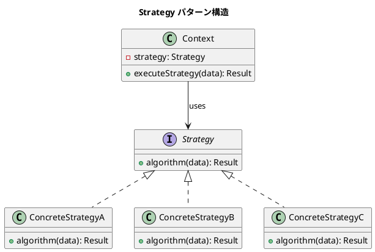

# 第10章: Strategy パターン

## はじめに

Strategy パターンは、アルゴリズムをカプセル化し、それらを交換可能にするパターンです。このパターンを使用すると、アルゴリズムをクライアントから独立して変更できます。

本章では、料金計算、配送料金、支払い方法などの例を通じて、トレイトと高階関数による Strategy パターンの実装を学びます。

## 1. パターンの構造



## 2. 料金計算戦略（トレイトベース）

### Strategy インターフェース

```scala
trait PricingStrategy:
  def calculatePrice(amount: BigDecimal): BigDecimal
```

### ConcreteStrategy: 通常料金

```scala
case object RegularPricing extends PricingStrategy:
  def calculatePrice(amount: BigDecimal): BigDecimal = amount
```

### ConcreteStrategy: 割引料金

```scala
case class DiscountPricing(discountRate: BigDecimal) extends PricingStrategy:
  require(discountRate >= 0 && discountRate <= 1, "Discount rate must be 0-1")
  
  def calculatePrice(amount: BigDecimal): BigDecimal =
    amount * (BigDecimal(1) - discountRate)
```

### ConcreteStrategy: 会員料金

```scala
enum MemberLevel(val discountRate: BigDecimal):
  case Gold extends MemberLevel(BigDecimal("0.20"))
  case Silver extends MemberLevel(BigDecimal("0.15"))
  case Bronze extends MemberLevel(BigDecimal("0.10"))

case class MemberPricing(level: MemberLevel) extends PricingStrategy:
  def calculatePrice(amount: BigDecimal): BigDecimal =
    amount * (BigDecimal(1) - level.discountRate)
```

### 使用例

```scala
// 通常料金
RegularPricing.calculatePrice(BigDecimal(1000))  // 1000

// 10%割引
DiscountPricing(BigDecimal("0.10")).calculatePrice(BigDecimal(1000))  // 900

// ゴールド会員料金
MemberPricing(MemberLevel.Gold).calculatePrice(BigDecimal(1000))  // 800
```

## 3. Context: ショッピングカート

```scala
case class CartItem(name: String, price: BigDecimal, quantity: Int = 1)

case class ShoppingCart(
  items: List[CartItem] = Nil,
  strategy: PricingStrategy = RegularPricing
):
  def addItem(item: CartItem): ShoppingCart =
    copy(items = items :+ item)
  
  def removeItem(name: String): ShoppingCart =
    copy(items = items.filterNot(_.name == name))
  
  def changeStrategy(newStrategy: PricingStrategy): ShoppingCart =
    copy(strategy = newStrategy)
  
  def subtotal: BigDecimal =
    items.map(item => item.price * item.quantity).sum
  
  def total: BigDecimal =
    strategy.calculatePrice(subtotal)
```

### 使用例

```scala
val cart = ShoppingCart(
  CartItem("Item A", BigDecimal(500)),
  CartItem("Item B", BigDecimal(300), quantity = 2)
)

cart.subtotal  // 1100
cart.total     // 1100 (通常料金)

val discountedCart = cart.changeStrategy(MemberPricing(MemberLevel.Gold))
discountedCart.total  // 880 (20%割引)
```

## 4. 関数型アプローチ

関数を第一級オブジェクトとして扱い、より簡潔に Strategy パターンを実装します。

### 関数による Strategy

```scala
object FunctionalStrategy:
  type PriceFn = BigDecimal => BigDecimal
  
  val regular: PriceFn = identity
  
  def discount(rate: BigDecimal): PriceFn =
    amount => amount * (BigDecimal(1) - rate)
  
  def member(level: MemberLevel): PriceFn =
    discount(level.discountRate)
  
  def tax(rate: BigDecimal): PriceFn =
    amount => amount * (BigDecimal(1) + rate)
  
  def fixedDiscount(discountAmount: BigDecimal): PriceFn =
    amount => (amount - discountAmount).max(BigDecimal(0))
```

### 戦略の合成

関数型アプローチの大きな利点は、戦略を簡単に合成できることです。

```scala
def compose(strategies: PriceFn*): PriceFn =
  amount => strategies.foldLeft(amount)((a, f) => f(a))

// 使用例：割引後に税金を適用
val finalPrice = compose(
  discount(BigDecimal("0.10")),
  tax(BigDecimal("0.08"))
)

finalPrice(BigDecimal(1000))  // 972 (1000 * 0.9 * 1.08)
```

### 条件付き戦略

```scala
def conditional(
  predicate: BigDecimal => Boolean,
  thenStrategy: PriceFn,
  elseStrategy: PriceFn = regular
): PriceFn =
  amount =>
    if predicate(amount) then thenStrategy(amount)
    else elseStrategy(amount)

// 5000円以上で20%割引
val highValueDiscount = conditional(
  _ >= BigDecimal(5000),
  discount(BigDecimal("0.20")),
  regular
)

highValueDiscount(BigDecimal(6000))  // 4800
highValueDiscount(BigDecimal(3000))  // 3000
```

### 段階別戦略

```scala
def tiered(tiers: List[(BigDecimal, PriceFn)]): PriceFn =
  amount =>
    tiers
      .sortBy(-_._1)
      .find(_._1 <= amount)
      .map(_._2(amount))
      .getOrElse(amount)

val tierStrategy = tiered(List(
  BigDecimal(10000) -> discount(BigDecimal("0.20")),
  BigDecimal(5000) -> discount(BigDecimal("0.10")),
  BigDecimal(0) -> regular
))

tierStrategy(BigDecimal(10000))  // 8000 (20%割引)
tierStrategy(BigDecimal(6000))   // 5400 (10%割引)
tierStrategy(BigDecimal(3000))   // 3000 (割引なし)
```

## 5. 配送料金戦略

```scala
trait ShippingStrategy:
  def calculate(weight: Double, distance: Double): BigDecimal

case object StandardShipping extends ShippingStrategy:
  def calculate(weight: Double, distance: Double): BigDecimal =
    BigDecimal(weight * 10 + distance * 5)

case object ExpressShipping extends ShippingStrategy:
  def calculate(weight: Double, distance: Double): BigDecimal =
    BigDecimal(weight * 20 + distance * 15)

case class FreeShipping(minOrderAmount: BigDecimal) extends ShippingStrategy:
  def calculate(weight: Double, distance: Double): BigDecimal =
    BigDecimal(0)

case class WeightBasedShipping(
  baseRate: BigDecimal,
  perKgRate: BigDecimal,
  freeThreshold: Double = Double.MaxValue
) extends ShippingStrategy:
  def calculate(weight: Double, distance: Double): BigDecimal =
    if weight >= freeThreshold then BigDecimal(0)
    else baseRate + BigDecimal(weight) * perKgRate
```

### 使用例

```scala
StandardShipping.calculate(2.0, 100.0)  // 520
ExpressShipping.calculate(2.0, 100.0)   // 1540
FreeShipping(BigDecimal(5000)).calculate(10.0, 1000.0)  // 0
```

## 6. 注文コンテキスト

```scala
case class Order(
  cart: ShoppingCart,
  shippingStrategy: ShippingStrategy = StandardShipping,
  weight: Double = 1.0,
  distance: Double = 10.0
):
  def itemsTotal: BigDecimal = cart.total
  def shippingCost: BigDecimal = shippingStrategy.calculate(weight, distance)
  def grandTotal: BigDecimal = itemsTotal + shippingCost
  
  def changeShipping(strategy: ShippingStrategy): Order =
    copy(shippingStrategy = strategy)
```

## 7. 支払い戦略

```scala
case class PaymentResult(
  success: Boolean,
  transactionId: Option[String] = None,
  fee: BigDecimal = BigDecimal(0),
  message: String = ""
)

trait PaymentStrategy:
  def pay(amount: BigDecimal): PaymentResult
  def fee(amount: BigDecimal): BigDecimal

case class CreditCardPayment(
  cardNumber: String,
  feeRate: BigDecimal = BigDecimal("0.03")
) extends PaymentStrategy:
  def pay(amount: BigDecimal): PaymentResult =
    PaymentResult(
      success = true,
      transactionId = Some(s"CC-${System.currentTimeMillis()}"),
      fee = fee(amount),
      message = s"Charged ${amount + fee(amount)} to card"
    )
  def fee(amount: BigDecimal): BigDecimal = amount * feeRate

case class BankTransferPayment(
  bankCode: String,
  fixedFee: BigDecimal = BigDecimal(300)
) extends PaymentStrategy:
  def pay(amount: BigDecimal): PaymentResult =
    PaymentResult(
      success = true,
      transactionId = Some(s"BT-${System.currentTimeMillis()}"),
      fee = fixedFee,
      message = s"Transfer ${amount + fixedFee} to bank"
    )
  def fee(amount: BigDecimal): BigDecimal = fixedFee

case class PointsPayment(
  availablePoints: Int,
  pointValue: BigDecimal = BigDecimal("0.01")
) extends PaymentStrategy:
  def pay(amount: BigDecimal): PaymentResult =
    val pointsNeeded = (amount / pointValue).toInt
    if pointsNeeded <= availablePoints then
      PaymentResult(success = true, fee = BigDecimal(0))
    else
      PaymentResult(success = false, message = "Insufficient points")
  def fee(amount: BigDecimal): BigDecimal = BigDecimal(0)
```

## 8. ソート戦略

```scala
object SortStrategy:
  type SortFn[A] = List[A] => List[A]
  
  def ascending[A](using ord: Ordering[A]): SortFn[A] = _.sorted
  def descending[A](using ord: Ordering[A]): SortFn[A] = _.sorted(ord.reverse)
  def byKey[A, B](key: A => B)(using ord: Ordering[B]): SortFn[A] = _.sortBy(key)
```

### 使用例

```scala
import SortStrategy._

val numbers = List(3, 1, 4, 1, 5, 9, 2, 6)
ascending[Int].apply(numbers)   // List(1, 1, 2, 3, 4, 5, 6, 9)
descending[Int].apply(numbers)  // List(9, 6, 5, 4, 3, 2, 1, 1)

case class Person(name: String, age: Int)
val people = List(Person("Bob", 30), Person("Alice", 25))
byKey[Person, String](_.name).apply(people)  // List(Alice, Bob)
```

## 9. バリデーション戦略

```scala
sealed trait ValidationResult[+A]:
  def isValid: Boolean

case class Valid[A](value: A) extends ValidationResult[A]:
  def isValid: Boolean = true

case class Invalid(errors: List[String]) extends ValidationResult[Nothing]:
  def isValid: Boolean = false

object ValidationStrategy:
  type Validator[A] = A => ValidationResult[A]
  
  def always[A]: Validator[A] = a => Valid(a)
  def never[A](error: String): Validator[A] = _ => Invalid(List(error))
  
  def predicate[A](pred: A => Boolean, error: String): Validator[A] =
    a => if pred(a) then Valid(a) else Invalid(List(error))
  
  def min[A: Ordering](minValue: A, error: String): Validator[A] =
    predicate(a => Ordering[A].gteq(a, minValue), error)
  
  def max[A: Ordering](maxValue: A, error: String): Validator[A] =
    predicate(a => Ordering[A].lteq(a, maxValue), error)
  
  def all[A](validators: Validator[A]*): Validator[A] =
    a =>
      val results = validators.map(_(a))
      val errors = results.collect { case Invalid(errs) => errs }.flatten.toList
      if errors.isEmpty then Valid(a) else Invalid(errors)
```

### 使用例

```scala
import ValidationStrategy._

val validator = all(
  min(0, "Must be non-negative"),
  max(100, "Must be at most 100")
)

validator(50).isValid   // true
validator(-1).isValid   // false
validator(101).isValid  // false
```

## 10. パターンの利点

1. **アルゴリズムの交換**: 実行時に戦略を変更可能
2. **開放/閉鎖の原則**: 新しい戦略を追加しても既存コードは変更不要
3. **条件分岐の排除**: if/switch 文の代わりにポリモーフィズムを使用
4. **テストの容易さ**: 各戦略を独立してテスト可能
5. **戦略の合成**: 関数型アプローチで複数の戦略を組み合わせ可能

## Clojure との比較

| 概念 | Clojure | Scala |
|------|---------|-------|
| Strategy | マルチメソッド | trait + case class/object |
| Context | マップ + 関数 | case class |
| 関数型戦略 | `(fn [amount] ...)` | `BigDecimal => BigDecimal` |
| 戦略合成 | `(comp f g)` | `compose(f, g)` or `f andThen g` |
| 条件付き | `(if (pred x) ...)` | `conditional(pred, then, else)` |

## まとめ

本章では、Strategy パターンについて学びました：

1. **トレイトベース**: 型安全な戦略の定義と切り替え
2. **関数型アプローチ**: 高階関数による簡潔な実装
3. **戦略の合成**: 複数の戦略をパイプラインとして組み合わせ
4. **条件付き・段階別戦略**: 条件に応じた動的な戦略選択
5. **多様なユースケース**: 料金計算、配送、支払い、ソート、バリデーション

Strategy パターンは、アルゴリズムを柔軟に交換する必要がある場面で非常に有効です。

## 参考コード

本章のコード例は以下のファイルで確認できます：

- ソースコード: `app/scala/part3/src/main/scala/StrategyPattern.scala`
- テストコード: `app/scala/part3/src/test/scala/StrategyPatternSpec.scala`

## 次章予告

次章では、**Command パターン**について学びます。コマンドをデータとして表現し、バッチ処理や Undo 機能を実装する方法を探ります。
