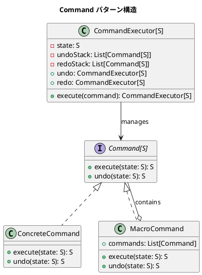

# 第11章: Command パターン

## はじめに

Command パターンは、リクエストをオブジェクトとしてカプセル化し、操作の履歴管理、Undo/Redo、バッチ処理を可能にするパターンです。

本章では、テキスト編集、キャンバス操作、計算機、ファイルシステム、タスク管理などの例を通じて、Command パターンの実装を学びます。

## 1. パターンの構造



## 2. Command インターフェース

```scala
trait Command[S]:
  def execute(state: S): S
  def undo(state: S): S
```

シンプルなインターフェースで、状態 `S` を受け取り、新しい状態を返します。

## 3. テキスト操作コマンド

### Document（状態）

```scala
case class Document(content: String):
  def insert(position: Int, text: String): Document =
    val (before, after) = content.splitAt(position)
    Document(before + text + after)
  
  def delete(start: Int, end: Int): Document =
    val before = content.take(start)
    val after = content.drop(end)
    Document(before + after)
  
  def replace(start: Int, end: Int, text: String): Document =
    delete(start, end).insert(start, text)
```

### InsertCommand

```scala
case class InsertCommand(position: Int, text: String) extends Command[Document]:
  def execute(doc: Document): Document =
    doc.insert(position, text)
  
  def undo(doc: Document): Document =
    doc.delete(position, position + text.length)
```

### DeleteCommand

```scala
case class DeleteCommand(start: Int, end: Int, deletedText: String) extends Command[Document]:
  def execute(doc: Document): Document =
    doc.delete(start, end)
  
  def undo(doc: Document): Document =
    doc.insert(start, deletedText)
```

### ReplaceCommand

```scala
case class ReplaceCommand(start: Int, oldText: String, newText: String) extends Command[Document]:
  def execute(doc: Document): Document =
    doc.replace(start, start + oldText.length, newText)
  
  def undo(doc: Document): Document =
    doc.replace(start, start + newText.length, oldText)
```

### 使用例

```scala
val doc = Document("Hello")
val cmd = InsertCommand(5, " World")
cmd.execute(doc).content  // "Hello World"
cmd.undo(Document("Hello World")).content  // "Hello"
```

## 4. キャンバス操作コマンド

### Canvas と Shape

```scala
sealed trait Shape:
  def id: String
  def x: Double
  def y: Double
  def move(dx: Double, dy: Double): Shape

case class Circle(id: String, x: Double, y: Double, radius: Double) extends Shape:
  def move(dx: Double, dy: Double): Circle = copy(x = x + dx, y = y + dy)

case class Canvas(shapes: List[Shape] = Nil):
  def addShape(shape: Shape): Canvas = copy(shapes = shapes :+ shape)
  def removeShape(id: String): Canvas = copy(shapes = shapes.filterNot(_.id == id))
  def moveShape(id: String, dx: Double, dy: Double): Canvas = ...
```

### Canvas コマンド

```scala
case class AddShapeCommand(shape: Shape) extends Command[Canvas]:
  def execute(canvas: Canvas): Canvas = canvas.addShape(shape)
  def undo(canvas: Canvas): Canvas = canvas.removeShape(shape.id)

case class MoveShapeCommand(shapeId: String, dx: Double, dy: Double) extends Command[Canvas]:
  def execute(canvas: Canvas): Canvas = canvas.moveShape(shapeId, dx, dy)
  def undo(canvas: Canvas): Canvas = canvas.moveShape(shapeId, -dx, -dy)
```

## 5. コマンド実行器（Invoker）

```scala
case class CommandExecutor[S](
  state: S,
  undoStack: List[Command[S]] = Nil,
  redoStack: List[Command[S]] = Nil
):
  def execute(command: Command[S]): CommandExecutor[S] =
    copy(
      state = command.execute(state),
      undoStack = command :: undoStack,
      redoStack = Nil  // 新しいコマンド実行で Redo 履歴クリア
    )
  
  def undo: CommandExecutor[S] =
    undoStack match
      case head :: tail =>
        copy(
          state = head.undo(state),
          undoStack = tail,
          redoStack = head :: redoStack
        )
      case Nil => this
  
  def redo: CommandExecutor[S] =
    redoStack match
      case head :: tail =>
        copy(
          state = head.execute(state),
          undoStack = head :: undoStack,
          redoStack = tail
        )
      case Nil => this
  
  def canUndo: Boolean = undoStack.nonEmpty
  def canRedo: Boolean = redoStack.nonEmpty
  
  def executeBatch(commands: List[Command[S]]): CommandExecutor[S] =
    commands.foldLeft(this)((exec, cmd) => exec.execute(cmd))
  
  def undoAll: CommandExecutor[S] =
    if canUndo then undo.undoAll else this
```

### 使用例

```scala
val exec = CommandExecutor(Document("Hello"))
  .execute(InsertCommand(5, " World"))
  .execute(InsertCommand(11, "!"))

exec.state.content  // "Hello World!"
exec.undo.state.content  // "Hello World"
exec.undo.undo.state.content  // "Hello"
exec.undo.undo.redo.state.content  // "Hello World"
```

## 6. マクロコマンド（複合コマンド）

```scala
case class MacroCommand[S](commands: List[Command[S]]) extends Command[S]:
  def execute(state: S): S =
    commands.foldLeft(state)((s, cmd) => cmd.execute(s))
  
  def undo(state: S): S =
    commands.reverse.foldLeft(state)((s, cmd) => cmd.undo(s))
  
  def add(command: Command[S]): MacroCommand[S] =
    copy(commands = commands :+ command)

object MacroCommand:
  def apply[S](commands: Command[S]*): MacroCommand[S] = 
    MacroCommand(commands.toList)
```

### 使用例

```scala
val macroCmd = MacroCommand(
  InsertCommand(5, " World"),
  InsertCommand(11, "!")
)

val exec = CommandExecutor(Document("Hello"))
  .execute(macroCmd)

exec.state.content  // "Hello World!"
exec.undoCount  // 1（マクロ全体で1コマンド）
exec.undo.state.content  // "Hello"（一度に全て取り消し）
```

## 7. 計算機コマンド

```scala
case class Calculator(value: Double = 0)

case class AddCommand(operand: Double) extends Command[Calculator]:
  def execute(calc: Calculator): Calculator = 
    calc.copy(value = calc.value + operand)
  def undo(calc: Calculator): Calculator = 
    calc.copy(value = calc.value - operand)

case class MultiplyCommand(operand: Double) extends Command[Calculator]:
  def execute(calc: Calculator): Calculator = 
    calc.copy(value = calc.value * operand)
  def undo(calc: Calculator): Calculator = 
    calc.copy(value = calc.value / operand)
```

### 使用例

```scala
val exec = CommandExecutor(Calculator())
  .execute(AddCommand(100))
  .execute(MultiplyCommand(2))
  .execute(SubtractCommand(50))
  .execute(DivideCommand(3))

exec.state.value  // 50.0 ((100 * 2 - 50) / 3)
exec.undo.state.value  // 150.0
```

## 8. ファイル操作コマンド

```scala
case class FileSystem(files: Map[String, String] = Map.empty)

case class CreateFileCommand(path: String, content: String) extends Command[FileSystem]:
  def execute(fs: FileSystem): FileSystem = 
    fs.copy(files = fs.files + (path -> content))
  def undo(fs: FileSystem): FileSystem = 
    fs.copy(files = fs.files - path)

case class UpdateFileCommand(path: String, oldContent: String, newContent: String) 
    extends Command[FileSystem]:
  def execute(fs: FileSystem): FileSystem = 
    fs.copy(files = fs.files + (path -> newContent))
  def undo(fs: FileSystem): FileSystem = 
    fs.copy(files = fs.files + (path -> oldContent))
```

## 9. タスク管理コマンド

```scala
enum TaskStatus:
  case Todo, InProgress, Done

case class Task(id: String, title: String, status: TaskStatus = TaskStatus.Todo)

case class TaskList(tasks: Map[String, Task] = Map.empty)

case class AddTaskCommand(task: Task) extends Command[TaskList]:
  def execute(list: TaskList): TaskList = list.addTask(task)
  def undo(list: TaskList): TaskList = list.removeTask(task.id)

case class ChangeTaskStatusCommand(
  taskId: String,
  oldStatus: TaskStatus,
  newStatus: TaskStatus
) extends Command[TaskList]:
  def execute(list: TaskList): TaskList = 
    list.updateTask(taskId, _.copy(status = newStatus))
  def undo(list: TaskList): TaskList = 
    list.updateTask(taskId, _.copy(status = oldStatus))
```

## 10. コマンドキュー（遅延実行）

```scala
case class CommandQueue[S](commands: List[Command[S]] = Nil):
  def enqueue(command: Command[S]): CommandQueue[S] =
    copy(commands = commands :+ command)
  
  def executeAll(initialState: S): S =
    commands.foldLeft(initialState)((s, cmd) => cmd.execute(s))
  
  def executeNext(state: S): (S, CommandQueue[S]) =
    commands match
      case head :: tail => (head.execute(state), CommandQueue(tail))
      case Nil => (state, this)
```

## 11. 関数型コマンド

```scala
case class FunctionalCommand[S](
  executeFn: S => S,
  undoFn: S => S,
  description: String = ""
) extends Command[S]:
  def execute(state: S): S = executeFn(state)
  def undo(state: S): S = undoFn(state)

object FunctionalCommand:
  def reversible[S](forward: S => S, backward: S => S): FunctionalCommand[S] =
    FunctionalCommand(forward, backward)
  
  def symmetric[S](transform: S => S): FunctionalCommand[S] =
    FunctionalCommand(transform, transform)
```

### 使用例

```scala
// 可逆な操作
val cmd = FunctionalCommand.reversible[Int](_ + 10, _ - 10)
cmd.execute(5)  // 15
cmd.undo(15)    // 5

// 対称な操作（toggleなど）
val toggle = FunctionalCommand.symmetric[Boolean](!_)
toggle.execute(true)  // false
toggle.undo(false)    // true
```

## 12. パターンの利点

1. **操作のオブジェクト化**: 操作をデータとして表現できる
2. **Undo/Redo**: 操作履歴の管理が容易
3. **バッチ処理**: 複数の操作をまとめて処理
4. **遅延実行**: コマンドをキューに入れて後で実行
5. **ログ記録**: 操作の履歴をログとして保存
6. **マクロ**: 複数の操作を一つにまとめる

## Clojure との比較

| 概念 | Clojure | Scala |
|------|---------|-------|
| Command | マップ + マルチメソッド | trait + case class |
| execute/undo | `(defmethod execute ...)` | `def execute(s: S): S` |
| 状態変更 | 関数を返す `(fn [state] ...)` | 直接新しい状態を返す |
| MacroCommand | ベクタ + reduce | `case class MacroCommand` |
| 履歴管理 | アトム + ベクタ | イミュータブルリスト |

## まとめ

本章では、Command パターンについて学びました：

1. **Command インターフェース**: execute と undo を持つシンプルな設計
2. **具体コマンド**: テキスト、キャンバス、計算機、ファイル、タスク
3. **CommandExecutor**: Undo/Redo スタックによる履歴管理
4. **MacroCommand**: 複数のコマンドを一つとして扱う
5. **CommandQueue**: 遅延実行のためのキュー
6. **FunctionalCommand**: 関数からコマンドを生成

Command パターンは、操作の履歴管理や取り消し機能が必要な場面で非常に有効です。

## 参考コード

本章のコード例は以下のファイルで確認できます：

- ソースコード: `app/scala/part3/src/main/scala/CommandPattern.scala`
- テストコード: `app/scala/part3/src/test/scala/CommandPatternSpec.scala`

## 次章予告

次章では、**Visitor パターン**について学びます。データ構造と操作を分離し、新しい操作を追加しやすくする方法を探ります。
