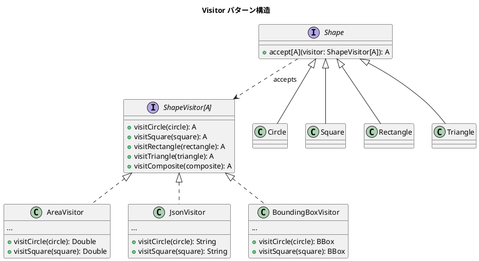

# 第12章: Visitor パターン

## はじめに

Visitor パターンは、データ構造と操作を分離し、既存のデータ構造を変更することなく新しい操作を追加できるようにするパターンです。

本章では、図形（Shape）や式木（Expression Tree）に対する様々な操作を通じて、Visitor パターンの実装を学びます。

## 1. パターンの構造



## 2. Element: 図形の定義

```scala
case class Point(x: Double, y: Double)

sealed trait Shape:
  def translate(dx: Double, dy: Double): Shape
  def scale(factor: Double): Shape

case class Circle(center: Point, radius: Double) extends Shape
case class Square(topLeft: Point, side: Double) extends Shape
case class Rectangle(topLeft: Point, width: Double, height: Double) extends Shape
case class Triangle(p1: Point, p2: Point, p3: Point) extends Shape
case class CompositeShape(shapes: List[Shape]) extends Shape
```

## 3. Visitor インターフェース

```scala
trait ShapeVisitor[A]:
  def visitCircle(circle: Circle): A
  def visitSquare(square: Square): A
  def visitRectangle(rectangle: Rectangle): A
  def visitTriangle(triangle: Triangle): A
  def visitComposite(composite: CompositeShape): A
```

### accept 拡張メソッド

```scala
extension (shape: Shape)
  def accept[A](visitor: ShapeVisitor[A]): A = shape match
    case c: Circle => visitor.visitCircle(c)
    case s: Square => visitor.visitSquare(s)
    case r: Rectangle => visitor.visitRectangle(r)
    case t: Triangle => visitor.visitTriangle(t)
    case cs: CompositeShape => visitor.visitComposite(cs)
```

## 4. 具体 Visitor: 面積計算

```scala
object AreaVisitor extends ShapeVisitor[Double]:
  def visitCircle(circle: Circle): Double =
    math.Pi * circle.radius * circle.radius
  
  def visitSquare(square: Square): Double =
    square.side * square.side
  
  def visitRectangle(rectangle: Rectangle): Double =
    rectangle.width * rectangle.height
  
  def visitTriangle(triangle: Triangle): Double =
    val Triangle(p1, p2, p3) = triangle
    math.abs((p2.x - p1.x) * (p3.y - p1.y) - (p3.x - p1.x) * (p2.y - p1.y)) / 2
  
  def visitComposite(composite: CompositeShape): Double =
    composite.shapes.map(_.accept(this)).sum
```

### 使用例

```scala
val circle = Circle(Point(0, 0), 5)
circle.accept(AreaVisitor)  // 78.53981...

val composite = CompositeShape(List(
  Square(Point(0, 0), 10),
  Rectangle(Point(0, 0), 5, 10)
))
composite.accept(AreaVisitor)  // 150.0
```

## 5. 具体 Visitor: JSON 変換

```scala
object JsonVisitor extends ShapeVisitor[String]:
  def visitCircle(circle: Circle): String =
    s"""{"type":"circle","center":{"x":${circle.center.x},"y":${circle.center.y}},"radius":${circle.radius}}"""
  
  def visitSquare(square: Square): String =
    s"""{"type":"square","topLeft":{"x":${square.topLeft.x},"y":${square.topLeft.y}},"side":${square.side}}"""
  
  def visitRectangle(rectangle: Rectangle): String =
    s"""{"type":"rectangle","topLeft":{"x":${rectangle.topLeft.x},"y":${rectangle.topLeft.y}},"width":${rectangle.width},"height":${rectangle.height}}"""
  
  def visitComposite(composite: CompositeShape): String =
    val shapesJson = composite.shapes.map(_.accept(this)).mkString(",")
    s"""{"type":"composite","shapes":[$shapesJson]}"""
```

## 6. 具体 Visitor: バウンディングボックス

```scala
case class BoundingBox(minX: Double, minY: Double, maxX: Double, maxY: Double):
  def union(other: BoundingBox): BoundingBox =
    BoundingBox(
      math.min(minX, other.minX), math.min(minY, other.minY),
      math.max(maxX, other.maxX), math.max(maxY, other.maxY)
    )

object BoundingBoxVisitor extends ShapeVisitor[BoundingBox]:
  def visitCircle(circle: Circle): BoundingBox =
    val r = circle.radius
    BoundingBox(
      circle.center.x - r, circle.center.y - r,
      circle.center.x + r, circle.center.y + r
    )
  
  def visitComposite(composite: CompositeShape): BoundingBox =
    composite.shapes.map(_.accept(this)).reduce(_ union _)
  // ...
```

## 7. 具体 Visitor: 描画コマンド生成

```scala
sealed trait DrawCommand
case class DrawCircle(center: Point, radius: Double) extends DrawCommand
case class DrawRect(topLeft: Point, width: Double, height: Double) extends DrawCommand
case class DrawPolygon(points: List[Point]) extends DrawCommand
case class DrawGroup(commands: List[DrawCommand]) extends DrawCommand

object DrawVisitor extends ShapeVisitor[DrawCommand]:
  def visitCircle(circle: Circle): DrawCommand =
    DrawCircle(circle.center, circle.radius)
  
  def visitSquare(square: Square): DrawCommand =
    DrawRect(square.topLeft, square.side, square.side)
  
  def visitTriangle(triangle: Triangle): DrawCommand =
    DrawPolygon(List(triangle.p1, triangle.p2, triangle.p3))
  
  def visitComposite(composite: CompositeShape): DrawCommand =
    DrawGroup(composite.shapes.map(_.accept(this)))
```

## 8. 型クラスベースの Visitor

Scala 3 では型クラスを使ってより柔軟な Visitor を実装できます。

```scala
trait HasArea[A]:
  def area(a: A): Double

object HasArea:
  given HasArea[Circle] with
    def area(c: Circle): Double = math.Pi * c.radius * c.radius
  
  given HasArea[Square] with
    def area(s: Square): Double = s.side * s.side
  
  given HasArea[Rectangle] with
    def area(r: Rectangle): Double = r.width * r.height

// 拡張メソッド
extension [A](a: A)
  def area(using ha: HasArea[A]): Double = ha.area(a)
```

### 使用例

```scala
import HasArea.given

val circle = Circle(Point(0, 0), 5)
circle.area  // 78.53981...

val rect = Rectangle(Point(0, 0), 10, 20)
rect.area  // 200.0
```

## 9. パターンマッチベースの Visitor

シンプルなケースではパターンマッチで実装することもできます。

```scala
object PatternMatchVisitor:
  def calculateArea(shape: Shape): Double = shape match
    case Circle(_, radius) => math.Pi * radius * radius
    case Square(_, side) => side * side
    case Rectangle(_, width, height) => width * height
    case Triangle(p1, p2, p3) =>
      math.abs((p2.x - p1.x) * (p3.y - p1.y) - (p3.x - p1.x) * (p2.y - p1.y)) / 2
    case CompositeShape(shapes) => shapes.map(calculateArea).sum
  
  def toJson(shape: Shape): String = shape match
    case Circle(center, radius) =>
      s"""{"type":"circle","center":{"x":${center.x},"y":${center.y}},"radius":$radius}"""
    case Square(topLeft, side) =>
      s"""{"type":"square","topLeft":{"x":${topLeft.x},"y":${topLeft.y}},"side":$side}"""
    // ...
```

## 10. 式木の Visitor

Visitor パターンは式木の処理にも適しています。

```scala
sealed trait Expr
case class Num(value: Double) extends Expr
case class Var(name: String) extends Expr
case class Add(left: Expr, right: Expr) extends Expr
case class Mul(left: Expr, right: Expr) extends Expr

trait ExprVisitor[A]:
  def visitNum(num: Num): A
  def visitVar(v: Var): A
  def visitAdd(add: Add): A
  def visitMul(mul: Mul): A
```

### 式評価 Visitor

```scala
class EvalVisitor(env: Map[String, Double]) extends ExprVisitor[Double]:
  def visitNum(num: Num): Double = num.value
  def visitVar(v: Var): Double = env.getOrElse(v.name, 0.0)
  def visitAdd(add: Add): Double = 
    add.left.accept(this) + add.right.accept(this)
  def visitMul(mul: Mul): Double = 
    mul.left.accept(this) * mul.right.accept(this)
```

### 式簡約 Visitor

```scala
object SimplifyVisitor extends ExprVisitor[Expr]:
  def visitAdd(add: Add): Expr =
    (add.left.accept(this), add.right.accept(this)) match
      case (Num(0), r) => r           // 0 + x = x
      case (l, Num(0)) => l           // x + 0 = x
      case (Num(a), Num(b)) => Num(a + b)  // 定数畳み込み
      case (l, r) => Add(l, r)
  
  def visitMul(mul: Mul): Expr =
    (mul.left.accept(this), mul.right.accept(this)) match
      case (Num(0), _) => Num(0)      // 0 * x = 0
      case (_, Num(0)) => Num(0)      // x * 0 = 0
      case (Num(1), r) => r           // 1 * x = x
      case (l, Num(1)) => l           // x * 1 = x
      case (l, r) => Mul(l, r)
```

## 11. ファイルシステム Visitor

```scala
sealed trait FileEntry:
  def name: String

case class File(name: String, size: Long) extends FileEntry
case class Directory(name: String, entries: List[FileEntry]) extends FileEntry

trait FileVisitor[A]:
  def visitFile(file: File): A
  def visitDirectory(dir: Directory): A

object SizeVisitor extends FileVisitor[Long]:
  def visitFile(file: File): Long = file.size
  def visitDirectory(dir: Directory): Long =
    dir.entries.map(_.accept(this)).sum

object FileCountVisitor extends FileVisitor[Int]:
  def visitFile(file: File): Int = 1
  def visitDirectory(dir: Directory): Int =
    dir.entries.map(_.accept(this)).sum
```

## 12. パターンの利点と欠点

### 利点

1. **操作の追加が容易**: 新しい Visitor を追加するだけで新しい操作を実装可能
2. **関連操作の集約**: 同じ操作に関するコードが一箇所にまとまる
3. **型安全**: コンパイル時に全てのケースがカバーされているか確認

### 欠点

1. **要素の追加が困難**: 新しい要素タイプを追加すると、すべての Visitor を更新する必要がある
2. **カプセル化の破壊**: Visitor は要素の内部状態にアクセスする必要がある

## Clojure との比較

| 概念 | Clojure | Scala |
|------|---------|-------|
| Visitor | マルチメソッド | trait + object |
| Element | マップ + ::type | sealed trait + case class |
| ディスパッチ | 型キーでディスパッチ | パターンマッチ or accept |
| 拡張性 | オープン（後から追加可能） | sealed（コンパイル時確認） |

## まとめ

本章では、Visitor パターンについて学びました：

1. **OOP スタイル**: ShapeVisitor トレイトと accept 拡張メソッド
2. **具体 Visitor**: AreaVisitor, JsonVisitor, BoundingBoxVisitor, DrawVisitor
3. **型クラスベース**: HasArea, HasPerimeter, Serializable
4. **パターンマッチベース**: シンプルなケースでの実装
5. **式木 Visitor**: 評価、文字列化、変数収集、簡約
6. **ファイルシステム Visitor**: サイズ計算、ファイル数カウント、検索

Visitor パターンは、データ構造が安定していて、操作を頻繁に追加する必要がある場面で有効です。

## 参考コード

本章のコード例は以下のファイルで確認できます：

- ソースコード: `app/scala/part3/src/main/scala/VisitorPattern.scala`
- テストコード: `app/scala/part3/src/test/scala/VisitorPatternSpec.scala`

## 第4部のまとめ

第4部では、振る舞いパターンについて学びました：

- **Strategy パターン**: アルゴリズムをカプセル化し交換可能にする
- **Command パターン**: 操作をデータ化し、Undo/Redo を実現
- **Visitor パターン**: データ構造と操作を分離し、新しい操作を追加しやすくする

これらのパターンは、関数型プログラミングの特性を活かして簡潔に実装できます。
