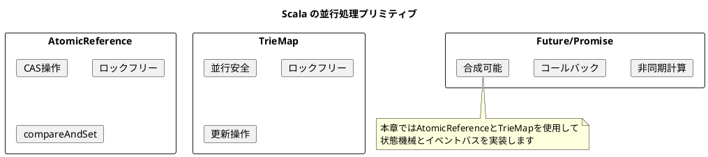
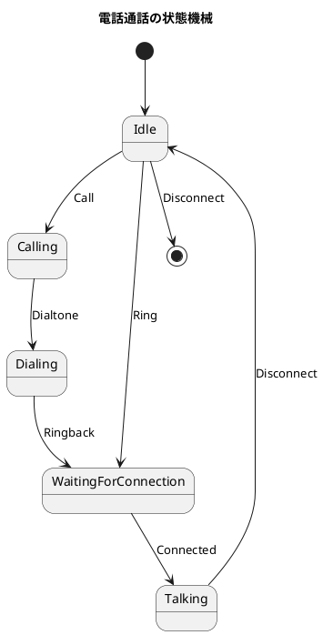
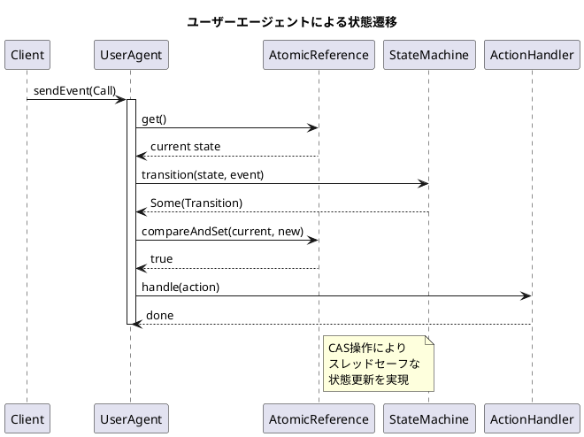
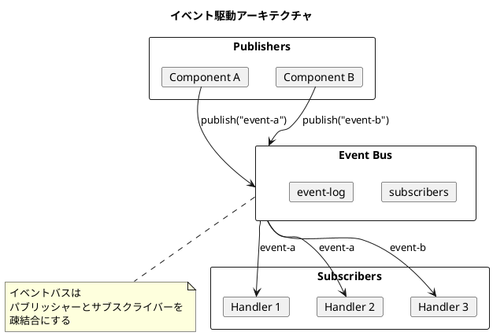
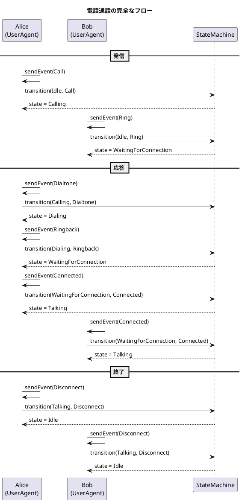

# 第18章: 並行処理システム

## はじめに

本章では、Scala の並行処理プリミティブを使った並行処理システムを学びます。電話通話システムを状態機械パターンで実装し、イベント駆動アーキテクチャの基礎を理解します。

この問題を通じて以下の概念を学びます：

- Scala の並行処理プリミティブ（AtomicReference、TrieMap）
- 状態機械パターンの実装
- イベント駆動アーキテクチャ
- Pub/Sub パターン

## 1. Scala の並行処理モデル

Scala/JVM は複数の並行処理プリミティブを提供します：

| プリミティブ | 特徴 | 用途 |
|------------|------|------|
| AtomicReference | CAS 操作、ロックフリー | 単一値の安全な更新 |
| TrieMap | 並行安全なマップ | 共有状態の管理 |
| Future/Promise | 非同期計算 | 並行タスクの実行 |



## 2. 状態機械パターン

### 電話通話の状態遷移



### 状態機械の定義

```scala
/**
 * 電話の状態
 */
enum PhoneState:
  case Idle
  case Calling
  case Dialing
  case WaitingForConnection
  case Talking

/**
 * 電話イベント
 */
enum PhoneEvent:
  case Call
  case Ring
  case Dialtone
  case Ringback
  case Connected
  case Disconnect

/**
 * アクションタイプ
 */
enum ActionType:
  case CallerOffHook
  case CalleeOffHook
  case Dial
  case Talk
  case None

/**
 * 状態遷移結果
 */
case class Transition(
  nextState: PhoneState,
  action: ActionType
)

/**
 * 状態機械の定義
 */
object PhoneStateMachine:
  import PhoneState.*
  import PhoneEvent.*
  import ActionType.*

  private val transitions: Map[(PhoneState, PhoneEvent), Transition] = Map(
    (Idle, Call) -> Transition(Calling, CallerOffHook),
    (Idle, Ring) -> Transition(WaitingForConnection, CalleeOffHook),
    (Idle, Disconnect) -> Transition(Idle, None),
    (Calling, Dialtone) -> Transition(Dialing, Dial),
    (Dialing, Ringback) -> Transition(WaitingForConnection, None),
    (WaitingForConnection, Connected) -> Transition(Talking, Talk),
    (Talking, Disconnect) -> Transition(Idle, None)
  )

  def transition(state: PhoneState, event: PhoneEvent): Option[Transition] =
    transitions.get((state, event))

  def isValidTransition(state: PhoneState, event: PhoneEvent): Boolean =
    transitions.contains((state, event))
```

## 3. アクションハンドラ

```scala
/**
 * アクションハンドラ
 */
trait ActionHandler:
  def handle(fromUser: UserId, toUser: UserId, action: ActionType): Unit

/**
 * ログ出力アクションハンドラ
 */
class LoggingActionHandler extends ActionHandler:
  private var logs: List[String] = Nil

  def handle(fromUser: UserId, toUser: UserId, action: ActionType): Unit =
    val message = action match
      case ActionType.CallerOffHook => s"$fromUser picked up the phone to call $toUser"
      case ActionType.CalleeOffHook => s"$fromUser answered the call from $toUser"
      case ActionType.Dial => s"$fromUser is dialing $toUser"
      case ActionType.Talk => s"$fromUser is now talking with $toUser"
      case ActionType.None => ""

    if message.nonEmpty then
      logs = logs :+ message
      println(message)

  def getLogs: List[String] = logs
  def clear(): Unit = logs = Nil

/**
 * サイレントアクションハンドラ（テスト用）
 */
class SilentActionHandler extends ActionHandler:
  private var actions: List[(UserId, UserId, ActionType)] = Nil

  def handle(fromUser: UserId, toUser: UserId, action: ActionType): Unit =
    if action != ActionType.None then
      actions = actions :+ (fromUser, toUser, action)

  def getActions: List[(UserId, UserId, ActionType)] = actions
  def clear(): Unit = actions = Nil
```

## 4. ユーザーエージェント

AtomicReference を使用してスレッドセーフな状態管理を実現します。

```scala
/**
 * ユーザー状態
 */
case class UserState(
  userId: UserId,
  state: PhoneState = PhoneState.Idle,
  peer: Option[UserId] = None
)

/**
 * ユーザーエージェント
 */
class UserAgent(val userId: UserId, actionHandler: ActionHandler):
  private val stateRef = new AtomicReference(UserState(userId))

  def getState: PhoneState = stateRef.get().state
  def getPeer: Option[UserId] = stateRef.get().peer
  def getUserState: UserState = stateRef.get()

  /**
   * イベントを送信（CAS操作で安全に状態遷移）
   */
  def sendEvent(event: PhoneEvent, peer: Option[UserId] = None): Boolean =
    var success = false
    var done = false
    while !done do
      val current = stateRef.get()
      PhoneStateMachine.transition(current.state, event) match
        case Some(trans) =>
          val newPeer = peer.orElse(current.peer)
          val newState = current.copy(state = trans.nextState, peer = newPeer)
          if stateRef.compareAndSet(current, newState) then
            if trans.action != ActionType.None then
              actionHandler.handle(userId, newPeer.getOrElse("unknown"), trans.action)
            success = true
            done = true
        case None =>
          done = true
    success

  def reset(): Unit =
    stateRef.set(UserState(userId))
```



## 5. 電話システム

```scala
/**
 * 電話システム
 */
class PhoneSystem(actionHandler: ActionHandler = new LoggingActionHandler):
  private val users = TrieMap.empty[UserId, UserAgent]

  def createUser(userId: UserId): UserAgent =
    val agent = new UserAgent(userId, actionHandler)
    users.put(userId, agent)
    agent

  def getUser(userId: UserId): Option[UserAgent] =
    users.get(userId)

  /**
   * 電話をかける
   */
  def makeCall(callerId: UserId, calleeId: UserId): Boolean =
    (for
      caller <- users.get(callerId)
      callee <- users.get(calleeId)
    yield
      val callerSuccess = caller.sendEvent(PhoneEvent.Call, Some(calleeId))
      val calleeSuccess = callee.sendEvent(PhoneEvent.Ring, Some(callerId))
      callerSuccess && calleeSuccess
    ).getOrElse(false)

  /**
   * 電話に出る
   */
  def answerCall(callerId: UserId, calleeId: UserId): Boolean =
    (for
      caller <- users.get(callerId)
      callee <- users.get(calleeId)
    yield
      caller.sendEvent(PhoneEvent.Dialtone) &&
      caller.sendEvent(PhoneEvent.Ringback) &&
      caller.sendEvent(PhoneEvent.Connected) &&
      callee.sendEvent(PhoneEvent.Connected)
    ).getOrElse(false)

  /**
   * 電話を切る
   */
  def hangUp(callerId: UserId, calleeId: UserId): Boolean =
    (for
      caller <- users.get(callerId)
      callee <- users.get(calleeId)
    yield
      caller.sendEvent(PhoneEvent.Disconnect) &&
      callee.sendEvent(PhoneEvent.Disconnect)
    ).getOrElse(false)
```

## 6. イベントバス

```scala
/**
 * イベント
 */
case class Event(
  eventType: EventType,
  data: Map[String, Any],
  timestamp: Long = System.currentTimeMillis()
)

/**
 * イベントハンドラ
 */
type EventHandler = Event => Unit

/**
 * イベントバス
 */
class EventBus:
  private val subscribers = TrieMap.empty[EventType, List[EventHandler]]
  private var eventLog: List[Event] = Nil
  private val logLock = new Object

  /**
   * イベントを購読
   */
  def subscribe(eventType: EventType, handler: EventHandler): Unit =
    subscribers.updateWith(eventType) {
      case Some(handlers) => Some(handlers :+ handler)
      case None => Some(List(handler))
    }

  /**
   * イベントを発行（同期）
   */
  def publish(eventType: EventType, data: Map[String, Any] = Map.empty): Event =
    val event = Event(eventType, data)
    logLock.synchronized {
      eventLog = eventLog :+ event
    }
    subscribers.get(eventType).foreach { handlers =>
      handlers.foreach { handler =>
        try handler(event)
        catch case e: Exception => println(s"Handler error: ${e.getMessage}")
      }
    }
    event

  /**
   * イベントを発行（非同期）
   */
  def publishAsync(eventType: EventType, data: Map[String, Any] = Map.empty)
                  (using ec: ExecutionContext): Future[Event] =
    Future {
      publish(eventType, data)
    }

  def getEventLog: List[Event] = logLock.synchronized { eventLog }
```



## 7. 汎用状態機械

```scala
/**
 * 汎用状態機械
 */
class StateMachine[S, E](
  initialState: S,
  transitions: Map[(S, E), (S, Option[() => Unit])]
):
  private val stateRef = new AtomicReference(initialState)

  def getState: S = stateRef.get()

  def send(event: E): Boolean =
    var success = false
    var done = false
    while !done do
      val current = stateRef.get()
      transitions.get((current, event)) match
        case Some((nextState, action)) =>
          if stateRef.compareAndSet(current, nextState) then
            action.foreach(_())
            success = true
            done = true
        case None =>
          done = true
    success

  def reset(): Unit = stateRef.set(initialState)

object StateMachine:
  def builder[S, E](initialState: S): StateMachineBuilder[S, E] =
    StateMachineBuilder(initialState, Map.empty)

  case class StateMachineBuilder[S, E](
    initialState: S,
    transitions: Map[(S, E), (S, Option[() => Unit])]
  ):
    def addTransition(from: S, event: E, to: S, action: Option[() => Unit] = None): StateMachineBuilder[S, E] =
      copy(transitions = transitions + ((from, event) -> (to, action)))

    def build: StateMachine[S, E] =
      new StateMachine(initialState, transitions)
```

## 8. Pub/Sub システム

```scala
/**
 * トピック
 */
class Topic[T](name: String):
  private val subscribers = TrieMap.empty[String, T => Unit]

  def subscribe(subscriberId: String, handler: T => Unit): Unit =
    subscribers.put(subscriberId, handler)

  def unsubscribe(subscriberId: String): Unit =
    subscribers.remove(subscriberId)

  def publish(message: T): Unit =
    subscribers.values.foreach { handler =>
      try handler(message)
      catch case e: Exception => println(s"Handler error: ${e.getMessage}")
    }

  def subscriberCount: Int = subscribers.size

/**
 * メッセージブローカー
 */
class MessageBroker:
  private val topics = TrieMap.empty[String, Topic[Any]]

  def getTopic[T](name: String): Topic[T] =
    topics.getOrElseUpdate(name, new Topic[Any](name)).asInstanceOf[Topic[T]]

  def topicNames: Set[String] = topics.keySet.toSet
```

## 9. タスクキュー

```scala
/**
 * タスクキュー
 */
class TaskQueue[T](workers: Int = 4)(using ec: ExecutionContext):
  private val queue = new java.util.concurrent.LinkedBlockingQueue[Task[T]]()
  @volatile private var running = false
  private var workerThreads: List[Thread] = Nil

  def submit(id: String, computation: () => T): Future[T] =
    val task = Task(id, computation)
    queue.put(task)
    task.future

  def start(): Unit =
    if !running then
      running = true
      workerThreads = (1 to workers).map { i =>
        val t = new Thread(() => {
          while running do
            try
              val task = queue.poll(100, java.util.concurrent.TimeUnit.MILLISECONDS)
              if task != null then
                try
                  val result = task.computation()
                  task.promise.success(result)
                catch
                  case e: Exception => task.promise.failure(e)
            catch
              case _: InterruptedException => ()
        }, s"TaskQueue-Worker-$i")
        t.start()
        t
      }.toList

  def stop(): Unit =
    running = false
    workerThreads.foreach(_.interrupt())
```

## 10. 使用例

### 電話通話のシミュレーション

```scala
import ConcurrencySystem.*

// 電話システムを作成
val handler = new SilentActionHandler
val system = new PhoneSystem(handler)

// ユーザーを作成
val alice = system.createUser("Alice")
val bob = system.createUser("Bob")

// 初期状態の確認
alice.getState // => PhoneState.Idle
bob.getState   // => PhoneState.Idle

// Alice が Bob に電話をかける
system.makeCall("Alice", "Bob")
alice.getState // => PhoneState.Calling
bob.getState   // => PhoneState.WaitingForConnection

// Bob が電話に出る
system.answerCall("Alice", "Bob")
alice.getState // => PhoneState.Talking
bob.getState   // => PhoneState.Talking

// 電話を切る
system.hangUp("Alice", "Bob")
alice.getState // => PhoneState.Idle
bob.getState   // => PhoneState.Idle
```

### イベントシステムの使用

```scala
import ConcurrencySystem.*
import scala.collection.mutable.ListBuffer

// イベントバスを作成
val bus = new EventBus

// ログを収集するリスト
val logs = ListBuffer.empty[String]

// ハンドラを登録
bus.subscribe("user-logged-in", event =>
  logs += s"User logged in: ${event.data}"
)

bus.subscribe("user-logged-in", event =>
  logs += s"Sending welcome email to: ${event.data}"
)

// イベントを発行
bus.publish("user-logged-in", Map("userId" -> "U001", "name" -> "Alice"))

// ログの確認
logs.toList
// => List(
//      "User logged in: Map(userId -> U001, name -> Alice)",
//      "Sending welcome email to: Map(userId -> U001, name -> Alice)"
//    )

// イベントログの確認
bus.getEventLog
// => List(Event("user-logged-in", Map(...), timestamp))
```

## 11. Clojure との比較

| 機能 | Clojure | Scala |
|------|---------|-------|
| 非同期状態 | Agent | AtomicReference + CAS |
| 並行マップ | atom + {} | TrieMap |
| 非同期送信 | send | Future |
| 状態待機 | await | compareAndSet ループ |
| エラー処理 | agent-error | try/catch |

Clojure の Agent は非同期で `send` によりバックグラウンドで状態更新されますが、Scala では `AtomicReference` の CAS（Compare-And-Set）操作を使用して同期的にスレッドセーフな更新を行います。

```scala
// Scala: CAS操作による安全な更新
while !done do
  val current = stateRef.get()
  transitions.get((current, event)) match
    case Some((nextState, _)) =>
      if stateRef.compareAndSet(current, newState) then
        done = true
    case None =>
      done = true
```

```clojure
;; Clojure: Agentによる非同期更新
(send user-agent transition event event-data)
(await user-agent)  ; 完了を待つ
```

## 12. シーケンス図



## まとめ

本章では、並行処理システムを通じて以下を学びました：

1. **AtomicReference**: CAS 操作による安全な状態更新
2. **状態機械パターン**: 宣言的な状態遷移定義
3. **イベント駆動アーキテクチャ**: 疎結合なコンポーネント間通信
4. **Pub/Sub パターン**: トピックベースのメッセージング
5. **タスクキュー**: 並行タスクの管理

Scala では Clojure の Agent と異なり、`AtomicReference` と CAS 操作を使用してスレッドセーフな状態管理を実現しました。これにより、同期的かつ決定的な動作が保証され、テストが容易になります。

## 参考コード

本章のコード例は以下のファイルで確認できます：

- ソースコード: `app/scala/part6/src/main/scala/ConcurrencySystem.scala`
- テストコード: `app/scala/part6/src/test/scala/ConcurrencySystemSpec.scala`
