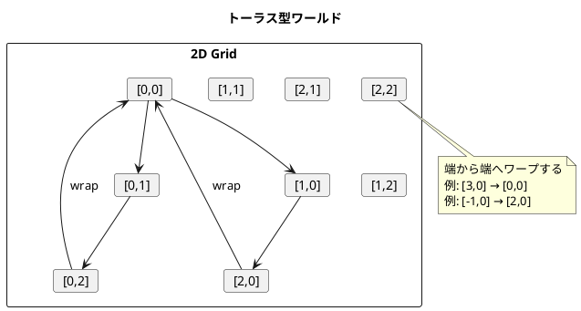
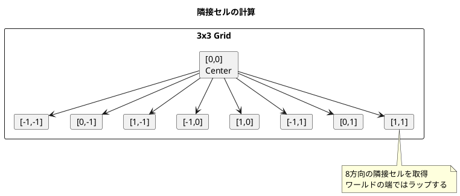
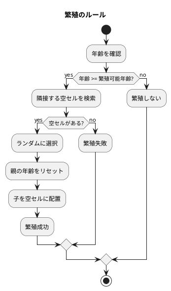
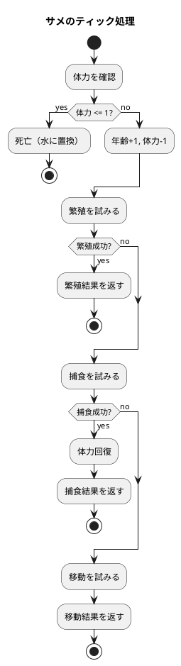
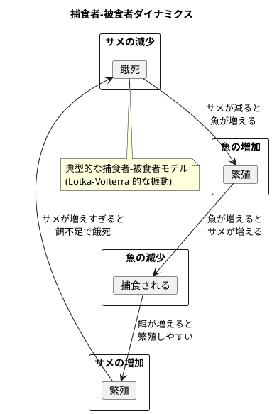

# 第19章: Wa-Tor シミュレーション

## はじめに

本章では、Wa-Tor（Water Torus）シミュレーションを通じて、セルオートマトンと ADT（代数的データ型）を使った捕食者-被食者モデルの実装を学びます。

Wa-Tor は1984年に A.K. Dewdney が Scientific American で紹介した古典的なシミュレーションで、魚（被食者）とサメ（捕食者）の生態系をモデル化します。

この問題を通じて以下の概念を学びます：

- セルオートマトンの実装
- sealed trait と case class による ADT
- トーラス型ワールドの座標計算
- 繁殖と捕食のルール実装

## 1. Wa-Tor の世界

### トーラス型ワールド

Wa-Tor の世界はトーラス（ドーナツ型）です。端に到達すると反対側に出現します。



### セルの種類

- **水（Water）**: 空のセル
- **魚（Fish）**: 被食者、移動と繁殖のみ
- **サメ（Shark）**: 捕食者、移動、繁殖、捕食

## 2. 基本型定義

### 座標と方向

```scala
case class Position(x: Int, y: Int):
  def +(other: Position): Position = Position(x + other.x, y + other.y)

object Direction:
  val deltas: Seq[Position] = for
    dx <- Seq(-1, 0, 1)
    dy <- Seq(-1, 0, 1)
    if !(dx == 0 && dy == 0)
  yield Position(dx, dy)
```

### セルの定義（ADT）

```scala
/**
 * セルの基底trait
 */
sealed trait Cell:
  def display: Char

/**
 * 水（空のセル）
 */
case object Water extends Cell:
  def display: Char = '.'

/**
 * 動物の共通属性
 */
sealed trait Animal extends Cell:
  def age: Int
  def withAge(newAge: Int): Animal
  def incrementAge: Animal = withAge(age + 1)
  def reproductionAge: Int

/**
 * 魚（被食者）
 */
case class Fish(age: Int = 0) extends Animal:
  def display: Char = 'f'
  def withAge(newAge: Int): Fish = copy(age = newAge)
  def reproductionAge: Int = Config.fishReproductionAge

/**
 * サメ（捕食者）
 */
case class Shark(age: Int = 0, health: Int = Config.sharkStartingHealth) extends Animal:
  def display: Char = 'S'
  def withAge(newAge: Int): Shark = copy(age = newAge)
  def reproductionAge: Int = Config.sharkReproductionAge

  def withHealth(newHealth: Int): Shark = copy(health = newHealth)
  def decrementHealth: Shark = copy(health = health - 1)
  def feed: Shark =
    val newHealth = math.min(Config.sharkMaxHealth, health + Config.sharkEatingHealth)
    copy(health = newHealth)
```

## 3. ワールド構造

```scala
case class World(
  width: Int,
  height: Int,
  cells: Map[Position, Cell],
  generation: Int = 0
):
  /**
   * 座標をトーラス上でラップ
   */
  def wrap(pos: Position): Position =
    Position(
      ((pos.x % width) + width) % width,
      ((pos.y % height) + height) % height
    )

  /**
   * 隣接セルの座標を取得（8方向）
   */
  def neighbors(pos: Position): Seq[Position] =
    Direction.deltas.map(d => wrap(pos + d))

  /**
   * 隣接する空のセルを取得
   */
  def emptyNeighbors(pos: Position): Seq[Position] =
    neighbors(pos).filter(p => getCell(p) == Water)

  /**
   * 隣接する魚のセルを取得
   */
  def fishNeighbors(pos: Position): Seq[Position] =
    neighbors(pos).filter(p => getCell(p).isInstanceOf[Fish])

  /**
   * 統計情報
   */
  def statistics: Statistics =
    val cellList = cells.values.toList
    Statistics(
      fish = cellList.count(_.isInstanceOf[Fish]),
      sharks = cellList.count(_.isInstanceOf[Shark]),
      water = cellList.count(_ == Water),
      generation = generation
    )
```



## 4. シミュレーションロジック

### アクション結果の定義

```scala
/**
 * セルの更新結果
 */
sealed trait CellUpdate
case class Move(from: Position, to: Position, cell: Cell) extends CellUpdate
case class Reproduce(parent: Position, child: Position, parentCell: Cell, childCell: Cell) extends CellUpdate
case class Eat(from: Position, to: Position, cell: Cell) extends CellUpdate
case class Die(at: Position) extends CellUpdate
case object NoChange extends CellUpdate
```

### 移動と繁殖

```scala
object Simulation:
  /**
   * 動物の移動を試みる
   */
  def tryMove(animal: Animal, pos: Position, world: World, random: Random): Option[Move] =
    val empty = world.emptyNeighbors(pos)
    if empty.isEmpty then None
    else
      val target = empty(random.nextInt(empty.length))
      Some(Move(pos, target, animal))

  /**
   * 動物の繁殖を試みる
   */
  def tryReproduce(animal: Animal, pos: Position, world: World, random: Random): Option[Reproduce] =
    if animal.age < animal.reproductionAge then None
    else
      val empty = world.emptyNeighbors(pos)
      if empty.isEmpty then None
      else
        val childPos = empty(random.nextInt(empty.length))
        val child = animal match
          case _: Fish => Fish()
          case _: Shark => Shark()
        Some(Reproduce(pos, childPos, animal.withAge(0), child))
```



### サメの捕食

```scala
/**
 * サメの捕食を試みる
 */
def tryEat(shark: Shark, pos: Position, world: World, random: Random): Option[Eat] =
  val fishCells = world.fishNeighbors(pos)
  if fishCells.isEmpty then None
  else
    val target = fishCells(random.nextInt(fishCells.length))
    Some(Eat(pos, target, shark.feed))

/**
 * サメのティック処理
 */
def tickShark(shark: Shark, pos: Position, world: World, random: Random): CellUpdate =
  // 体力が尽きたら死亡
  if shark.health <= 1 then
    return Die(pos)

  val agedShark = shark.incrementAge.asInstanceOf[Shark].decrementHealth

  // 優先順位: 繁殖 > 捕食 > 移動
  tryReproduce(agedShark, pos, world, random)
    .orElse(tryEat(agedShark, pos, world, random))
    .orElse(tryMove(agedShark, pos, world, random))
    .getOrElse(NoChange)
```



### ワールドの更新

```scala
/**
 * 更新を適用
 */
def applyUpdate(world: World, update: CellUpdate): World =
  update match
    case Move(from, to, cell) =>
      world.setCell(from, Water).setCell(to, cell)
    case Reproduce(parent, child, parentCell, childCell) =>
      world.setCell(parent, parentCell).setCell(child, childCell)
    case Eat(from, to, cell) =>
      world.setCell(from, Water).setCell(to, cell)
    case Die(at) =>
      world.setCell(at, Water)
    case NoChange =>
      world

/**
 * ワールドの1ステップを実行
 */
def tick(world: World, random: Random = new Random): World =
  val positions = random.shuffle(world.allPositions.toList)
  val processed = scala.collection.mutable.Set.empty[Position]

  val newWorld = positions.foldLeft(world) { (w, pos) =>
    if processed.contains(pos) then w
    else
      val cell = w.getCell(pos)
      val update = tickCell(cell, pos, w, random)
      // 処理済みの位置を記録
      update match
        case Move(from, to, _) =>
          processed += from
          processed += to
        // ... 他のケース
        case _ => ()
      applyUpdate(w, update)
  }

  newWorld.copy(generation = newWorld.generation + 1)
```

## 5. 設定パラメータ

```scala
object Config:
  // 魚の設定
  val fishReproductionAge: Int = 6

  // サメの設定
  val sharkReproductionAge: Int = 5
  val sharkReproductionHealth: Int = 8
  val sharkStartingHealth: Int = 5
  val sharkEatingHealth: Int = 5
  val sharkMaxHealth: Int = 10
```

| パラメータ | 説明 | デフォルト値 |
|-----------|------|-------------|
| fishReproductionAge | 魚の繁殖可能年齢 | 6 |
| sharkReproductionAge | サメの繁殖可能年齢 | 5 |
| sharkStartingHealth | サメの初期体力 | 5 |
| sharkEatingHealth | 捕食時の体力回復量 | 5 |
| sharkMaxHealth | サメの最大体力 | 10 |

## 6. DSL

```scala
object DSL:
  def world(width: Int, height: Int): World = World(width, height)

  def fish: Fish = Fish()
  def fish(age: Int): Fish = Fish(age)

  def shark: Shark = Shark()
  def shark(age: Int, health: Int): Shark = Shark(age, health)

  def pos(x: Int, y: Int): Position = Position(x, y)

  extension (w: World)
    def place(cell: Cell, pos: Position): World = w.setCell(pos, cell)
    def placeFish(pos: Position): World = w.setCell(pos, Fish())
    def placeShark(pos: Position): World = w.setCell(pos, Shark())
    def populate(fishCount: Int, sharkCount: Int): World =
      World.populateRandom(w, fishCount, sharkCount)
    def step: World = Simulation.tick(w)
    def steps(n: Int): World = Simulation.run(w, n)
    def history(n: Int): List[World] = Simulation.runWithHistory(w, n)
```

## 7. 使用例

```scala
import WatorSimulation.*
import DSL.*

// 10x10 のワールドを作成
val w = world(10, 10)

// 魚20匹、サメ5匹をランダム配置
val populated = w.populate(20, 5)

// 統計情報
val stats = populated.statistics
// => Statistics(fish = 20, sharks = 5, water = 75, generation = 0)

// ワールドを表示
println(populated.display)
// ..f.......
// .S....f...
// ..f.......
// ...f..f...
// ....S.....
// .f........
// ......f...
// ..f...S...
// ....f.....
// .......f..

// 1ステップ実行
val w1 = populated.step

// 100ステップ実行
val w100 = populated.steps(100)

// 履歴付き実行
val history = populated.history(50)
```

## 8. コンビネータ

```scala
object Combinators:
  /**
   * 条件が満たされるまでシミュレーションを実行
   */
  def runUntil(world: World, predicate: World => Boolean, maxSteps: Int = 1000): (World, Int) =
    var current = world
    var steps = 0
    while steps < maxSteps && !predicate(current) do
      current = Simulation.tick(current)
      steps += 1
    (current, steps)

  /**
   * 絶滅判定
   */
  def isExtinct(world: World): Boolean =
    val stats = world.statistics
    stats.fish == 0 || stats.sharks == 0

  /**
   * 安定判定
   */
  def isStable(world: World, minFish: Int, maxFish: Int, minSharks: Int, maxSharks: Int): Boolean =
    val stats = world.statistics
    stats.fish >= minFish && stats.fish <= maxFish &&
    stats.sharks >= minSharks && stats.sharks <= maxSharks
```

## 9. シミュレーションのダイナミクス



## 10. Clojure との比較

| 機能 | Clojure | Scala |
|------|---------|-------|
| セル定義 | defmulti/defmethod | sealed trait + case class |
| 多態的ティック | マルチメソッド | パターンマッチング |
| ワールド更新 | assoc/update | copy メソッド |
| ランダム選択 | rand-nth | random.nextInt |
| 座標ラップ | mod | ((x % w) + w) % w |

Clojure ではマルチメソッドを使用して異なるセルタイプの振る舞いを定義しますが、Scala では sealed trait と case class による ADT とパターンマッチングで同等の多態性を実現します。

```scala
// Scala: パターンマッチングによる多態性
def tickCell(cell: Cell, pos: Position, world: World, random: Random): CellUpdate =
  cell match
    case Water => NoChange
    case fish: Fish => tickFish(fish, pos, world, random)
    case shark: Shark => tickShark(shark, pos, world, random)
```

```clojure
;; Clojure: マルチメソッドによる多態性
(defmulti tick (fn [cell loc world] (::type cell)))

(defmethod tick ::water [_water _loc _world] nil)
(defmethod tick ::fish [fish loc world] ...)
(defmethod tick ::shark [shark loc world] ...)
```

## 11. 関数型アプローチの特徴

### 不変性

すべての状態更新は新しいワールドを返します。

```scala
// 元のワールドは変更されない
val w1 = World(5, 5)
val w2 = Simulation.tick(w1)

// w1 と w2 は独立
w1.generation // => 0
w2.generation // => 1
```

### ADT による型安全性

sealed trait により、すべてのセルタイプがコンパイル時に網羅されていることが保証されます。

```scala
// コンパイラが網羅性をチェック
cell match
  case Water => ...
  case fish: Fish => ...
  case shark: Shark => ...
  // すべてのケースをカバー
```

### テスト容易性

純粋関数であるため、決定的なテストが可能です。

```scala
// シード付きRandomで決定的なテスト
val random = new Random(42)
val world = World.populateRandom(World(10, 10), 20, 5, random)
val result = Simulation.tick(world, new Random(42))
// 同じシードなら同じ結果
```

## まとめ

本章では、Wa-Tor シミュレーションを通じて以下を学びました：

1. **セルオートマトン**: グリッドベースのシミュレーション
2. **ADT**: sealed trait と case class による型安全な設計
3. **トーラス型ワールド**: 端のラップ処理
4. **捕食者-被食者モデル**: 繁殖、捕食、餓死のルール
5. **パターンマッチング**: 多態的な振る舞いの実現
6. **不変データ構造**: 状態更新の明示的な管理

## 参考コード

本章のコード例は以下のファイルで確認できます：

- ソースコード: `app/scala/part6/src/main/scala/WatorSimulation.scala`
- テストコード: `app/scala/part6/src/test/scala/WatorSimulationSpec.scala`
