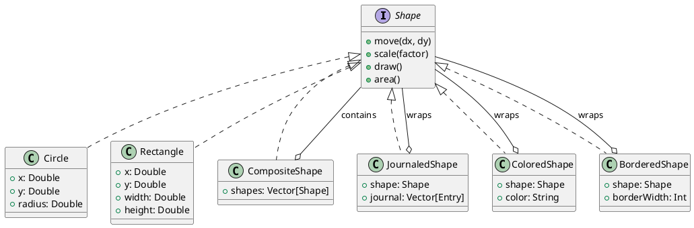
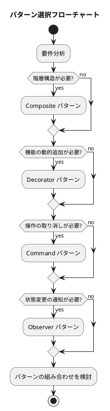

# 第20章: パターン間の相互作用

## 1. はじめに

デザインパターンは単独で使用されることもありますが、実際のアプリケーションでは複数のパターンを組み合わせて使用することが一般的です。本章では、関数型プログラミングにおけるパターンの組み合わせ方と、その相乗効果について解説します。

### 学習目標

- Composite と Decorator パターンの組み合わせを理解する
- Command と Observer パターンの連携を実装する
- 複合的なアーキテクチャ設計のアプローチを学ぶ

## 2. Composite + Decorator パターン

### 2.1 基本概念

**Composite パターン**は、オブジェクトを木構造で表現し、個別オブジェクトと複合オブジェクトを同一視できるようにします。

**Decorator パターン**は、オブジェクトに動的に機能を追加します。

これらを組み合わせることで、複合オブジェクトに対しても装飾を適用できます。



### 2.2 基本図形の実装

```scala
/**
 * 図形の基底trait
 */
trait Shape:
  def move(dx: Double, dy: Double): Shape
  def scale(factor: Double): Shape
  def area: Double
  def draw: String

case class Circle(x: Double, y: Double, radius: Double) extends Shape:
  def move(dx: Double, dy: Double): Circle = copy(x = x + dx, y = y + dy)
  def scale(factor: Double): Circle = copy(radius = radius * factor)
  def area: Double = Math.PI * radius * radius
  def draw: String = s"Circle(x=$x, y=$y, r=$radius)"

case class Rectangle(x: Double, y: Double, width: Double, height: Double) extends Shape:
  def move(dx: Double, dy: Double): Rectangle = copy(x = x + dx, y = y + dy)
  def scale(factor: Double): Rectangle = copy(width = width * factor, height = height * factor)
  def area: Double = width * height
  def draw: String = s"Rectangle(x=$x, y=$y, w=$width, h=$height)"
```

### 2.3 Composite パターンの実装

```scala
case class CompositeShape(shapes: Vector[Shape] = Vector.empty) extends Shape:
  def add(shape: Shape): CompositeShape = copy(shapes = shapes :+ shape)
  def remove(shape: Shape): CompositeShape = copy(shapes = shapes.filterNot(_ == shape))

  def move(dx: Double, dy: Double): CompositeShape =
    copy(shapes = shapes.map(_.move(dx, dy)))

  def scale(factor: Double): CompositeShape =
    copy(shapes = shapes.map(_.scale(factor)))

  def area: Double = shapes.map(_.area).sum

  def draw: String =
    s"Composite[\n  ${shapes.map(_.draw).mkString("\n  ")}\n]"
```

### 2.4 Decorator パターンの実装

```scala
case class JournalEntry(operation: String, timestamp: Long = System.currentTimeMillis())

case class JournaledShape(shape: Shape, journal: Vector[JournalEntry] = Vector.empty) extends Shape:
  def move(dx: Double, dy: Double): JournaledShape =
    copy(
      shape = shape.move(dx, dy),
      journal = journal :+ JournalEntry(s"move($dx, $dy)")
    )

  def scale(factor: Double): JournaledShape =
    copy(
      shape = shape.scale(factor),
      journal = journal :+ JournalEntry(s"scale($factor)")
    )

  def area: Double = shape.area
  def draw: String = s"[Journaled: ${journal.size} ops] ${shape.draw}"
  def getJournal: Vector[JournalEntry] = journal

case class ColoredShape(shape: Shape, color: String) extends Shape:
  def move(dx: Double, dy: Double): ColoredShape = copy(shape = shape.move(dx, dy))
  def scale(factor: Double): ColoredShape = copy(shape = shape.scale(factor))
  def area: Double = shape.area
  def draw: String = s"[$color] ${shape.draw}"

case class BorderedShape(shape: Shape, borderWidth: Int) extends Shape:
  def move(dx: Double, dy: Double): BorderedShape = copy(shape = shape.move(dx, dy))
  def scale(factor: Double): BorderedShape = copy(shape = shape.scale(factor))
  def area: Double = shape.area
  def draw: String = s"[Border: ${borderWidth}px] ${shape.draw}"
```

### 2.5 組み合わせの例

```scala
// Composite に Decorator を適用
val composite = CompositeShape(Circle(0, 0, 10), Rectangle(0, 0, 10, 20))
val journaled = JournaledShape(composite)
val afterMove = journaled.move(5, 3)
afterMove.getJournal.length // => 1

// Decorated な図形を Composite に含める
val coloredCircle = ColoredShape(Circle(0, 0, 10), "red")
val borderedRect = BorderedShape(Rectangle(0, 0, 10, 20), 2)
val comp = CompositeShape(coloredCircle, borderedRect)
comp.draw
// => Composite[
//      [red] Circle...
//      [Border: 2px] Rectangle...
//    ]

// 多重デコレータ
val decorated = JournaledShape(
  BorderedShape(
    ColoredShape(Circle(0, 0, 10), "blue"),
    3
  )
)
decorated.draw // => [Journaled: 0 ops] [Border: 3px] [blue] Circle...
```

## 3. Command + Observer パターン

### 3.1 基本概念

**Command パターン**は、操作をオブジェクトとしてカプセル化し、Undo/Redo を可能にします。

**Observer パターン**は、状態の変更を監視者に通知します。

これらを組み合わせることで、コマンド実行時に自動的に通知を行うシステムを構築できます。

```plantuml
@startuml
title Command + Observer パターン

class Canvas {
  +shapes: Vector[Shape]
}

class ObservableCanvas {
  +canvas: Canvas
  +history: Vector[Command]
  +redoStack: Vector[Command]
  +subject: Subject
}

trait Command {
  +execute(canvas): Canvas
  +undo(canvas): Canvas
  +describe: String
}

class Subject {
  +observers: List[Observer]
  +notify(event)
}

type Observer = Event => Unit

ObservableCanvas o-- Canvas
ObservableCanvas o-- Command : history
ObservableCanvas o-- Subject : notifies
Subject --> Observer : notifies
@enduml
```

### 3.2 Observer パターンの実装

```scala
sealed trait Event
case class CommandExecuted(command: Command, description: String) extends Event
case class CommandUndone(command: Command) extends Event
case class CommandRedone(command: Command) extends Event

type Observer = Event => Unit

class Subject:
  private val observers = ListBuffer.empty[Observer]

  def addObserver(observer: Observer): Unit =
    observers += observer

  def removeObserver(observer: Observer): Unit =
    observers -= observer

  def notifyObservers(event: Event): Unit =
    observers.foreach(_(event))
```

### 3.3 Command パターンの実装

```scala
trait Command:
  def execute(canvas: Canvas): Canvas
  def undo(canvas: Canvas): Canvas
  def describe: String

case class AddShapeCommand(shape: Shape) extends Command:
  def execute(canvas: Canvas): Canvas = canvas.addShape(shape)
  def undo(canvas: Canvas): Canvas = canvas.removeShape(canvas.shapes.length - 1)
  def describe: String = s"Add shape: ${shape.draw}"

case class MoveShapeCommand(index: Int, dx: Double, dy: Double) extends Command:
  def execute(canvas: Canvas): Canvas =
    canvas.getShape(index) match
      case Some(shape) => canvas.updateShape(index, shape.move(dx, dy))
      case None => canvas
  def undo(canvas: Canvas): Canvas =
    canvas.getShape(index) match
      case Some(shape) => canvas.updateShape(index, shape.move(-dx, -dy))
      case None => canvas
  def describe: String = s"Move shape[$index] by ($dx, $dy)"

case class MacroCommand(commands: Vector[Command]) extends Command:
  def execute(canvas: Canvas): Canvas =
    commands.foldLeft(canvas)((c, cmd) => cmd.execute(c))
  def undo(canvas: Canvas): Canvas =
    commands.reverse.foldLeft(canvas)((c, cmd) => cmd.undo(c))
  def describe: String = s"Macro[${commands.map(_.describe).mkString(", ")}]"
```

### 3.4 Command + Observer の統合

```scala
class ObservableCanvas:
  private var canvas: Canvas = Canvas()
  private var history: Vector[Command] = Vector.empty
  private var redoStack: Vector[Command] = Vector.empty
  val subject: Subject = new Subject

  def executeCommand(command: Command): Unit =
    canvas = command.execute(canvas)
    history = history :+ command
    redoStack = Vector.empty
    subject.notifyObservers(CommandExecuted(command, command.describe))

  def undoLast(): Boolean =
    if history.isEmpty then false
    else
      val lastCommand = history.last
      canvas = lastCommand.undo(canvas)
      history = history.init
      redoStack = redoStack :+ lastCommand
      subject.notifyObservers(CommandUndone(lastCommand))
      true

  def redoLast(): Boolean =
    if redoStack.isEmpty then false
    else
      val command = redoStack.last
      canvas = command.execute(canvas)
      redoStack = redoStack.init
      history = history :+ command
      subject.notifyObservers(CommandRedone(command))
      true
```

### 3.5 使用例

```scala
// キャンバスを作成
val obsCanvas = new ObservableCanvas

// ログオブザーバーを登録
val logObserver = new LogObserver
obsCanvas.subject.addObserver(logObserver.observer)

// コマンドを実行
obsCanvas.executeCommand(AddShapeCommand(Circle(0, 0, 10)))
obsCanvas.executeCommand(MoveShapeCommand(0, 5, 3))

logObserver.getLogs
// => List(
//      "Executed: Add shape: Circle...",
//      "Executed: Move shape[0] by (5.0, 3.0)"
//    )

// Undo
obsCanvas.undoLast()
logObserver.getLogs
// => List(..., "Undone: Move shape[0] by (5.0, 3.0)")

// Redo
obsCanvas.redoLast()
```

## 4. Strategy パターンとの組み合わせ

```scala
trait RenderStrategy:
  def render(canvas: Canvas): String

object TextRenderStrategy extends RenderStrategy:
  def render(canvas: Canvas): String =
    canvas.shapes.zipWithIndex.map { case (shape, i) =>
      s"[$i] ${shape.draw}"
    }.mkString("\n")

object JsonRenderStrategy extends RenderStrategy:
  def render(canvas: Canvas): String =
    val shapesJson = canvas.shapes.map(shapeToJson).mkString(",\n  ")
    s"{\n  \"shapes\": [\n  $shapesJson\n  ]\n}"

object SvgRenderStrategy extends RenderStrategy:
  def render(canvas: Canvas): String =
    val shapeSvg = canvas.shapes.map(shapeToSvg).mkString("\n  ")
    s"""<svg xmlns="http://www.w3.org/2000/svg">
  $shapeSvg
</svg>"""
```

## 5. Factory パターンとの組み合わせ

```scala
trait ShapeFactory:
  def createCircle(x: Double, y: Double, radius: Double): Shape
  def createRectangle(x: Double, y: Double, width: Double, height: Double): Shape

object SimpleShapeFactory extends ShapeFactory:
  def createCircle(x: Double, y: Double, radius: Double): Shape = Circle(x, y, radius)
  def createRectangle(x: Double, y: Double, width: Double, height: Double): Shape = Rectangle(x, y, width, height)

class ColoredShapeFactory(color: String) extends ShapeFactory:
  def createCircle(x: Double, y: Double, radius: Double): Shape =
    ColoredShape(Circle(x, y, radius), color)
  def createRectangle(x: Double, y: Double, width: Double, height: Double): Shape =
    ColoredShape(Rectangle(x, y, width, height), color)
```

## 6. Visitor パターンとの組み合わせ

```scala
trait ShapeVisitor[T]:
  def visitCircle(circle: Circle): T
  def visitRectangle(rectangle: Rectangle): T
  def visitComposite(composite: CompositeShape): T
  def visitColored(colored: ColoredShape): T
  def visitBordered(bordered: BorderedShape): T
  def visitJournaled(journaled: JournaledShape): T

object AreaVisitor extends ShapeVisitor[Double]:
  def visitCircle(c: Circle): Double = c.area
  def visitRectangle(r: Rectangle): Double = r.area
  def visitComposite(comp: CompositeShape): Double =
    comp.shapes.map(s => ShapeVisitor.visit(s, this)).sum
  def visitColored(col: ColoredShape): Double = ShapeVisitor.visit(col.shape, this)
  // ...

case class BoundingBox(minX: Double, minY: Double, maxX: Double, maxY: Double):
  def merge(other: BoundingBox): BoundingBox =
    BoundingBox(
      math.min(minX, other.minX),
      math.min(minY, other.minY),
      math.max(maxX, other.maxX),
      math.max(maxY, other.maxY)
    )
```

## 7. パターン選択のガイドライン



## 8. パターン組み合わせのマトリクス

| パターン A | パターン B | 相乗効果 |
|-----------|-----------|---------|
| Composite | Decorator | 複合オブジェクト全体に装飾を適用 |
| Composite | Visitor | 木構造を走査して各要素に操作を適用 |
| Command | Observer | コマンド実行を監視・ログ |
| Command | Composite | マクロコマンドの実現 |
| Strategy | Decorator | 戦略にキャッシュ・ログを追加 |
| Factory | Strategy | 生成戦略の切り替え |

## 9. DSL

```scala
object DSL:
  def circle(x: Double, y: Double, radius: Double): Circle = Circle(x, y, radius)
  def rectangle(x: Double, y: Double, width: Double, height: Double): Rectangle = Rectangle(x, y, width, height)
  def composite(shapes: Shape*): CompositeShape = CompositeShape(shapes.toVector)

  extension (shape: Shape)
    def withColor(color: String): ColoredShape = ColoredShape(shape, color)
    def withBorder(width: Int): BorderedShape = BorderedShape(shape, width)
    def withJournal: JournaledShape = JournaledShape(shape)

// 使用例
import DSL.*

val decorated = circle(0, 0, 10)
  .withColor("red")
  .withBorder(3)
  .withJournal
```

## まとめ

### パターン組み合わせの原則

1. **単一責任を維持**: 各パターンは独自の責任を持つ
2. **疎結合を保つ**: パターン間は明確なインターフェースで連携
3. **データ中心**: パターン間のやり取りはデータで行う
4. **テスト可能性**: 組み合わせても個別にテスト可能

### Scala での利点

- **case class による不変性**: 状態の追跡が容易
- **パターンマッチング**: Visitor パターンの簡潔な実装
- **extension methods**: DSL の構築が容易
- **型安全性**: コンパイル時にエラーを検出

## 参考コード

本章のコード例は以下のファイルで確認できます：

- ソースコード: `app/scala/part7/src/main/scala/PatternInteractions.scala`
- テストコード: `app/scala/part7/src/test/scala/PatternInteractionsSpec.scala`
