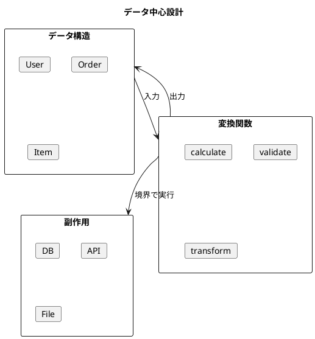

# 第21章: 関数型デザインのベストプラクティス

## 1. はじめに

本章では、関数型プログラミングにおける設計のベストプラクティスを体系的に解説します。これらの原則は、保守性が高く、テストしやすい、堅牢なソフトウェアを構築するための指針となります。

### 学習目標

- データ中心設計の原則を理解する
- 純粋関数と副作用の分離方法を学ぶ
- テスト可能な設計パターンを習得する

## 2. データ中心設計

### 2.1 基本原則

関数型プログラミングでは、**データが主役**です。まずデータ構造を設計し、そのデータを変換する関数を実装します。



### 2.2 データ構造の定義

```scala
// シンプルな case class でデータを表現
case class User(
  id: String,
  name: String,
  email: String,
  createdAt: Long = System.currentTimeMillis()
)

case class OrderItem(
  productId: String,
  quantity: Int,
  price: BigDecimal
)

case class Order(
  id: String,
  userId: String,
  items: Vector[OrderItem],
  status: OrderStatus = OrderStatus.Pending,
  createdAt: Long = System.currentTimeMillis()
)

enum OrderStatus:
  case Pending, Processing, Completed, Cancelled
```

**ポイント**:
- case class を使用（不変性を保証）
- 必要最小限のフィールド
- 明確な命名

### 2.3 小さな純粋関数

```scala
object OrderCalculations:
  // 各関数は単一の責任を持つ
  def calculateItemTotal(item: OrderItem): BigDecimal =
    item.price * item.quantity

  def calculateOrderTotal(order: Order): BigDecimal =
    order.items.map(calculateItemTotal).sum

  def applyDiscount(total: BigDecimal, discountRate: BigDecimal): BigDecimal =
    total * (1 - discountRate)

  def applyTax(total: BigDecimal, taxRate: BigDecimal): BigDecimal =
    total * (1 + taxRate)
```

**原則**:
- 1つの関数は1つのことを行う
- 入力から出力への純粋な変換
- 副作用なし

### 2.4 データ変換パイプライン

```scala
def processOrder(
  order: Order,
  discountRate: BigDecimal,
  taxRate: BigDecimal
): ProcessedOrder =
  val subtotal = calculateOrderTotal(order)
  val discountedSubtotal = applyDiscount(subtotal, discountRate)
  val discount = subtotal - discountedSubtotal
  val tax = discountedSubtotal * taxRate
  val total = discountedSubtotal + tax

  ProcessedOrder(
    order = order.copy(status = OrderStatus.Processing),
    subtotal = subtotal,
    discount = discount,
    tax = tax,
    total = total
  )
```

## 3. データ検証

### 3.1 検証結果の型

```scala
sealed trait ValidationResult[+A]:
  def isValid: Boolean
  def map[B](f: A => B): ValidationResult[B]
  def flatMap[B](f: A => ValidationResult[B]): ValidationResult[B]

case class Valid[A](value: A) extends ValidationResult[A]:
  def isValid: Boolean = true
  def map[B](f: A => B): ValidationResult[B] = Valid(f(value))
  def flatMap[B](f: A => ValidationResult[B]): ValidationResult[B] = f(value)

case class Invalid(errors: Vector[String]) extends ValidationResult[Nothing]:
  def isValid: Boolean = false
  def map[B](f: Nothing => B): ValidationResult[B] = this
  def flatMap[B](f: Nothing => ValidationResult[B]): ValidationResult[B] = this
```

### 3.2 検証関数

```scala
object Validation:
  def validEmail(email: String): Boolean =
    email.matches("^[^@]+@[^@]+\\.[^@]+$")

  def validateUser(user: User): ValidationResult[User] =
    val errors = Vector.newBuilder[String]

    if !nonEmpty(user.name) then
      errors += "Name is required"
    if !validEmail(user.email) then
      errors += "Invalid email format"

    val errs = errors.result()
    if errs.isEmpty then Valid(user) else Invalid(errs)
```

## 4. イミュータブルな更新

```scala
object ImmutableUpdates:
  def updateUserEmail(user: User, newEmail: String): Either[String, User] =
    if Validation.validEmail(newEmail) then
      Right(user.copy(email = newEmail))
    else
      Left("Invalid email format")

  def cancelOrder(order: Order): Either[String, Order] =
    if order.status == OrderStatus.Pending then
      Right(order.copy(status = OrderStatus.Cancelled))
    else
      Left("Only pending orders can be cancelled")
```

**イミュータビリティの利点**:
- 元のデータは変更されない
- 履歴の追跡が容易
- 並行処理が安全

## 5. 純粋関数と副作用の分離

### 5.1 IO モナド

```scala
sealed trait IO[+A]:
  def map[B](f: A => B): IO[B] = IO.Map(this, f)
  def flatMap[B](f: A => IO[B]): IO[B] = IO.FlatMap(this, f)
  def run(): A

object IO:
  case class Pure[A](value: A) extends IO[A]:
    def run(): A = value

  case class Suspend[A](thunk: () => A) extends IO[A]:
    def run(): A = thunk()

  def pure[A](a: A): IO[A] = Pure(a)
  def suspend[A](thunk: => A): IO[A] = Suspend(() => thunk)
```

## 6. 高階関数によるデコレーション

```scala
object FunctionDecorators:
  // ロギングデコレータ
  def withLogging[A, B](f: A => B, logger: String => Unit): A => B =
    (a: A) =>
      logger(s"Input: $a")
      val result = f(a)
      logger(s"Output: $result")
      result

  // リトライデコレータ
  def withRetry[A, B](f: A => B, maxRetries: Int): A => Try[B] =
    (a: A) =>
      def attempt(remaining: Int): Try[B] =
        Try(f(a)) match
          case success @ Success(_) => success
          case Failure(_) if remaining > 0 => attempt(remaining - 1)
          case failure => failure
      attempt(maxRetries)

  // キャッシュデコレータ
  def withCache[A, B](f: A => B): A => B =
    val cache = scala.collection.mutable.Map.empty[A, B]
    (a: A) => cache.getOrElseUpdate(a, f(a))
```

## 7. 関数合成

```scala
object FunctionComposition:
  // パイプライン形式の関数合成
  def pipeline[A](fns: (A => A)*): A => A =
    fns.reduce((f, g) => x => g(f(x)))

  // 条件付き関数適用
  def when[A](condition: Boolean)(f: A => A): A => A =
    if condition then f else identity

  // 繰り返し適用
  def repeat[A](n: Int)(f: A => A): A => A =
    if n <= 0 then identity
    else pipeline((1 to n).map(_ => f): _*)

// 使用例
val process = pipeline[Int](_ + 1, _ * 2, _ - 3)
process(5)  // => (5+1)*2-3 = 9
```

## 8. テスト可能な設計 - 依存性注入

```scala
// リポジトリインターフェース
trait Repository[T, ID]:
  def findById(id: ID): Option[T]
  def findAll(): Vector[T]
  def save(entity: T): T
  def delete(id: ID): Boolean

// インメモリリポジトリ（テスト用）
class InMemoryRepository[T, ID](idExtractor: T => ID) extends Repository[T, ID]:
  private var data = Vector.empty[T]

  def findById(id: ID): Option[T] =
    data.find(e => idExtractor(e) == id)

  def save(entity: T): T =
    data = data.filterNot(e => idExtractor(e) == idExtractor(entity)) :+ entity
    entity
```

## 9. テスト可能な設計 - 時間の抽象化

```scala
// 時間プロバイダー
trait Clock:
  def now(): Long

object SystemClock extends Clock:
  def now(): Long = System.currentTimeMillis()

class FixedClock(time: Long) extends Clock:
  def now(): Long = time

// ID生成器
trait IdGenerator:
  def generate(): String

class SequentialIdGenerator(prefix: String = "id") extends IdGenerator:
  private var counter = 0
  def generate(): String =
    counter += 1
    s"$prefix-$counter"
```

## 10. テスト可能な設計 - 設定の分離

```scala
case class PricingConfig(
  taxRate: BigDecimal = BigDecimal("0.1"),
  discountRate: BigDecimal = BigDecimal("0.0"),
  currency: String = "JPY"
)

object Pricing:
  def calculatePrice(config: PricingConfig, basePrice: BigDecimal): PriceBreakdown =
    val discounted = basePrice * (1 - config.discountRate)
    val tax = discounted * config.taxRate
    val total = discounted + tax

    PriceBreakdown(
      basePrice = basePrice,
      discountedPrice = discounted,
      tax = tax,
      total = total,
      currency = config.currency
    )
```

## 11. サービス層の設計

```scala
class UserService(
  repository: Repository[User, String],
  clock: Clock,
  idGenerator: IdGenerator
):
  def createUser(name: String, email: String): Either[Vector[String], User] =
    val user = User(
      id = idGenerator.generate(),
      name = name,
      email = email,
      createdAt = clock.now()
    )

    Validation.validateUser(user) match
      case Valid(u) => Right(repository.save(u))
      case Invalid(errors) => Left(errors)
```

## 12. DSL

```scala
object DSL:
  def user(name: String, email: String)(using clock: Clock, idGen: IdGenerator): User =
    User(idGen.generate(), name, email, clock.now())

  def order(userId: String, items: OrderItem*)(using clock: Clock, idGen: IdGenerator): Order =
    Order(idGen.generate(), userId, items.toVector, createdAt = clock.now())

  extension (order: Order)
    def withItem(item: OrderItem): Order = order.copy(items = order.items :+ item)
    def process(discountRate: BigDecimal, taxRate: BigDecimal): ProcessedOrder =
      OrderProcessing.processOrder(order, discountRate, taxRate)

// 使用例
given Clock = new FixedClock(1000)
given IdGenerator = new SequentialIdGenerator("u")

import DSL.*
val u = user("John", "john@example.com")
```

## 13. Result 型

```scala
enum Result[+E, +A]:
  case Success(value: A)
  case Failure(error: E)

  def map[B](f: A => B): Result[E, B] = this match
    case Success(a) => Success(f(a))
    case Failure(e) => Failure(e)

  def flatMap[E2 >: E, B](f: A => Result[E2, B]): Result[E2, B] = this match
    case Success(a) => f(a)
    case Failure(e) => Failure(e)

object Result:
  def fromOption[A](opt: Option[A], ifNone: => String): Result[String, A] =
    opt match
      case Some(a) => Success(a)
      case None => Failure(ifNone)

  def fromEither[E, A](either: Either[E, A]): Result[E, A] =
    either match
      case Right(a) => Success(a)
      case Left(e) => Failure(e)
```

## まとめ

### ベストプラクティスの要約

| カテゴリ | プラクティス | 効果 |
|---------|------------|------|
| データ設計 | case class を使用 | 不変性、型安全性 |
| 関数設計 | 小さな純粋関数 | テスト容易性、再利用性 |
| 副作用 | 境界に押し出す | 予測可能性、保守性 |
| 依存性 | 注入パターン | テスト容易性、疎結合 |
| 検証 | 型安全な検証 | 明確性、拡張性 |

### 実践のポイント

1. **データファースト**: まずデータ構造を設計
2. **小さな関数**: 1関数1責任
3. **純粋性を優先**: 副作用は最後に
4. **テストを考慮**: 依存性は注入可能に
5. **型を活用**: 型で不正状態を表現不能に

## 参考コード

本章のコード例は以下のファイルで確認できます：

- ソースコード: `app/scala/part7/src/main/scala/BestPractices.scala`
- テストコード: `app/scala/part7/src/test/scala/BestPracticesSpec.scala`
