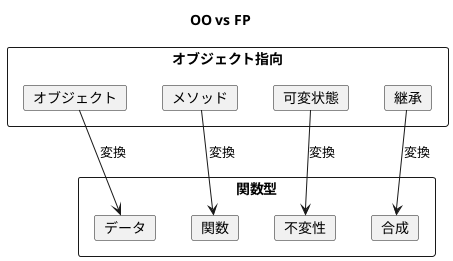
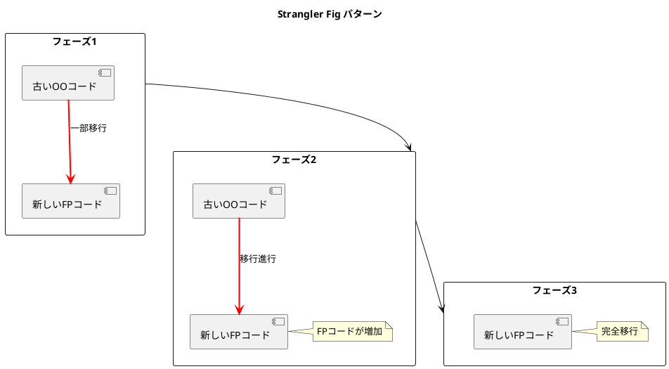
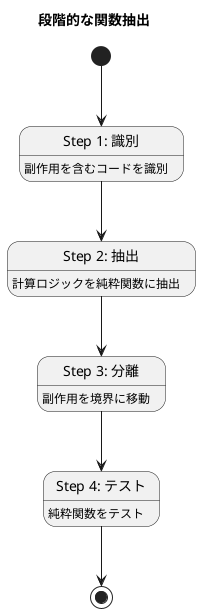
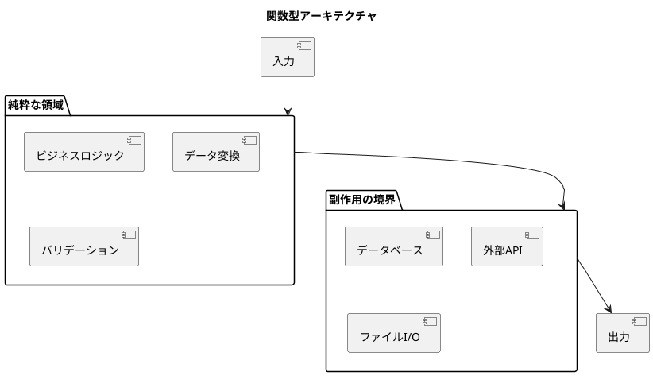

# 第22章: オブジェクト指向から関数型への移行

## 1. はじめに

本章では、オブジェクト指向（OO）スタイルのコードを関数型（FP）スタイルに移行するための戦略とテクニックを解説します。Scala は OO と FP の両方をサポートするため、段階的なアプローチにより既存のコードベースを安全に関数型に移行できます。

### 学習目標

- OO と FP の根本的な違いを理解する
- 段階的な移行戦略を学ぶ
- 実践的なリファクタリングパターンを習得する

## 2. OO と FP の対比

### 2.1 パラダイムの違い



| 概念 | オブジェクト指向 | 関数型 |
|-----|----------------|-------|
| 基本単位 | オブジェクト | データ + 関数 |
| 状態管理 | 可変（mutable） | 不変（immutable） |
| 多態性 | 継承・インターフェース | ADT・パターンマッチ |
| コード再利用 | 継承 | 関数合成 |
| 副作用 | どこでも可能 | 境界に分離 |

### 2.2 OO スタイルの例

```scala
object OOStyle:
  /** OOスタイル: 内部状態を持つオブジェクト（可変） */
  class Account(val id: String, initialBalance: Double):
    private var _balance: Double = initialBalance
    private var _transactions: List[Transaction] = List.empty

    def balance: Double = _balance
    def transactions: List[Transaction] = _transactions

    def deposit(amount: Double): Double =
      if amount > 0 then
        _balance += amount
        _transactions = _transactions :+ Transaction(TransactionType.Deposit, amount)
        _balance
      else _balance

    def withdraw(amount: Double): Double =
      if amount > 0 && _balance >= amount then
        _balance -= amount
        _transactions = _transactions :+ Transaction(TransactionType.Withdrawal, amount)
        _balance
      else _balance
```

**問題点**:
- 内部状態が可変
- テストが困難（状態に依存）
- 履歴の追跡が難しい

### 2.3 FP スタイルへの変換

```scala
object FPStyle:
  /** トランザクションの種類 */
  enum TransactionType:
    case Deposit, Withdrawal

  /** トランザクション記録 */
  case class Transaction(transactionType: TransactionType, amount: Double)

  /** 口座（不変データ） */
  case class Account(
      id: String,
      balance: Double,
      transactions: List[Transaction] = List.empty
  )

  /** 口座を作成 */
  def makeAccount(id: String, initialBalance: Double): Account =
    Account(id, initialBalance)

  /** 入金（新しい口座を返す） */
  def deposit(account: Account, amount: Double): Account =
    if amount > 0 then
      account.copy(
        balance = account.balance + amount,
        transactions = account.transactions :+ Transaction(TransactionType.Deposit, amount)
      )
    else account

  /** 出金（新しい口座を返す） */
  def withdraw(account: Account, amount: Double): Account =
    if amount > 0 && account.balance >= amount then
      account.copy(
        balance = account.balance - amount,
        transactions = account.transactions :+ Transaction(TransactionType.Withdrawal, amount)
      )
    else account
```

**利点**:
- 元のデータは不変
- テストが容易（入力 → 出力）
- 完全な履歴を保持

### 2.4 使用例の比較

```scala
// OOスタイル: 副作用で状態変更
val accOO = new OOStyle.Account("A001", 1000)
accOO.deposit(500)   // 内部状態が変わる
accOO.withdraw(200)  // 内部状態が変わる
println(accOO.balance)  // 1300

// FPスタイル: 新しい値を生成
val acc1 = FPStyle.makeAccount("A001", 1000)
val acc2 = FPStyle.deposit(acc1, 500)   // acc1は変わらない
val acc3 = FPStyle.withdraw(acc2, 200)  // acc2も変わらない
println(FPStyle.getBalance(acc3))  // 1300
println(FPStyle.getBalance(acc1))  // 1000（元のまま）
```

## 3. 移行戦略

### 3.1 Strangler Fig パターン

古いコードを徐々に新しいコードで「絞め殺す」パターン。



```scala
/** スタイル識別子 */
enum Style:
  case FP, OO

/** Strangler パターン用のラッパー */
case class StranglerAccount(style: Style, data: Account)

/** フィーチャーフラグによるアカウント作成 */
def createAccountStrangler(id: String, initialBalance: Double, useFP: Boolean): StranglerAccount =
  if useFP then StranglerAccount(Style.FP, makeAccount(id, initialBalance))
  else StranglerAccount(Style.OO, makeAccount(id, initialBalance))

/** Strangler パターンでの入金 */
def accountDeposit(account: StranglerAccount, amount: Double): StranglerAccount =
  account.style match
    case Style.FP => account.copy(data = deposit(account.data, amount))
    case Style.OO => account.copy(data = deposit(account.data, amount))
```

### 3.2 アダプターパターン

古いインターフェースを維持しながら、内部実装を FP に移行。

```scala
/** 既存のインターフェースを維持するためのトレイト */
trait AccountOperations:
  def getAccountBalance: Double
  def depositToAccount(amount: Double): Double
  def withdrawFromAccount(amount: Double): Double

/** FPスタイルのアダプター（状態は外部で管理） */
class FPAccountAdapter(private var account: Account) extends AccountOperations:
  def getAccountBalance: Double = getBalance(account)

  def depositToAccount(amount: Double): Double =
    account = deposit(account, amount)
    getBalance(account)

  def withdrawFromAccount(amount: Double): Double =
    account = withdraw(account, amount)
    getBalance(account)

def makeFPAccountAdapter(id: String, initialBalance: Double): FPAccountAdapter =
  new FPAccountAdapter(makeAccount(id, initialBalance))

// 使用例：既存コードとの互換性を維持
val adapter = makeFPAccountAdapter("A001", 1000)
adapter.depositToAccount(500)
println(adapter.getAccountBalance)  // 1500
```

### 3.3 イベントソーシング移行

状態をイベントの履歴として表現。

```scala
/** イベントの種類 */
enum EventType:
  case Created, Deposited, Withdrawn

/** イベント */
case class AccountEvent(
    eventType: EventType,
    data: Map[String, Any],
    timestamp: Long = System.currentTimeMillis()
)

/** イベントを適用して状態を更新 */
def applyEvent(account: Account, event: AccountEvent): Account =
  event.eventType match
    case EventType.Created =>
      Account(
        id = event.data("id").toString,
        balance = event.data.getOrElse("balance", 0.0).asInstanceOf[Double],
        transactions = List.empty
      )
    case EventType.Deposited =>
      deposit(account, event.data("amount").asInstanceOf[Double])
    case EventType.Withdrawn =>
      withdraw(account, event.data("amount").asInstanceOf[Double])

/** イベントのリプレイ */
def replayEvents(events: List[AccountEvent]): Account =
  events.foldLeft(Account("", 0.0))(applyEvent)

// 使用例
val events = List(
  accountEvent(EventType.Created, Map("id" -> "A001", "balance" -> 0.0)),
  accountEvent(EventType.Deposited, Map("amount" -> 1000.0)),
  accountEvent(EventType.Withdrawn, Map("amount" -> 300.0))
)
val account = replayEvents(events)  // balance: 700
```

**利点**:
- 完全な監査証跡
- 任意の時点の状態を再構築可能
- デバッグが容易

### 3.4 段階的な関数抽出

副作用を含むコードから純粋ロジックを段階的に抽出。



```scala
// Step 1: 計算ロジックを純粋関数に抽出
def calculateInterest(balance: Double, rate: Double, days: Int): Double =
  balance * rate * (days / 365.0)

def calculateFee(balance: Double, feeStructure: FeeStructure): Double =
  if balance < feeStructure.minimumBalance then feeStructure.lowBalanceFee
  else if balance > feeStructure.premiumThreshold then 0.0
  else feeStructure.standardFee

// Step 2: 業務ルールを純粋関数として表現
def canWithdraw(account: Account, amount: Double, overdraftLimit: Double): Boolean =
  account.balance + overdraftLimit >= amount

def calculateNewBalance(currentBalance: Double, operation: TransactionType, amount: Double): Double =
  operation match
    case TransactionType.Deposit    => currentBalance + amount
    case TransactionType.Withdrawal => currentBalance - amount

// Step 3: 副作用を境界に押し出す
def processTransaction(
    account: Account,
    operation: TransactionType,
    amount: Double,
    rules: TransactionRules
): ProcessResult =
  val canProcess = operation match
    case TransactionType.Deposit    => true
    case TransactionType.Withdrawal => canWithdraw(account, amount, rules.overdraftLimit)

  if canProcess then
    val newBalance = calculateNewBalance(account.balance, operation, amount)
    val newAccount = account.copy(
      balance = newBalance,
      transactions = account.transactions :+ Transaction(operation, amount)
    )
    ProcessResult(true, newAccount)
  else ProcessResult(false, account, Some("Insufficient funds"))
```

## 4. ADT による多態性

### 4.1 継承から ADT + パターンマッチへ

```scala
/** 図形（ADT） */
sealed trait Shape:
  def x: Double
  def y: Double

case class Circle(x: Double, y: Double, radius: Double) extends Shape
case class Rectangle(x: Double, y: Double, width: Double, height: Double) extends Shape
case class Triangle(x: Double, y: Double, base: Double, height: Double) extends Shape

/** 図形の面積を計算（パターンマッチで多態性） */
def area(shape: Shape): Double = shape match
  case Circle(_, _, r)         => Math.PI * r * r
  case Rectangle(_, _, w, h)   => w * h
  case Triangle(_, _, base, h) => base * h / 2

/** 図形を拡大（パターンマッチで多態性） */
def scale(shape: Shape, factor: Double): Shape = shape match
  case c: Circle    => c.copy(radius = c.radius * factor)
  case r: Rectangle => r.copy(width = r.width * factor, height = r.height * factor)
  case t: Triangle  => t.copy(base = t.base * factor, height = t.height * factor)

/** 共通操作（型に依存しない） */
def move(shape: Shape, dx: Double, dy: Double): Shape = shape match
  case c: Circle    => c.copy(x = c.x + dx, y = c.y + dy)
  case r: Rectangle => r.copy(x = r.x + dx, y = r.y + dy)
  case t: Triangle  => t.copy(x = t.x + dx, y = t.y + dy)
```

**使用例**:
```scala
val circle = Circle(0, 0, 10)
val rect = Rectangle(0, 0, 10, 20)

println(area(circle))        // 314.159...
println(area(rect))          // 200.0

val moved = move(circle, 5, 3)  // Circle(5, 3, 10)
val scaled = scale(rect, 2)     // Rectangle(0, 0, 20, 40)
```

## 5. イベント駆動アーキテクチャ

### 5.1 FP スタイルのイベントシステム

```scala
/** イベント */
case class Event[A](eventType: String, data: A)

/** イベントハンドラ */
type EventHandler[A, B] = Event[A] => B

/** イベントシステム（不変） */
case class EventSystem[A](
    handlers: Map[String, List[EventHandler[A, Any]]] = Map.empty,
    eventLog: List[Event[A]] = List.empty
)

/** ハンドラを登録 */
def subscribe[A, B](
    system: EventSystem[A],
    eventType: String,
    handler: EventHandler[A, B]
): EventSystem[A] =
  val currentHandlers = system.handlers.getOrElse(eventType, List.empty)
  system.copy(
    handlers = system.handlers + (eventType -> (currentHandlers :+ handler))
  )

/** イベントを発行 */
def publish[A](system: EventSystem[A], eventType: String, data: A): PublishResult[A] =
  val event = Event(eventType, data)
  val handlers = system.handlers.getOrElse(eventType, List.empty)
  val results = handlers.map(h => h(event))
  val newSystem = system.copy(eventLog = system.eventLog :+ event)
  PublishResult(newSystem, results)
```

**使用例**:
```scala
val system = subscribe(
  makeEventSystem[Map[String, String]](),
  "user-created",
  (e: Event[Map[String, String]]) => s"Welcome, ${e.data("name")}"
)

val result = publish(system, "user-created", Map("name" -> "John", "email" -> "john@example.com"))
println(result.results.head)  // "Welcome, John"
```

## 6. 実践的な移行例

### 6.1 ドメインモデリング

```scala
/** ユーザーID（値オブジェクト） */
opaque type UserId = String
object UserId:
  def apply(value: String): UserId = value
  extension (id: UserId) def value: String = id

/** メールアドレス（値オブジェクト + バリデーション） */
opaque type Email = String
object Email:
  def apply(value: String): Either[String, Email] =
    if value.contains("@") && value.length > 3 then Right(value)
    else Left("Invalid email format")

  extension (email: Email) def value: String = email

/** ユーザー（不変エンティティ） */
case class User(id: UserId, name: String, email: String, active: Boolean = true)

/** ユーザー作成（バリデーション付き） */
def createUser(id: String, name: String, email: String): CreateUserResult =
  val errors = List(
    if name.isEmpty then Some("Name is required") else None,
    if !email.contains("@") then Some("Invalid email") else None,
    if id.isEmpty then Some("ID is required") else None
  ).flatten

  if errors.isEmpty then UserCreated(User(UserId(id), name, email))
  else UserCreationFailed(errors)
```

### 6.2 リポジトリパターン（FP版）

```scala
/** リポジトリ操作の結果 */
sealed trait RepositoryResult[+A]
case class Found[A](value: A) extends RepositoryResult[A]
case object NotFound extends RepositoryResult[Nothing]
case class RepoError(message: String) extends RepositoryResult[Nothing]

/** 不変リポジトリ */
case class UserRepository(users: Map[UserId, User] = Map.empty):
  def save(user: User): UserRepository =
    copy(users = users + (user.id -> user))

  def findById(id: UserId): RepositoryResult[User] =
    users.get(id) match
      case Some(user) => Found(user)
      case None       => NotFound

  def findAll: List[User] = users.values.toList

  def delete(id: UserId): UserRepository =
    copy(users = users - id)

  def update(id: UserId, f: User => User): UserRepository =
    users.get(id) match
      case Some(user) => copy(users = users + (id -> f(user)))
      case None       => this
```

### 6.3 サービス層（純粋関数）

```scala
/** サービス操作の結果 */
case class ServiceResult[A](value: A, repository: UserRepository)

/** ユーザーサービス（純粋関数として実装） */
object UserService:
  def registerUser(
      repo: UserRepository,
      id: String,
      name: String,
      email: String
  ): Either[List[String], ServiceResult[User]] =
    createUser(id, name, email) match
      case UserCreated(user) =>
        Right(ServiceResult(user, repo.save(user)))
      case UserCreationFailed(errors) =>
        Left(errors)

  def deactivateUser(
      repo: UserRepository,
      id: UserId
  ): Either[String, ServiceResult[User]] =
    repo.findById(id) match
      case Found(user) =>
        val updated = user.copy(active = false)
        Right(ServiceResult(updated, repo.update(id, _ => updated)))
      case NotFound =>
        Left("User not found")

  def getAllActiveUsers(repo: UserRepository): List[User] =
    repo.findAll.filter(_.active)
```

### 6.4 パイプライン処理

```scala
/** パイプライン演算子（拡張メソッド） */
extension [A](a: A)
  def |>[B](f: A => B): B = f(a)

// 使用例
val result = 10 |> (_ * 2) |> (_ + 5)  // 25

/** データ変換の例 */
def transformUserData(users: List[User]): Map[String, List[String]] =
  users
    .filter(_.active)
    .groupBy(_.name.head.toString.toUpperCase)
    .view
    .mapValues(_.map(_.email))
    .toMap
```

## 7. 移行チェックリスト

### 7.1 準備フェーズ

- [ ] 現在のコードの状態を把握
- [ ] テストカバレッジを確認
- [ ] 移行の優先順位を決定
- [ ] チームへの教育

### 7.2 実行フェーズ

- [ ] 純粋関数を抽出
- [ ] 副作用を分離
- [ ] ADT に移行
- [ ] テストを追加

### 7.3 完了フェーズ

- [ ] 古いコードを削除
- [ ] ドキュメントを更新
- [ ] パフォーマンスを確認
- [ ] チームレビュー

## 8. OO vs FP 比較表

| 側面 | OO | FP | 優位性 |
|-----|----|----|-------|
| 基本単位 | オブジェクト | データ + 関数 | FP: より単純な構造 |
| 状態管理 | 可変（mutable） | 不変（immutable） | FP: 予測可能 |
| 多態性 | 継承・インターフェース | ADT・パターンマッチ | FP: より柔軟 |
| コード再利用 | 継承 | 関数合成 | FP: より疎結合 |
| 副作用 | どこでも可能 | 境界に分離 | FP: テスト容易 |
| テスト | モックが必要 | 入力→出力のみ | FP: シンプル |
| デバッグ | 状態追跡が困難 | 値が不変で追跡容易 | FP: 容易 |
| 並行処理 | ロックが必要 | 不変データで安全 | FP: 安全 |

## 9. テストコード

```scala
describe("OOスタイル vs FPスタイル"):
  it("FPスタイルは元の値を変更しない"):
    val acc = makeAccount("A001", 1000)
    val newAcc = deposit(acc, 500)
    getBalance(acc) shouldBe 1000    // 元は変わらない
    getBalance(newAcc) shouldBe 1500

describe("移行戦略"):
  it("アダプターで既存インターフェースを維持"):
    val adapter = makeFPAccountAdapter("A001", 1000)
    adapter.depositToAccount(500) shouldBe 1500
    adapter.getAccountBalance shouldBe 1500

  it("イベントをリプレイできる"):
    val events = List(
      accountEvent(EventType.Created, Map("id" -> "A001", "balance" -> 0.0)),
      accountEvent(EventType.Deposited, Map("amount" -> 1000.0)),
      accountEvent(EventType.Withdrawn, Map("amount" -> 300.0))
    )
    val account = replayEvents(events)
    account.balance shouldBe 700

describe("ADTによる多態性"):
  it("異なる図形の面積を計算"):
    val circle = Circle(0, 0, 10)
    val rect = Rectangle(0, 0, 10, 20)
    area(circle) shouldBe Math.PI * 100
    area(rect) shouldBe 200
```

## 10. まとめ

### 移行のポイント

1. **段階的に進める**: 一度にすべてを変更しない
2. **テストを書く**: 移行前後の動作を保証
3. **アダプターを活用**: 既存のインターフェースを維持
4. **純粋関数から始める**: 計算ロジックを先に抽出

### 関数型アーキテクチャ



### シリーズのまとめ

本シリーズを通じて、以下を学びました：

1. **基礎原則**: 不変性、関数合成、多態性
2. **仕様とテスト**: データ検証、プロパティベーステスト、TDD
3. **構造パターン**: Composite、Decorator、Adapter
4. **振る舞いパターン**: Strategy、Command、Visitor
5. **生成パターン**: Abstract Factory、Abstract Server
6. **ケーススタディ**: 実践的なアプリケーション
7. **ベストプラクティス**: データ中心設計、テスト可能な設計

関数型デザインは、シンプルで保守しやすく、テストしやすいソフトウェアを構築するための強力なアプローチです。Scala の表現力豊かな型システムと関数型機能を活用して、より良いソフトウェアを作成してください。

---

**Simple made easy.**
