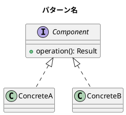

# 関数型デザイン - 多言語実装ガイド

本ドキュメントは、Clojure 版の記事を他の言語（Scala, TypeScript, Rust, Go など）で実装するための手順書です。

## 概要

### プロジェクト構造

```
docs/article/
├── clojure/           # オリジナル（参照元）
│   ├── index.md
│   ├── 01-immutability-and-data-transformation.md
│   ├── ...
│   └── 22-oo-to-fp-migration.md
├── scala/             # 実装済み
│   ├── index.md
│   ├── 01-immutability-and-data-transformation.md
│   ├── ...
│   └── 22-oo-to-fp-migration.md
└── {language}/        # 新規実装対象
    ├── index.md
    └── ...

app/
├── clojure/           # Clojure 実装
├── scala/             # Scala 実装
│   ├── part1/         # 第1部: 基礎原則
│   ├── part2/         # 第2部: 仕様とテスト
│   ├── part3/         # 第3部: 構造パターン
│   ├── part4/         # 第4部: 振る舞いパターン
│   ├── part5/         # 第5部: 生成パターン
│   ├── part6/         # 第6部: ケーススタディ
│   └── part7/         # 第7部: まとめと応用
└── {language}/        # 新規実装対象
```

### 章構成（全22章）

| 部 | 章 | タイトル |
|---|---|---------|
| 1 | 1 | 不変性とデータ変換 |
| 1 | 2 | 関数合成と高階関数 |
| 1 | 3 | 多態性の実現方法 |
| 2 | 4 | データ検証（Clojure: Spec） |
| 2 | 5 | プロパティベーステスト |
| 2 | 6 | TDD と関数型 |
| 3 | 7 | Composite パターン |
| 3 | 8 | Decorator パターン |
| 3 | 9 | Adapter パターン |
| 4 | 10 | Strategy パターン |
| 4 | 11 | Command パターン |
| 4 | 12 | Visitor パターン |
| 5 | 13 | Abstract Factory パターン |
| 5 | 14 | Abstract Server パターン |
| 6 | 15 | ゴシップ好きなバスの運転手 |
| 6 | 16 | 給与計算システム |
| 6 | 17 | レンタルビデオシステム |
| 6 | 18 | 並行処理システム |
| 6 | 19 | Wa-Tor シミュレーション |
| 7 | 20 | パターン間の相互作用 |
| 7 | 21 | ベストプラクティス |
| 7 | 22 | OO から FP への移行 |

---

## Phase 1: 環境構築

### 1.1 ディレクトリ作成

```bash
# ドキュメントディレクトリ
mkdir -p docs/article/{language}

# コード実装ディレクトリ
mkdir -p app/{language}/part{1..7}
```

### 1.2 プロジェクト設定

各言語のビルドツールとテストフレームワークを設定：

| 言語 | ビルドツール | テストフレームワーク |
|-----|------------|-------------------|
| TypeScript | npm/pnpm | Jest / Vitest |
| Rust | Cargo | built-in test |
| Go | go mod | built-in testing |
| Kotlin | Gradle | JUnit5 / Kotest |
| F# | dotnet | xUnit / Expecto |
| Haskell | Cabal/Stack | HSpec / QuickCheck |
| Elixir | Mix | ExUnit |

### 1.3 Nix 環境（推奨）

`flake.nix` に新言語の devShell を追加：

```nix
{language} = pkgs.mkShell {
  buildInputs = with pkgs; [
    # 言語固有のツール
  ];
  shellHook = ''
    echo "{Language} development environment"
  '';
};
```

---

## Phase 2: 実装手順（章ごと）

### 2.1 基本フロー

```
1. Clojure 記事を読む
   ↓
2. 言語のイディオムにマッピング
   ↓
3. コード実装（TDD）
   ↓
4. テスト作成・実行
   ↓
5. ドキュメント作成
   ↓
6. mkdocs.yml 更新
   ↓
7. Git コミット
```

### 2.2 各章の実装

#### Step 1: Clojure 記事の確認

```bash
# 対象章を確認
cat docs/article/clojure/{chapter}.md
```

#### Step 2: コード実装

```bash
# Part ディレクトリで作業
cd app/{language}/part{n}

# ソースファイル作成
# 例: src/{ChapterName}.{ext}

# テストファイル作成
# 例: test/{ChapterName}Test.{ext} または {ChapterName}.test.{ext}
```

#### Step 3: テスト実行

```bash
# 言語ごとのテストコマンド
# TypeScript: npm test
# Rust: cargo test
# Go: go test ./...
```

#### Step 4: ドキュメント作成

```bash
# Clojure をベースに言語固有の記事を作成
# テンプレート: docs/article/scala/{chapter}.md を参考
```

#### Step 5: mkdocs.yml 更新

```yaml
nav:
  - {Language}:
      - 概要: {language}/index.md
      - 第1部 - 基礎原則:
          - 1. 不変性とデータ変換: {language}/01-immutability-and-data-transformation.md
      # ... 続く
```

#### Step 6: コミット

```bash
git add app/{language}/part{n}/ docs/article/{language}/{chapter}.md mkdocs.yml
git commit -m "Add Chapter {N}: {Title} in {Language}

- Implement {MainComponent}.{ext}
- {X} tests for all components"
```

---

## Phase 3: 言語間マッピング

### 3.1 基本概念のマッピング

| Clojure | Scala | TypeScript | Rust | Go |
|---------|-------|------------|------|-----|
| `defn` | `def` | `function` / `const` | `fn` | `func` |
| `let` | `val` | `const` | `let` | `:=` |
| `atom` | `AtomicReference` | `let mut` / Ref | `Mutex` / `RwLock` | `sync.Mutex` |
| `defrecord` | `case class` | `interface` / `type` | `struct` | `struct` |
| `defprotocol` | `trait` | `interface` | `trait` | `interface` |
| `defmulti` | pattern match | type guards | `match` | type switch |
| `->` (threading) | method chain | pipe (`|>`) | method chain | method chain |
| `map` | `.map` | `.map` | `.map` / `.iter().map()` | `for` loop |
| `reduce` | `.foldLeft` | `.reduce` | `.fold` | `for` loop |
| `filter` | `.filter` | `.filter` | `.filter` | `for` loop |

### 3.2 ADT（代数的データ型）

```scala
// Scala
sealed trait Shape
case class Circle(radius: Double) extends Shape
case class Rectangle(width: Double, height: Double) extends Shape
```

```typescript
// TypeScript
type Shape = 
  | { kind: 'circle'; radius: number }
  | { kind: 'rectangle'; width: number; height: number };
```

```rust
// Rust
enum Shape {
    Circle { radius: f64 },
    Rectangle { width: f64, height: f64 },
}
```

```go
// Go (interface-based)
type Shape interface {
    Area() float64
}

type Circle struct {
    Radius float64
}

type Rectangle struct {
    Width, Height float64
}
```

### 3.3 パターンマッチ

```scala
// Scala
def area(shape: Shape): Double = shape match
  case Circle(r) => Math.PI * r * r
  case Rectangle(w, h) => w * h
```

```typescript
// TypeScript
function area(shape: Shape): number {
  switch (shape.kind) {
    case 'circle': return Math.PI * shape.radius ** 2;
    case 'rectangle': return shape.width * shape.height;
  }
}
```

```rust
// Rust
fn area(shape: &Shape) -> f64 {
    match shape {
        Shape::Circle { radius } => std::f64::consts::PI * radius * radius,
        Shape::Rectangle { width, height } => width * height,
    }
}
```

### 3.4 不変性の実現

| 言語 | アプローチ |
|-----|-----------|
| TypeScript | `readonly`, `as const`, Immer |
| Rust | デフォルトで不変、`mut` で可変 |
| Go | 値渡し、コピー |
| Kotlin | `val`, `data class`, `copy()` |
| F# | デフォルトで不変 |

---

## Phase 4: ダイアグラム

### 4.1 PlantUML を使用

すべてのダイアグラムは PlantUML で記述：

```markdown


### 4.2 よく使うダイアグラムタイプ

- **クラス図**: パターン構造
- **シーケンス図**: 処理フロー
- **状態図**: 状態遷移
- **オブジェクト図**: 構造共有

---

## Phase 5: 品質チェックリスト

### 5.1 コード品質

- [ ] すべてのテストがパス
- [ ] 言語のイディオムに従っている
- [ ] 型安全性が確保されている
- [ ] エラーハンドリングが適切

### 5.2 ドキュメント品質

- [ ] Clojure 版の内容を網羅
- [ ] 言語固有の説明を追加
- [ ] コード例が正しく動作
- [ ] ダイアグラムが PlantUML

### 5.3 整合性

- [ ] mkdocs.yml が更新済み
- [ ] index.md に全章リンク
- [ ] ファイル命名規則に準拠

---

## Phase 6: コミット規約

### 6.1 コミットメッセージ形式

```
Add Chapter {N}: {Title} in {Language}

- Implement {Component}.{ext} with {description}
- {Feature1}
- {Feature2}
- {X} tests for all components
- Part {N} total: {Y} tests
```

### 6.2 コミット粒度

- 1章 = 1コミット（推奨）
- 大きな章は分割可能：
  - コード実装
  - ドキュメント作成
  - mkdocs.yml 更新

---

## 付録 A: 言語別テンプレート

### TypeScript

```
app/typescript/part1/
├── package.json
├── tsconfig.json
├── src/
│   └── chapter01.ts
└── test/
    └── chapter01.test.ts
```

```json
// package.json
{
  "name": "functional-design-part1",
  "scripts": {
    "test": "vitest run",
    "test:watch": "vitest"
  },
  "devDependencies": {
    "typescript": "^5.0.0",
    "vitest": "^1.0.0"
  }
}
```

### Rust

```
app/rust/part1/
├── Cargo.toml
└── src/
    ├── lib.rs
    └── chapter01.rs
```

```toml
# Cargo.toml
[package]
name = "functional-design-part1"
version = "0.1.0"
edition = "2021"

[dev-dependencies]
# 必要に応じて追加
```

### Go

```
app/go/part1/
├── go.mod
├── chapter01.go
└── chapter01_test.go
```

```go
// go.mod
module functional-design/part1

go 1.21
```

---

## 付録 B: 参考リソース

### 書籍

- "Functional Design: Principles, Patterns, and Practices" - Robert C. Martin
- 各言語の関数型プログラミング関連書籍

### Clojure → 他言語

- Clojure の `->` マクロ → メソッドチェーン or パイプ演算子
- Clojure の `atom` → 各言語の並行プリミティブ
- Clojure の `spec` → 各言語のバリデーションライブラリ

### テストライブラリ

| 言語 | プロパティベーステスト |
|-----|---------------------|
| TypeScript | fast-check |
| Rust | proptest, quickcheck |
| Go | gopter |
| Kotlin | kotest-property |
| F# | FsCheck |

---

## 付録 C: よくある質問

### Q: どの章から始めるべき？

A: 第1章から順番に進めることを推奨。基礎概念が後の章で使われるため。

### Q: Clojure の機能が言語にない場合は？

A: 言語のイディオムで同等の機能を実現。完全な1対1対応は不要。

### Q: テスト数の目安は？

A: Scala 実装を参考に：
- Part 1-2: 各章 20-40 テスト
- Part 3-5: 各章 30-50 テスト
- Part 6-7: 各章 40-70 テスト

### Q: ドキュメントの長さは？

A: Clojure 版と同程度。言語固有の説明で若干増減あり。

---

**Simple made easy.**
